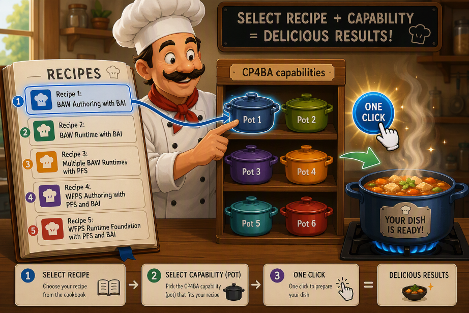

# CP4BA Documentation Index

📚 **Comprehensive documentation for IBM Cloud Pak for Business Automation deployment, configuration, and management scripts.**

Last update 2026-05-15

---

## 📥 Installation Guide

### [CP4BA Install Environment Documentation](cp4ba-installation-documentation-sequencediagram.md)

Complete guide for deploying IBM Cloud Pak for Business Automation environments. This comprehensive documentation covers the `cp4ba-one-shot-installation.sh` script, which orchestrates the entire deployment lifecycle including prerequisites validation, LDAP setup, database configuration, secrets management, and Custom Resource (CR) deployment. Includes multiple execution modes (full deployment, generate-only, wait-only, and federate-only) with detailed flowcharts and parameter references.

### [CP4BA Deploy Environment Documentation](cp4ba-deploy-env-documentation.md)

The deploy enviroment script `cp4ba-deploy-env.sh` is invoked by the main one-shot script.

**Topics:** Deployment | Prerequisites | Automation | Database Setup | LDAP Integration

---

## 💼 Case Manager Guide

### [CP4BA Case Manager Setup Documentation](casemanager-setup-documentation.md)

Detailed documentation for the `cp4ba-casemgr-install.sh` script, which automates downloading and installing IBM CP4BA Case Manager packages from GitHub. This guide covers version management, package extraction, cert-kubernetes integration, and provides practical usage examples for installing specific versions or the latest release. Essential for setting up the Case Manager automation framework.

**Topics:** Case Manager | Installation | Package Management | Version Control | GitHub Integration

---

## 🔐 IDP and LDAP Guide

### [CP4BA IDP-LDAP Documentation](idp-ldap-documentation.md)

Comprehensive guide for managing LDAP servers and Identity Providers (IDP) in CP4BA environments. Covers seven essential scripts: `add-ldap.sh`, `add-idp.sh`, `add-phpadmin.sh`, `onboard-users.sh`, and their removal counterparts. Includes detailed sequence diagrams for LDAP deployment, IDP configuration, PHP LDAP Admin interface setup, and user onboarding processes. Critical for authentication and user management infrastructure.

**Topics:** Authentication | LDAP | Identity Provider | User Management | PHP LDAP Admin | Security

---

## 🔀 Process Federation Guide

### [Process Federation Server (PFS) Documentation](pfs-documentation.md)

Complete documentation for deploying and managing IBM Process Federation Server instances. Covers four key scripts: `pfs-deploy.sh` for deployment, `pfs-show-contents.sh` for displaying federated content (tasks, processes, launchable entities), `pfs-show-federated.sh` for viewing connected servers, and `pfs-utils.sh` utility library. Includes detailed sequence diagrams and configuration examples for federated process management across multiple BAW instances.

**Topics:** Process Federation | PFS | Workflow Integration | Multi-Instance Management | Federated Tasks

---

## ⚙️ WfPS Guide

### [WfPS Deploy Documentation](wfps-deploy-documentation.md)

Detailed guide for deploying Workflow Process Service (WfPS) Runtime instances on OpenShift/Kubernetes. Documents the `wfps-deploy.sh` script with comprehensive coverage of Custom Resource creation, trusted certificate configuration, and deployment verification. Includes flowcharts for the complete deployment process, parameter validation, and instance readiness checks. Essential for WfPS runtime environment setup and management.

### [WfPS Application Deploy Documentation](wfps-install-application-documentation.md)

Detailed guide for deploying application in Workflow Process Service (WfPS) Runtime instances on OpenShift/Kubernetes. 

**Topics:** WfPS | Workflow Runtime | OpenShift | Kubernetes | Custom Resources | Certificate Management

---

## 🛠️ CP4BA Utilities Guide

### [CP4BA Utilities - Shell Scripts Documentation](utilities-documentation.md)

Comprehensive collection of utility scripts for CP4BA management and operations. Covers five major categories:

- **BAW Applications Management**: Export, list, deploy, undeploy, update applications and team bindings
- **GenAI Configuration**: Secret management for AI integration
- **TLS Entry Point Management**: Certificate updates and security
- **Cluster Operations**: Node rebooting and maintenance
- **Namespace Management**: Cleanup and resource management

Each script includes detailed execution flows, parameter references, and practical examples for day-to-day CP4BA administration tasks.

**Topics:** Utilities | BAW Apps | GenAI | TLS | Administration | Cluster Management | Namespace Operations

---

## 📝 CP4BA Logger Guide

### [CP4BA Logger Script Documentation](logger-documentation.md)

Advanced logging system documentation for bash scripts with enterprise-grade features. The `logger.sh` script provides multiple log levels (DEBUG, INFO, WARNING, ERROR), colored console output with ANSI codes, file logging with automatic rotation, ISO 8601 timestamps, and caller information tracking. Includes comprehensive environment variable configuration, function references, usage examples, and execution flow diagrams. Essential for debugging and monitoring all CP4BA pipeline scripts.

**Topics:** Logging | Debugging | Monitoring | Log Rotation | ANSI Colors | Timestamps | Error Tracking

---

## 📝 CP4BA Properties Configuration Guide

### [CP4BA Configs](properties-relationships/configs-relationships.md)

Entity relationship diagrams for all property files in the `cp4ba-installations/configs` folders, showing how each configuration file references external files (.yaml, .yml, .sql, .ldif).

**Topics:** Configuration

---

## 📖 IBM Cloud Pak for Business Automation (CP4BA) - Knowledge Base
[CP4BA v25](knowledge-bases/knowledge-v25.md)

## 📖 CP4BA Recipes

Let me introduce CP4BA Chef

[Recipe 1: BAW Authoring with BAI](recipes/recipe-authoring-baw-bai.md)

[Recipe 2: BAW Runtime with BAI](recipes/recipe-runtime-baw-bai.md)

[Recipe 3: Multiple BAW Runtimes with PFS](recipes/recipe-runtime-baw-double-pfs.md)

[Recipe 4: WFPS Authoring with PFS and BAI](recipes/recipe-authoring-wfps-pfs-bai.md)

[Recipe 5: WFPS Runtime Foundation with PFS and BAI](recipes/recipe-runtime-wfps-pfs-bai-foundation.md)

## 📖 Additional Resources

For more detailed information about specific components, refer to the individual README files in each component directory:

- `cp4ba-installations/README.md` - Installation configurations and templates
- `cp4ba-casemanager-setup/README.md` - Case Manager setup details
- `cp4ba-idp-ldap/README.md` - IDP and LDAP configuration
- `cp4ba-process-federation-server/README.md` - PFS configuration
- `cp4ba-wfps/README.md` - WfPS configuration and examples
- `cp4ba-utilities/README.md` - Utilities overview
- `cp4ba-logger/README.md` - Logger implementation details
- `cp4ba-config-tune/README.md` - Configuration & Tunining

---

Parts of this documents was generated by my teammate [IBM Bob](https://bob.ibm.com/) 