# CP4BA Case Manager Setup - Script Documentation

## Overview

The `cp4ba-casemgr-install.sh` script is a bash utility designed to download and install IBM Cloud Pak for Business Automation (CP4BA) Case Manager packages. It automates the process of fetching specific versions of the CP4BA automation case packages and their associated cert-kubernetes components.

**Script Location:** `cp4ba-casemanager-setup/cp4ba-casemgr-install.sh`

**Last Updated:** 2026-04-04 (Version 1.2.1)

---

## Script Purpose

This script performs the following main functions:
1. Downloads IBM CP4BA automation case packages from GitHub
2. Extracts and organizes the package contents
3. Downloads and integrates cert-kubernetes components
4. Optionally navigates to the scripts folder for immediate use

---

## Command Line Parameters

| Parameter | Required | Description |
|-----------|----------|-------------|
| `-d` | **Yes** | Target directory where the package will be installed (must exist) |
| `-v` | No | Specific package version to install (defaults to latest if not specified) |
| `-k` | No | Specific cert-kubernetes version (defaults to matching CP4BA version) |
| `-n` | No | If set, moves the shell to the scripts folder after installation |
| `-r` | No | If set, removes downloaded tar/zip files after extraction |
| `-s` | No | Shows all available versions and exits without installation |

---

## Usage Examples

### Show Available Versions
```bash
./cp4ba-casemgr-install.sh -s
```

### Install Latest Version
```bash
_CMGR_FOLDER="/tmp/cmgr-$USER"
mkdir -p ${_CMGR_FOLDER}
./cp4ba-casemgr-install.sh -d ${_CMGR_FOLDER}
```

### Install Specific Version (v23.x)
```bash
_CMGR_FOLDER="/tmp/cmgr-$USER"
_CMGR_VER="5.1.6"
./cp4ba-casemgr-install.sh -d ${_CMGR_FOLDER} -v ${_CMGR_VER}
```

### Install Specific Version with Custom Kubernetes Package (v24.x)
```bash
_CMGR_FOLDER="/tmp/cmgr-$USER"
_CMGR_VER="24.1.7"
_K_VER="24.0.1-IF007"
./cp4ba-casemgr-install.sh -d ${_CMGR_FOLDER} -v ${_CMGR_VER} -k ${_K_VER}
```

### Install with Auto-Discovery (v25.x - Preferred)
```bash
_CMGR_FOLDER="/tmp/cmgr-$USER"
_CMGR_VER="25.0.4"
./cp4ba-casemgr-install.sh -d ${_CMGR_FOLDER} -v ${_CMGR_VER}
```

---

## Execution Flow Diagram

```mermaid
sequenceDiagram
    autonumber
    participant User
    participant Script as cp4ba-casemgr-install.sh
    participant Logger as logger.sh
    participant GitHub as GitHub Repository
    participant FileSystem as File System

    User->>Script: Execute with parameters (-d, -v, -k, -n, -r, -s)
    
    Note over Script: Initialize Variables<br/>Set color codes<br/>Resolve script path
    
    Script->>Logger: Source logger.sh
    alt Logger not found
        Script->>User: Error: log package not found
        Script->>User: Exit(1)
    else Logger found
        Logger-->>Script: Initialize logging system
        Note over Script,Logger: Set logging defaults:<br/>CP4BA_LOGGING_ENABLED=true<br/>CP4BA_LOG_LEVEL=INFO<br/>CP4BA_LOG_TO_CONSOLE=true
    end
    
    Script->>Script: Parse command line arguments
    
    alt Show versions flag (-s)
        Script->>GitHub: Fetch index.yaml
        GitHub-->>Script: Return version index
        Script->>User: Display all available versions
        Script->>User: Exit(1)
    end
    
    alt No target directory specified
        Script->>User: Display usage message
        Script->>User: Exit(1)
    end
    
    alt No version specified (-v)
        Script->>Script: Call getLatestVersion()
        Script->>GitHub: curl index.yaml
        GitHub-->>Script: Return index data
        Script->>Script: Extract latestVersion → _CASE_VER
        Script->>Script: Extract latestAppVersion → _CP4BA_VER
        Script->>Script: Set _K8CERT_VER = _CP4BA_VER
    else Version specified
        Script->>Script: Call getSpecificVersion()
        Script->>GitHub: curl index.yaml
        GitHub-->>Script: Return index data
        Script->>Script: Search for version in index
        Script->>Script: Extract appVersion for specified version
        alt appVersion empty
            Script->>Logger: log_error "appVersion empty"
            Script->>User: Exit(1)
        end
        alt No -k parameter
            Script->>Script: Set _K8CERT_VER = _CP4BA_VER
        end
    end
    
    Script->>Script: Call installCasePackMgr()
    Script->>Logger: log_info "Installing case manager version"
    
    alt _CASE_VER is empty
        Script->>Logger: log_error "Version doesn't exist"
        Script->>User: Exit(1)
    end
    
    Script->>FileSystem: mkdir -p ${_DIR}
    Script->>FileSystem: cd ${_DIR}
    
    Script->>GitHub: Download ibm-cp-automation-${_CASE_VER}.tgz
    GitHub-->>Script: Return tarball
    
    Script->>FileSystem: mkdir ibm-cp-automation-${_CASE_VER}
    Script->>FileSystem: Extract tarball
    
    alt Remove tarball flag (-r)
        Script->>FileSystem: Delete .tgz file
    end
    
    alt Version 5.x (CP4BA < 24)
        Script->>FileSystem: Navigate to crs folder
        Script->>FileSystem: Extract cert-k8s-*.tar
        alt Remove tarball flag (-r)
            Script->>FileSystem: Delete .tgz file
        end
    else Version 24.x or 25.x
        Script->>FileSystem: Create crs directory structure
        Script->>FileSystem: Navigate to crs folder
        Script->>Logger: log_info "Downloading kubernetes package"
        Script->>GitHub: wget cert-kubernetes ${_K8CERT_VER}.zip
        GitHub-->>Script: Return zip file
        Script->>FileSystem: Unzip kubernetes package
        Script->>FileSystem: Rename to cert-kubernetes
        alt Remove zip flag (-r)
            Script->>FileSystem: Delete .zip file
        end
    else Unsupported version
        Script->>Logger: log_error "Version not supported"
        Script->>User: Exit(1)
    end
    
    Script->>Script: Set _SCRIPTS_FOLDER path
    
    alt Stay flag not set (-n)
        Script->>FileSystem: cd ${_SCRIPTS_FOLDER}
        Script->>Logger: log_info "New bash shell in scripts folder"
        Script->>User: exec bash (new shell)
        Note over User: User is now in scripts folder<br/>Type 'exit' to return
    else Stay flag set
        Script->>User: Return to original shell
    end
    
    Script->>User: Exit(0) - Success
```



---

## Main Execution Flow

### 1. Initialization Phase
- **Lines 1-64**: Script setup and initialization
  - Set script metadata and directory paths
  - Define color codes for output formatting
  - Resolve script path (handles symlinks)
  - Source the logger utility script
  - Configure logging parameters (enabled, level, console/file output)

### 2. Parameter Parsing Phase
- **Lines 68-78**: Command line argument processing
  - Parse flags: `-d`, `-v`, `-k`, `-n`, `-r`, `-s`
  - Store values in corresponding variables

### 3. Version Resolution Phase
- **Lines 85-104**: Determine which version to install

#### Branch A: Get Latest Version (`getLatestVersion()`)
- Triggered when no `-v` parameter is provided
- Fetches IBM CP4BA automation index from GitHub
- Extracts `latestVersion` → `_CASE_VER`
- Extracts `latestAppVersion` → `_CP4BA_VER`
- Sets `_K8CERT_VER` to match `_CP4BA_VER`

#### Branch B: Get Specific Version (`getSpecificVersion()`)
- Triggered when `-v` parameter is provided
- Fetches IBM CP4BA automation index from GitHub
- Searches for specified version in index
- Extracts corresponding `appVersion`
- Validates that `appVersion` is not empty
- Uses `-k` parameter if provided, otherwise defaults to `_CP4BA_VER`

### 4. Installation Phase
- **Lines 107-160**: Main installation logic (`installCasePackMgr()`)

#### Step 4.1: Pre-installation Validation
- Verify `_CASE_VER` is not empty
- Create target directory if it doesn't exist
- Change to target directory

#### Step 4.2: Download Case Package
- Download `ibm-cp-automation-${_CASE_VER}.tgz` from GitHub
- Create extraction directory
- Extract tarball contents
- Optionally remove tarball if `-r` flag is set

#### Step 4.3: Version-Specific Processing

**Branch C: Version 5.x (CP4BA versions < 24)**
- Navigate to: `ibm-cp-automation/inventory/cp4aOperatorSdk/files/deploy/crs`
- Extract embedded `cert-k8s-*.tar` file
- Optionally remove tar file if `-r` flag is set

**Branch D: Version 24.x or 25.x**
- Create directory structure for cert-kubernetes
- Navigate to crs folder
- Download cert-kubernetes package from GitHub as zip file
- Unzip the package
- Rename directory to `cert-kubernetes`
- Optionally remove zip file if `-r` flag is set

**Branch E: Unsupported Version**
- Log error message
- Exit with error code

#### Step 4.4: Post-installation Actions
- Set `_SCRIPTS_FOLDER` path to cert-kubernetes scripts directory
- If `-n` flag is NOT set:
  - Change directory to scripts folder
  - Launch new bash shell in that location
  - User must type `exit` to return to original shell
- If `-n` flag IS set:
  - Return control to user in original directory

### 5. Completion Phase
- **Line 183**: Exit with success code (0)

---

## Execution Branches

### Branch 1: Show Versions Only
**Condition:** `-s` flag is set  
**Flow:**
1. Fetch index.yaml from GitHub
2. Display all available versions
3. Exit immediately (line 170)

### Branch 2: No Target Directory
**Condition:** `-d` parameter not provided  
**Flow:**
1. Display usage message
2. Exit with error (line 175)

### Branch 3: Latest Version Installation
**Condition:** No `-v` parameter  
**Flow:**
1. Call `getLatestVersion()`
2. Fetch latest version information
3. Proceed to installation

### Branch 4: Specific Version Installation
**Condition:** `-v` parameter provided  
**Flow:**
1. Call `getSpecificVersion()`
2. Validate version exists
3. Proceed to installation

### Branch 5: Version 5.x Processing
**Condition:** `_CASE_VER` starts with "5."  
**Flow:**
1. Extract embedded cert-k8s tar file
2. No separate download needed

### Branch 6: Version 24.x/25.x Processing
**Condition:** `_CASE_VER` starts with "24" or "25"  
**Flow:**
1. Download separate cert-kubernetes zip
2. Extract and organize files

### Branch 7: Shell Navigation
**Condition:** `-n` flag NOT set  
**Flow:**
1. Navigate to scripts folder
2. Launch new bash shell
3. User remains in scripts folder

### Branch 8: Stay in Current Directory
**Condition:** `-n` flag IS set  
**Flow:**
1. Complete installation
2. Return to original directory

---

## Dependencies

### External Dependencies
1. **logger.sh** (Required)
   - Location: `../cp4ba-logger/scripts/logger.sh`
   - Purpose: Provides logging functionality
   - Functions used: `log_info()`, `log_error()`, `log_msg()`

2. **curl** (Required)
   - Purpose: Download files from GitHub
   - Used for: Fetching index.yaml and tarball files

3. **wget** (Required for v24+)
   - Purpose: Download cert-kubernetes zip files
   - Used for: Version 24.x and 25.x installations

4. **tar** (Required)
   - Purpose: Extract tarball archives
   - Used for: Extracting case packages and cert-k8s files

5. **unzip** (Required for v24+)
   - Purpose: Extract zip archives
   - Used for: Extracting cert-kubernetes packages

### GitHub Resources
1. **IBM Cloud Pak Index**
   - URL: `https://raw.githubusercontent.com/IBM/cloud-pak/master/repo/case/ibm-cp-automation/index.yaml`
   - Purpose: Version information and mapping

2. **IBM CP4BA Automation Cases**
   - URL: `https://github.com/IBM/cloud-pak/raw/master/repo/case/ibm-cp-automation/${VERSION}/`
   - Purpose: Main case package downloads

3. **Cert-Kubernetes Repository**
   - URL: `https://github.com/icp4a/cert-kubernetes/archive/refs/heads/${VERSION}.zip`
   - Purpose: Kubernetes certification files (v24+)

---

## Key Variables

| Variable | Description | Set By |
|----------|-------------|--------|
| `_DIR` | Target installation directory | `-d` parameter |
| `_VER` | Requested package version | `-v` parameter or latest |
| `_K8CERT_VER` | Cert-kubernetes version | `-k` parameter or auto-detected |
| `_CASE_VER` | Resolved case package version | Version resolution functions |
| `_CP4BA_VER` | CP4BA application version | Extracted from index.yaml |
| `_STAY` | Whether to stay in current directory | `-n` flag (default: true) |
| `_REMOVE_TGZ` | Whether to remove archives | `-r` flag (default: false) |
| `_SHOW_VERSIONS` | Whether to show versions only | `-s` flag (default: false) |
| `_SCRIPTS_FOLDER` | Path to cert-kubernetes scripts | Computed after extraction |

---

## Error Handling

### Error Conditions

1. **Logger Not Found** (Line 36-41)
   - **Condition:** `logger.sh` file doesn't exist
   - **Action:** Display error message and exit(1)
   - **Message:** "Error, log package not found!"

2. **Empty appVersion** (Line 96-100)
   - **Condition:** Version lookup returns empty appVersion
   - **Action:** Log error and exit(1)
   - **Message:** "ERROR for 'appVersion' found empty value"

3. **Version Doesn't Exist** (Line 110-113)
   - **Condition:** `_CASE_VER` is empty after resolution
   - **Action:** Log error and exit(1)
   - **Message:** "CP4BA Case Manager version doesn't exist!"

4. **Unsupported Version** (Line 147-149)
   - **Condition:** Version doesn't match 5.x, 24.x, or 25.x pattern
   - **Action:** Log error and exit(1)
   - **Message:** "CP4BA Case Manager version not supported!"

5. **Missing Target Directory** (Line 173-176)
   - **Condition:** `-d` parameter not provided
   - **Action:** Display usage and exit(1)

---

## Logging Configuration

The script uses the `cp4ba-logger` logging system with the following defaults:

| Setting | Default Value | Description |
|---------|---------------|-------------|
| `CP4BA_LOGGING_ENABLED` | `true` | Master logging switch |
| `CP4BA_LOG_LEVEL` | `INFO` | Minimum log level (DEBUG/INFO/WARNING/ERROR) |
| `CP4BA_LOG_TO_CONSOLE` | `true` | Enable console output |
| `CP4BA_LOG_TO_FILE` | `false` | Enable file output |
| `CP4BA_LOG_FILE` | `""` | Log file path (empty = no file logging) |
| `CP4BA_LOG_MAX_SIZE` | `10485760` | Max log file size (10MB) |
| `CP4BA_LOG_BACKUP_COUNT` | `5` | Number of rotated logs to keep |

---

## Version Support

### Version 5.x (CP4BA < 24)
- **Package Structure:** Single tarball with embedded cert-k8s
- **Extraction:** Two-stage (main tarball, then cert-k8s tar)
- **Example Versions:** 5.1.6 (maps to 23.0.2-IF006)

### Version 24.x
- **Package Structure:** Separate case package and cert-kubernetes
- **Extraction:** Tarball + zip download
- **Example Versions:** 24.1.7 with 24.0.1-IF007

### Version 25.x
- **Package Structure:** Separate case package and cert-kubernetes
- **Extraction:** Tarball + zip download
- **Example Versions:** 25.0.4, 25.1.0
- **Known Issue:** Version 25.1.0 has incorrect mapping in index.yaml

---

## Known Issues

### Version 25.1.0 Mapping Bug
**Issue:** The IBM Cloud Pak index.yaml has incorrect mapping for version 25.1.0, pointing to a non-existent 25.1.0.zip file.

**Workaround:** Use the specific version method with explicit cert-kubernetes version:
```bash
_CMGR_FOLDER="/tmp/cmgr-$USER"
_CMGR_VER="25.1.0"
_K_VER="25.0.1"
./cp4ba-casemgr-install.sh -d ${_CMGR_FOLDER} -v ${_CMGR_VER} -k ${_K_VER}
```

---

## Output Structure

After successful execution, the following directory structure is created:

```
${_DIR}/
└── ibm-cp-automation-${_CASE_VER}/
    └── ibm-cp-automation/
        └── inventory/
            └── cp4aOperatorSdk/
                └── files/
                    └── deploy/
                        └── crs/
                            └── cert-kubernetes/
                                └── scripts/  ← Target folder for -n flag
```

---

## Change History

### Version 1.2.1 (2026-04-04)
- **Fixed:** Download kubernetes package for specific fix

### Version 1.2.0 (2025-06-23)
- **Changed:** Support for v25.x
- **Fixed:** installCasePackMgr pattern matching to support v25

### Version 1.1.0 (2024-08-05)
- **Added:** Support for v24.x Case package manager
- **Changed:** Split contents support for IBM Cloud Pak and cert-kubernetes repositories
- **Changed:** Updated installCasePackMgr function

---

## Best Practices

1. **Always specify target directory:** Use `-d` parameter with an existing directory
2. **Use version auto-discovery:** For v25.x, omit `-k` parameter to auto-detect correct cert-kubernetes version
3. **Clean up archives:** Use `-r` flag to remove downloaded files after extraction
4. **Check available versions:** Use `-s` flag before installation to verify version availability
5. **Stay in current directory:** Use `-n` flag if you want to continue working in your current location

---

## Security Considerations

1. **HTTPS Downloads:** All downloads use HTTPS (curl -sk flag)
2. **Certificate Validation:** The `-k` flag in curl skips certificate validation (consider security implications)
3. **Source Verification:** Downloads are from official IBM GitHub repositories
4. **File Permissions:** Extracted files inherit default umask permissions

---

## Troubleshooting

### Problem: Logger not found
**Solution:** Clone the cp4ba-logger repository alongside this project:
```bash
git clone https://github.com/marcoantonioni/cp4ba-logger
```

### Problem: Version not found
**Solution:** Use `-s` flag to list available versions, then specify a valid version with `-v`

### Problem: Download fails
**Solution:** Check internet connectivity and GitHub accessibility

### Problem: Extraction fails
**Solution:** Ensure sufficient disk space and proper permissions in target directory

---

## Related Scripts

This script is part of the CP4BA utilities suite. Related scripts include:
- `cp4ba-logger/scripts/logger.sh` - Logging utility (required dependency)
- `cp4ba-installations/scripts/cp4ba-*.sh` - Installation and deployment scripts

---

## Author & Maintenance

**Repository:** IBM Cloud Pak for Business Automation Utilities  
**Last Updated:** 2026-04-04  
**Version:** 1.2.1

For issues and updates, refer to the changelog.md file in the script directory.