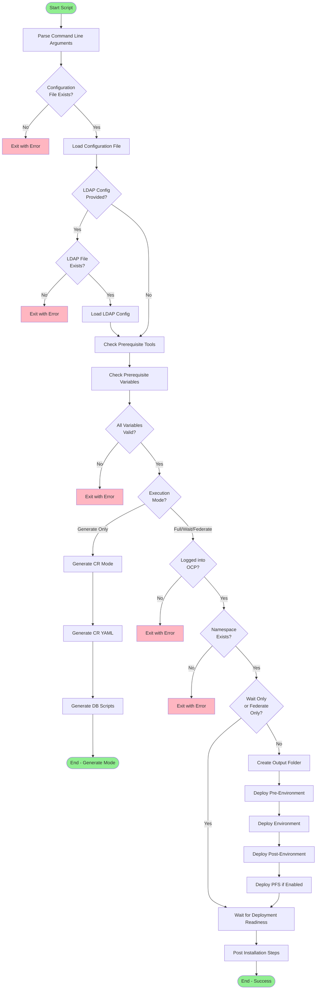
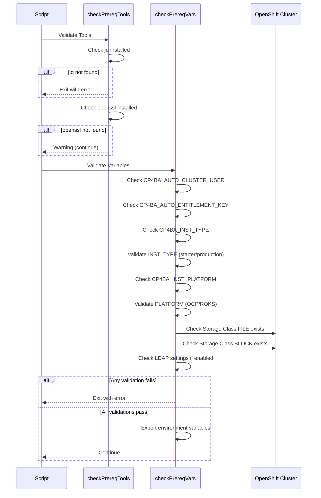
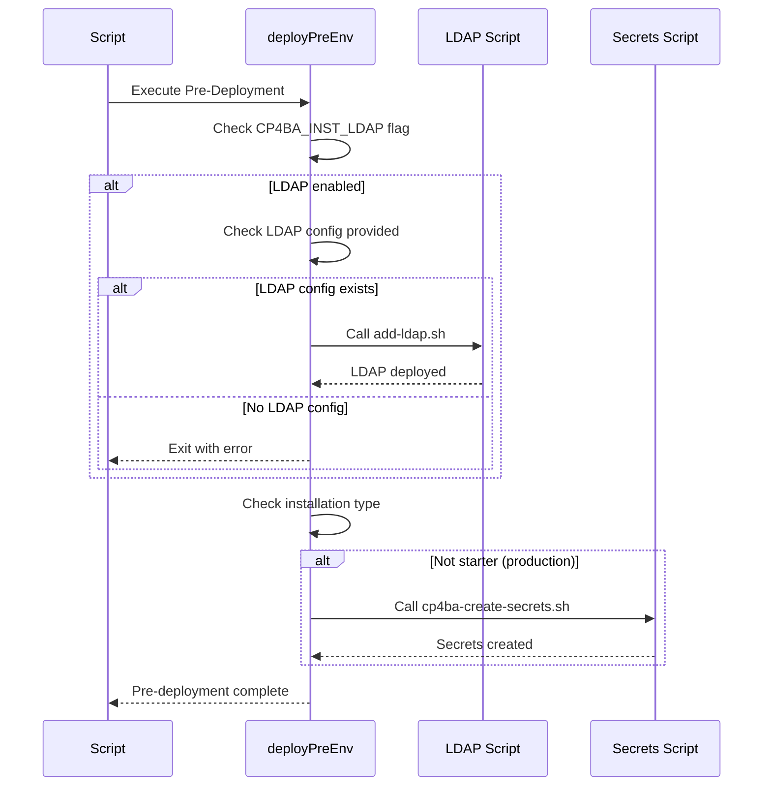
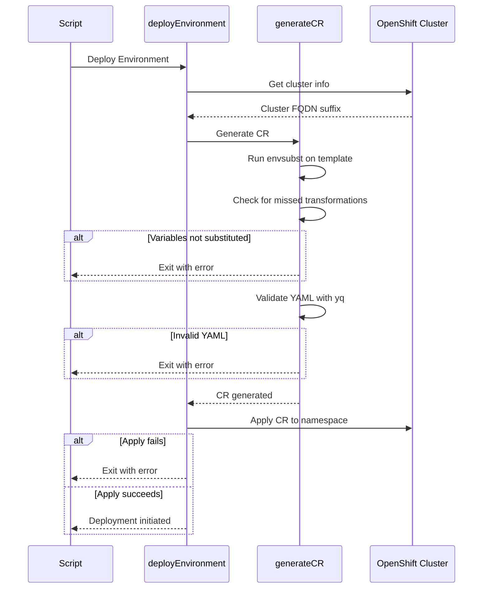
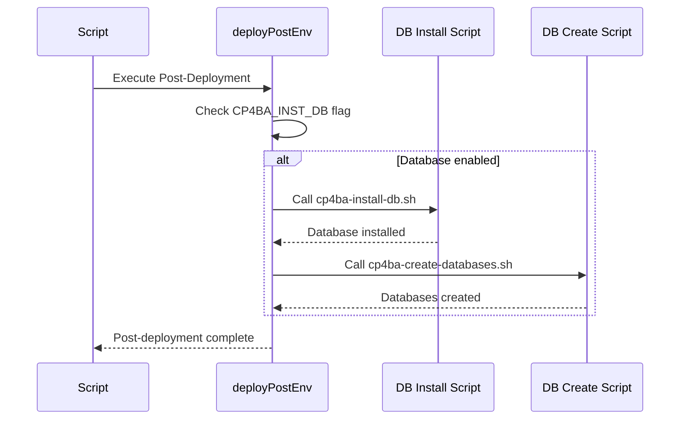
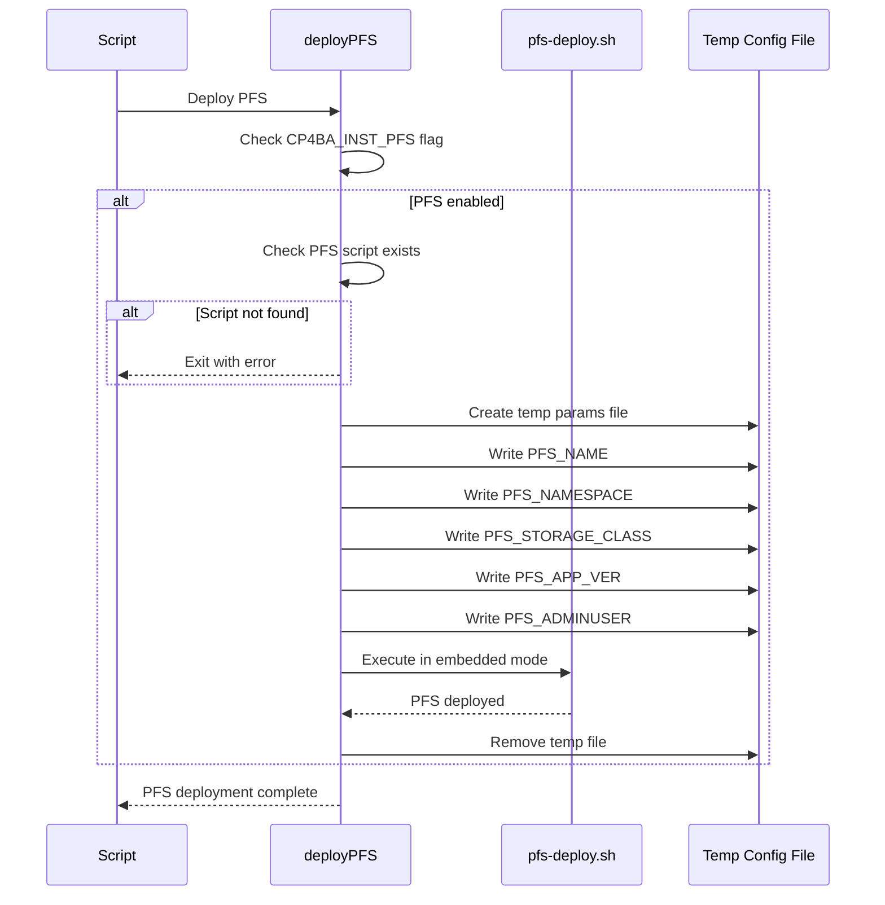
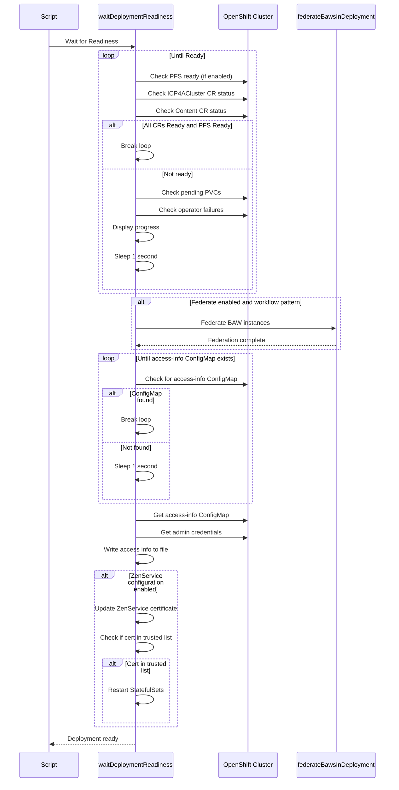
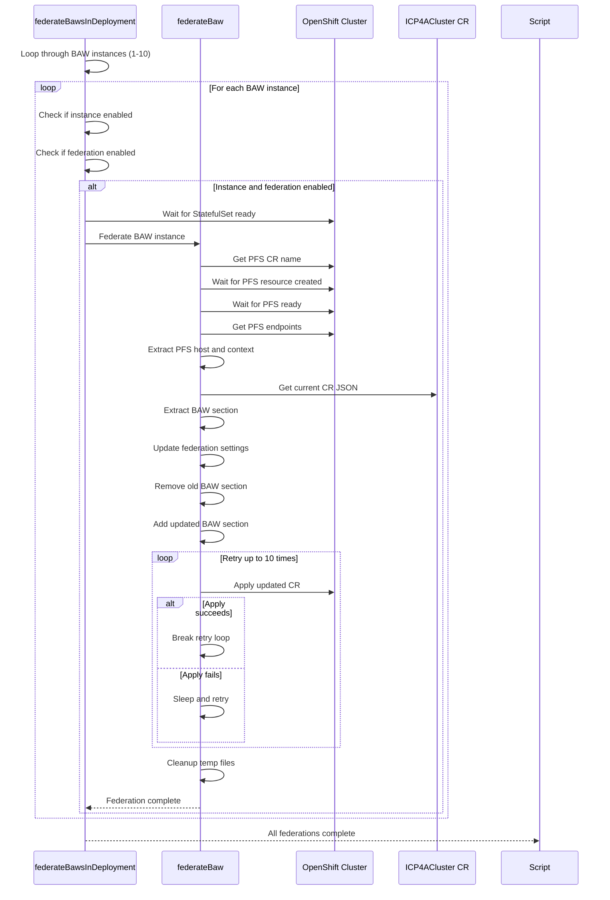
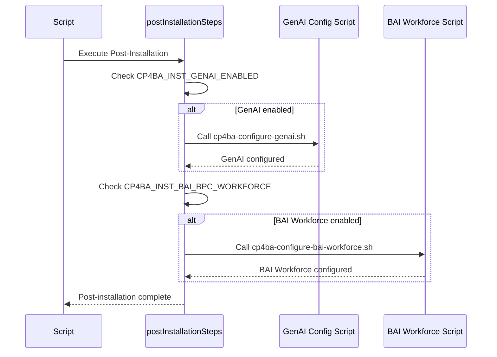
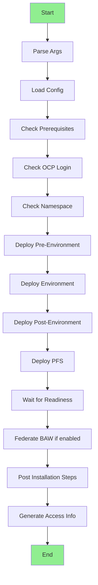

# CP4BA Deploy Environment Script Documentation

## Overview

The `cp4ba-deploy-env.sh` script is a comprehensive bash automation tool for deploying IBM Cloud Pak for Business Automation (CP4BA) environments. It orchestrates the complete deployment lifecycle including prerequisites validation, LDAP setup, database configuration, secrets management, and Custom Resource (CR) deployment.

## Script Metadata

- **Script Name**: `cp4ba-deploy-env.sh`
- **Location**: `cp4ba-installations/scripts/`
- **Purpose**: Automated CP4BA environment deployment and configuration
- **Dependencies**: `jq`, `openssl`, `oc` (OpenShift CLI), `yq`, `envsubst`

## Command Line Parameters

| Parameter | Required | Description | Example |
|-----------|----------|-------------|---------|
| `-c` | Yes | Full path to configuration file | `../configs/env1.properties` |
| `-l` | No | LDAP configuration file | `../configs/_cfg-production-ldap-domain.properties` |
| `-w` | No | Wait only mode - skip deployment, create access info | N/A |
| `-g` | No | Generate YAML only - skip deployment | N/A |
| `-f` | No | Federate only - skip deployment | N/A |

## Execution Modes

### 1. Full Deployment Mode (Default)
Complete deployment including all prerequisites, CR deployment, and post-installation steps.

### 2. Generate Only Mode (`-g`)
Generates the CR YAML and database scripts without deploying.

### 3. Wait Only Mode (`-w`)
Skips deployment and only waits for existing deployment to complete, then generates access info.

### 4. Federate Only Mode (`-f`)
Only performs BAW federation with PFS, skipping deployment steps.

## Main Execution Flow



## Detailed Component Flow

### 1. Prerequisites Validation Flow



### 2. Pre-Environment Deployment Flow



### 3. Environment Deployment Flow



### 4. Post-Environment Deployment Flow



### 5. PFS Deployment Flow



### 6. Deployment Readiness Wait Flow



### 7. BAW Federation Flow



### 8. Post Installation Steps Flow



## Key Functions Reference

### Utility Functions

| Function | Purpose | Parameters | Returns |
|----------|---------|------------|---------|
| `checkPrereqTools()` | Validates required tools (jq, openssl) | None | Exit on error |
| `checkPrereqVars()` | Validates required environment variables | None | Exit on error |
| `namespaceExist()` | Check if namespace exists | `$1`: namespace name | 0=not exist, 1=exists |
| `storageClassExist()` | Check if storage class exists | `$1`: storage class name | 0=not exist, 1=exists |
| `resourceExist()` | Check if resource exists | `$1`: namespace, `$2`: resource type, `$3`: resource name | 0=not exist, 1=exists |
| `waitForResourceCreated()` | Wait until resource is created | `$1`: namespace, `$2`: resource type, `$3`: resource name, `$4`: sleep interval | None |

### Deployment Functions

| Function | Purpose | Key Actions |
|----------|---------|-------------|
| `deployPreEnv()` | Pre-deployment setup | - Deploy LDAP if enabled<br>- Create secrets for production |
| `deployEnvironment()` | Main deployment | - Get cluster info<br>- Generate CR<br>- Apply CR to cluster |
| `deployPostEnv()` | Post-deployment setup | - Install database<br>- Create databases |
| `deployPFS()` | Deploy Process Federation Server | - Create temp config<br>- Execute PFS deployment script |
| `generateCR()` | Generate Custom Resource YAML | - Substitute environment variables<br>- Validate YAML<br>- Check for missed transformations |

### Monitoring Functions

| Function | Purpose | Key Actions |
|----------|---------|-------------|
| `waitDeploymentReadiness()` | Wait for deployment completion | - Monitor CR status<br>- Check PFS readiness<br>- Federate BAW instances<br>- Generate access info |
| `loopWaitForPfsReady()` | Wait for PFS to be ready | - Check PFS components status<br>- Loop until all ready |
| `checkForPfsReady()` | Check PFS readiness status | - Query PFS deployment, service, zen integration |
| `waitForBawStatefulSetReady()` | Wait for BAW StatefulSet | - Wait for StatefulSet creation<br>- Wait for ready replicas |

### Federation Functions

| Function | Purpose | Key Actions |
|----------|---------|-------------|
| `federateBaw()` | Federate single BAW instance | - Get PFS endpoints<br>- Update CR with federation config<br>- Retry on failure |
| `federateBawsInDeployment()` | Federate all BAW instances | - Loop through BAW 1-10<br>- Call federateBaw for each enabled instance |

### Post-Installation Functions

| Function | Purpose | Key Actions |
|----------|---------|-------------|
| `postInstallationSteps()` | Execute post-installation tasks | - Configure GenAI if enabled<br>- Configure BAI Workforce if enabled |
| `updateZenServiceCertificate()` | Update Zen certificate | - Call TLS update script<br>- Return configuration status |
| `zenCertInTrustedList()` | Check and restart if cert trusted | - Check if cert in trusted list<br>- Restart StatefulSets if needed |
| `restartStatefulSets()` | Restart StatefulSets | - Scale to 0<br>- Scale back to original replicas |

## Execution Branches

### Branch 1: Generate Only Mode


**Conditions**: `-g` flag provided  
**Actions**:
- Generate CR YAML from template
- Generate database creation scripts
- Display warnings about manual prerequisites
- Exit without deployment

### Branch 2: Wait Only Mode


**Conditions**: `-w` flag provided  
**Actions**:
- Skip all deployment steps
- Wait for existing deployment to complete
- Generate access information file
- Exit

### Branch 3: Federate Only Mode


**Conditions**: `-f` flag provided  
**Actions**:
- Skip deployment steps
- Wait for deployment readiness
- Federate BAW instances with PFS
- Generate access information file
- Exit

### Branch 4: Full Deployment Mode



**Conditions**: No special flags (default mode)  
**Actions**:
- Complete deployment lifecycle
- All prerequisites setup
- CR deployment
- Post-deployment configuration
- Federation if enabled
- Post-installation steps
- Access information generation

## Configuration Variables

### Required Variables

| Variable | Description | Example |
|----------|-------------|---------|
| `CP4BA_AUTO_CLUSTER_USER` | OCP cluster username | `admin` |
| `CP4BA_AUTO_ENTITLEMENT_KEY` | IBM entitlement key | `eyJhbGc...` |
| `CP4BA_INST_TYPE` | Installation type | `starter` or `production` |
| `CP4BA_INST_PLATFORM` | Platform type | `OCP` or `ROKS` |
| `CP4BA_INST_SC_FILE` | File storage class | `ocs-storagecluster-cephfs` |
| `CP4BA_INST_SC_BLOCK` | Block storage class | `ocs-storagecluster-ceph-rbd` |
| `CP4BA_INST_NAMESPACE` | Target namespace | `cp4ba-prod` |
| `CP4BA_INST_ENV` | Environment name | `production` |
| `CP4BA_INST_CR_NAME` | CR instance name | `icp4adeploy` |
| `CP4BA_INST_CR_TEMPLATE` | CR template path | `templates/cp4ba-cr-ref-baw.yaml` |
| `CP4BA_INST_OUTPUT_FOLDER` | Output directory | `../output` |
| `CP4BA_INST_APPVER` | Application version | `25.0.1` |

### Optional Variables

| Variable | Description | Default |
|----------|-------------|---------|
| `CP4BA_INST_LDAP` | Enable LDAP deployment | `false` |
| `CP4BA_INST_LDAP_SECRET` | LDAP secret name | - |
| `CP4BA_INST_DB` | Enable database deployment | `false` |
| `CP4BA_INST_PFS` | Enable PFS deployment | `false` |
| `CP4BA_INST_GENAI_ENABLED` | Enable GenAI configuration | `false` |
| `CP4BA_INST_BAI_BPC_WORKFORCE` | Enable BAI Workforce | `false` |
| `CP4BA_INST_ZS_CONFIGURE` | Configure ZenService certificate | `false` |

### BAW Federation Variables (1-10 instances)

| Variable Pattern | Description |
|-----------------|-------------|
| `CP4BA_INST_BAW_N` | Enable BAW instance N |
| `CP4BA_INST_BAW_N_NAME` | BAW instance N name |
| `CP4BA_INST_BAW_N_FEDERATED` | Enable federation for instance N |
| `CP4BA_INST_BAW_N_HOST_FEDERATED_PORTAL` | Host federated portal flag |

## Error Handling

### Exit Codes

| Code | Condition |
|------|-----------|
| `1` | Configuration file not found |
| `1` | LDAP configuration file not found |
| `1` | Required tool (jq) not installed |
| `1` | Required variables not set |
| `1` | Storage class not found |
| `1` | Not logged into OCP cluster |
| `1` | Namespace doesn't exist |
| `1` | CR generation failed |
| `1` | CR deployment failed |
| `1` | LDAP deployment failed |
| `1` | Secrets creation failed |
| `1` | Database installation failed |
| `1` | Database creation failed |
| `1` | PFS deployment failed |
| `1` | GenAI configuration failed |
| `1` | BAI Workforce configuration failed |
| `1` | Federation failed |
| `0` | Success |

### Validation Checks

1. **Tool Validation**
   - `jq` must be installed (critical)
   - `openssl` should be installed (warning only)

2. **Variable Validation**
   - Cluster user and entitlement key must be set
   - Installation type must be 'starter' or 'production'
   - Platform must be 'OCP' or 'ROKS'
   - Storage classes must exist in cluster
   - LDAP secret required if LDAP enabled

3. **File Validation**
   - Configuration file must exist
   - LDAP configuration file must exist (if provided)
   - CR template must exist
   - Generated CR must be valid YAML
   - All environment variables must be substituted

4. **Cluster Validation**
   - Must be logged into OCP cluster
   - Target namespace must exist
   - Storage classes must be available

## Output Files

| File | Location | Content |
|------|----------|---------|
| CR YAML | `${CP4BA_INST_OUTPUT_FOLDER}/cp4ba-${CR_NAME}-${ENV}.yaml` | Generated Custom Resource |
| Access Info | `${CP4BA_INST_OUTPUT_FOLDER}/cp4ba-${CR_NAME}-${ENV}-access-info.txt` | Platform URLs and credentials |
| DB Scripts | Generated by `cp4ba-create-databases.sh` | Database creation scripts |

## Monitoring and Progress

### Progress Indicators

The script displays real-time progress with:
- **Rotating character**: Visual indicator of activity (`|/-\`)
- **Warning count**: Number of pending PVCs and operator failures
- **Elapsed time**: Hours, minutes, and seconds since start
- **Status messages**: Color-coded messages for different stages

### Status Checks

The script monitors:
1. **ICP4ACluster CR status**: Ready condition
2. **Content CR status**: Ready condition (if applicable)
3. **PFS status**: Deployment, Service, and Zen Integration readiness
4. **Pending PVCs**: Count of pending persistent volume claims
5. **Operator failures**: Count of FAIL messages in operator logs
6. **Access-info ConfigMap**: Availability of access information

## Dependencies and Integration

### External Scripts Called

1. **LDAP Management**
   - `${CP4BA_INST_LDAP_TOOLS_FOLDER}/add-ldap.sh`

2. **Secrets Management**
   - `./cp4ba-create-secrets.sh`

3. **Database Management**
   - `./cp4ba-install-db.sh`
   - `./cp4ba-create-databases.sh`

4. **PFS Management**
   - `${CP4BA_INST_PFS_TOOLS_FOLDER}/scripts/pfs-deploy.sh`

5. **Post-Installation**
   - `./cp4ba-configure-genai.sh`
   - `./cp4ba-configure-bai-workforce.sh`

6. **Certificate Management**
   - `${CP4BA_INST_UTILS_TOOLS_FOLDER}/cp4ba-tls-update-ep.sh`

### OpenShift CLI Commands Used

- `oc whoami`: Verify login status
- `oc cluster-info`: Get cluster information
- `oc get`: Query resources (namespaces, storage classes, CRs, pods, etc.)
- `oc apply`: Apply Custom Resources
- `oc scale`: Scale StatefulSets
- `oc logs`: Check operator logs

## Best Practices and Recommendations

1. **Configuration Management**
   - Keep configuration files in version control
   - Use separate configs for different environments
   - Document all custom variables

2. **Pre-Deployment**
   - Verify all prerequisites before running
   - Test in non-production environment first
   - Ensure sufficient cluster resources

3. **Monitoring**
   - Watch for warnings during deployment
   - Check operator logs for errors
   - Monitor PVC binding status

4. **Post-Deployment**
   - Save access-info file securely
   - Verify all components are ready
   - Test federation if enabled

5. **Troubleshooting**
   - Use `-g` flag to generate and inspect CR before deployment
   - Check generated YAML for variable substitution issues
   - Review operator logs for detailed error messages

## Troubleshooting Guide

### Common Issues

| Issue | Possible Cause | Solution |
|-------|---------------|----------|
| "jq not installed" | Missing prerequisite | Install jq: `yum install jq` or `apt-get install jq` |
| "Not logged in to OCP" | No active OCP session | Run `oc login` with cluster credentials |
| "Namespace doesn't exist" | Target namespace not created | Create namespace or check configuration |
| "Storage class not found" | Invalid storage class name | Verify with `oc get sc` and update config |
| "CR deployment failed" | Invalid YAML or permissions | Check YAML with `yq` and verify permissions |
| "Pending PVCs" | Storage provisioning issues | Check storage class and cluster capacity |
| "Operator failures" | Configuration errors | Review operator logs for details |
| "Federation failed" | PFS not ready or config error | Verify PFS deployment and endpoints |

### Debug Mode

To enable detailed debugging:
```bash
# Uncomment at top of script
set -x  # Enable command tracing
```

### Log Analysis

Check operator logs:
```bash
oc logs -n ${NAMESPACE} -c operator $(oc get pods -n ${NAMESPACE} | grep "cp4a-operator-" | awk '{print $1}')
```

## Version History and Compatibility

This script is designed for:
- **CP4BA Version**: 23.x, 24.x, 25.x
- **OpenShift**: 4.10+
- **ROKS**: Compatible
- **Bash**: 4.0+

## Security Considerations

1. **Credentials**: Never commit entitlement keys or passwords to version control
2. **Access Info**: Protect access-info files containing credentials
3. **LDAP Secrets**: Ensure LDAP secrets are properly secured
4. **Certificates**: Manage TLS certificates according to security policies
5. **RBAC**: Ensure proper OpenShift permissions for deployment

## Conclusion

The `cp4ba-deploy-env.sh` script provides a comprehensive, automated approach to deploying CP4BA environments. Its modular design, extensive validation, and flexible execution modes make it suitable for various deployment scenarios from development to production environments.