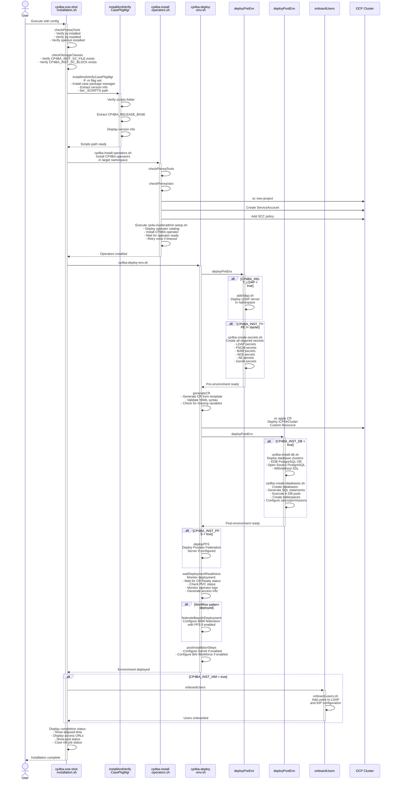
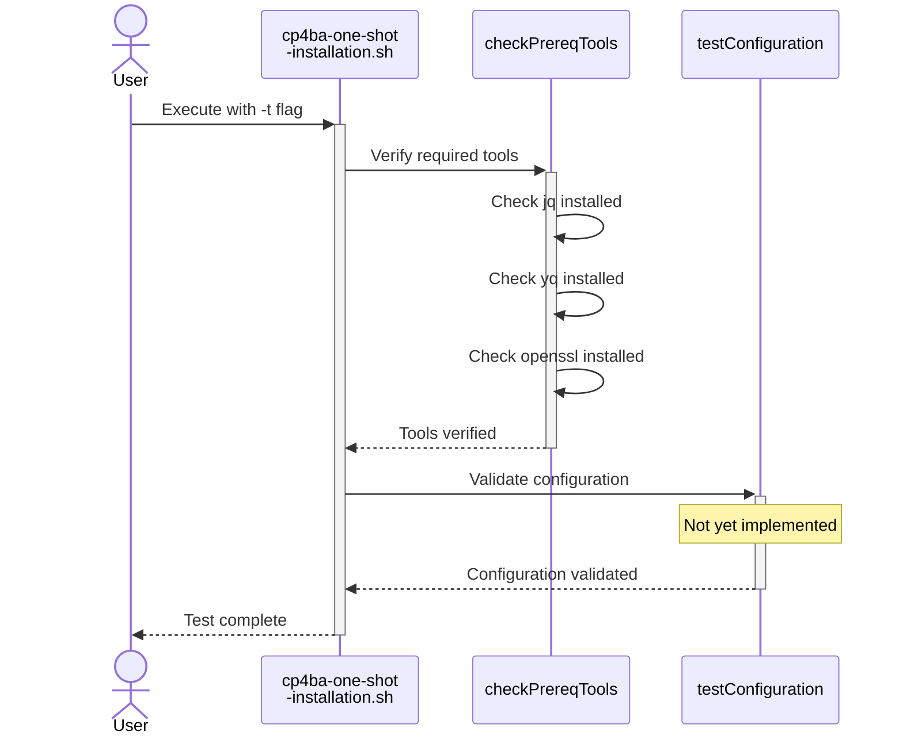
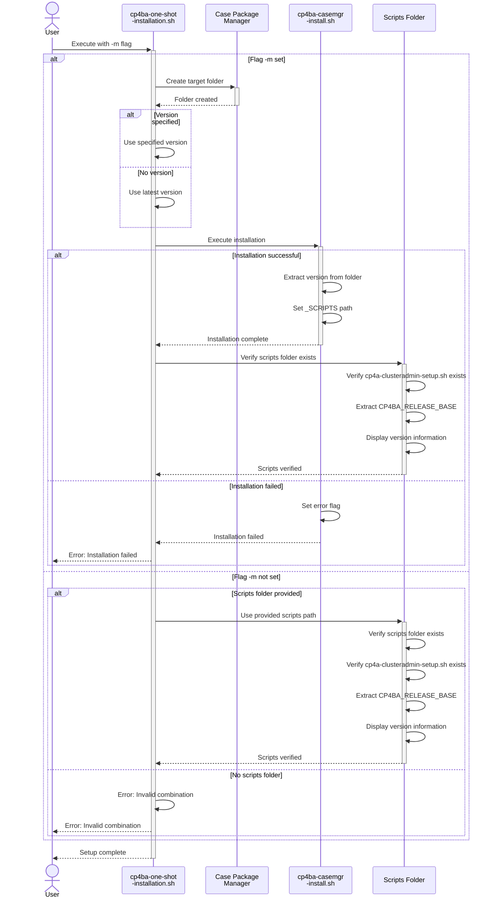
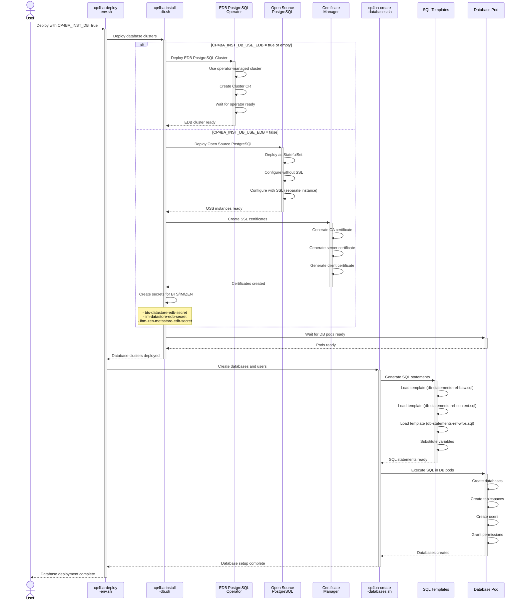
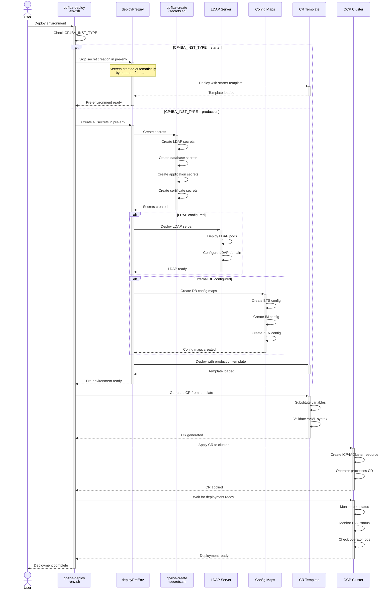
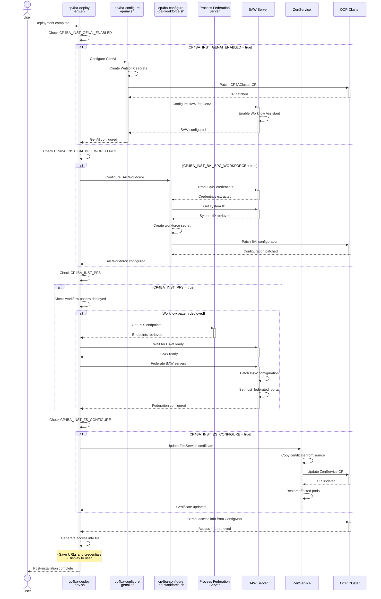

# CP4BA Installation Pipeline Documentation

## Overview

This document describes the automated installation pipeline for IBM Cloud Pak for Business Automation (CP4BA). The pipeline is orchestrated by the main script `cp4ba-one-shot-installation.sh` which coordinates multiple helper scripts to deploy a complete CP4BA environment.

## Main Entry Point

**Script**: `cp4ba-one-shot-installation.sh`

**Purpose**: Orchestrates the complete CP4BA installation process from operators to runtime environment.

**Usage**:
```bash
./cp4ba-one-shot-installation.sh \
  -c <config-file> \
  [-t] \
  [-p <scripts-folder>] \
  [-m] \
  [-v <case-version>] \
  [-k <cert-k8s-version>] \
  [-d <target-folder>]
```

**Parameters**:
- `-c`: Full path to configuration file (required)
- `-t`: Test configuration and exit (optional)
- `-p`: Path to previously installed CP4BA Case Manager scripts (optional)
- `-m`: Install fresh package manager (optional)
- `-v`: Case package manager version (optional)
- `-k`: cert-kubernetes version (optional)
- `-d`: Target folder for case package manager (optional)

## Installation Flow Diagram



## Execution Branches

### Branch 1: Configuration Testing Mode



### Branch 2: Case Package Manager Installation



### Branch 3: Database Deployment Options



### Branch 4: Deployment Type (Starter vs Production)



### Branch 5: Post-Installation Configuration



## Helper Scripts Reference

### 1. cp4ba-install-operators.sh

**Purpose**: Install CP4BA operators in the target namespace

**Key Functions**:
- `checkPrereqTools()`: Verify jq and openssl are installed
- `checkPrereqVars()`: Validate required environment variables
- `storageClassExist()`: Verify storage classes exist in cluster

**Process**:
1. Create namespace if not exists
2. Create ServiceAccount `ibm-cp4ba-anyuid`
3. Add SCC policy to ServiceAccount
4. Execute `cp4a-clusteradmin-setup.sh` from case package
5. Wait for operators to be ready (with retry logic)

**Exit Codes**:
- 0: Success
- 1: Error (operators not installed)

### 2. cp4ba-install-db.sh

**Purpose**: Deploy PostgreSQL database clusters

**Key Functions**:
- `_deployDBClusterEDB()`: Deploy EDB PostgreSQL using operator
- `_deployPostgresNoSSL()`: Deploy open source PostgreSQL without SSL
- `_deployPostgresSSL()`: Deploy open source PostgreSQL with SSL
- `_createDBCertificates()`: Generate SSL certificates for database
- `waitForClustersPostgresCRD()`: Wait for PostgreSQL operator ready

**Database Types**:
1. **EDB PostgreSQL** (default):
   - Operator-managed cluster
   - Uses `Cluster` CR
   - Automatic backup/restore

2. **Open Source PostgreSQL**:
   - StatefulSet deployment
   - Two instances: one without SSL, one with SSL
   - Manual certificate management

**SSL Configuration**:
- CA certificate
- Server certificate with SANs
- Client certificate
- Secrets for BTS, IM, ZEN components

### 3. cp4ba-create-databases.sh

**Purpose**: Create databases and configure users/permissions

**Key Functions**:
- `_generateSQL()`: Generate SQL statements from templates
- `_createDatabases()`: Execute SQL in database pods
- `createDatabases()`: Iterate over configured database instances

**Process**:
1. Generate SQL from template with variable substitution
2. Wait for database pod ready
3. Create tablespace directories in pod
4. Copy SQL file to pod
5. Execute SQL using psql
6. Verify database creation

**SQL Templates**:
- `db-statements-ref-baw.sql`: BAW databases
- `db-statements-ref-content.sql`: Content databases
- `db-statements-ref-wfps.sql`: WFPS databases
- `db-statements-ref-bpmonly.sql`: BPM-only databases
- `db-statements-ref-icn-only.sql`: ICN databases

### 4. cp4ba-deploy-env.sh

**Purpose**: Deploy CP4BA environment and orchestrate deployment phases

**Key Functions**:
- `deployPreEnv()`: Pre-deployment setup (LDAP, secrets)
- `generateCR()`: Generate Custom Resource from template
- `deployEnvironment()`: Apply CR to cluster
- `deployPostEnv()`: Post-deployment setup (databases)
- `deployPFS()`: Deploy Process Federation Server
- `waitDeploymentReadiness()`: Monitor deployment progress
- `federateBawsInDeployment()`: Configure BAW federation
- `postInstallationSteps()`: Configure GenAI and BAI

**Deployment Phases**:

**Phase 1 - Pre-Environment**:
- Deploy LDAP if configured
- Create secrets for production deployments

**Phase 2 - Environment**:
- Generate CR from template
- Validate YAML syntax
- Apply CR to cluster

**Phase 3 - Post-Environment**:
- Deploy database clusters
- Create databases and users

**Phase 4 - PFS**:
- Deploy Process Federation Server if configured

**Phase 5 - Wait for Ready**:
- Monitor CR status
- Check PVC status
- Monitor operator logs
- Generate access info

**Phase 6 - Federation**:
- Configure BAW servers with PFS
- Set host_federated_portal flag

**Phase 7 - Post-Installation**:
- Configure GenAI
- Configure BAI Workforce

### 5. cp4ba-create-secrets.sh

**Purpose**: Create all required Kubernetes secrets

**Key Functions**:
- `createSecretLDAP()`: LDAP connection secret
- `createSecretFNCM()`: FileNet Content Manager secrets
- `createSecretBAN()`: Business Automation Navigator secrets
- `createSecretBAW()`: BAW database secrets
- `createSecretBAS()`: Business Automation Studio secrets
- `createSecretAE()`: Application Engine secrets
- `createSecretADS()`: Automation Decision Services secrets
- `createConfigMapADS()`: ADS trusted certificates
- `createConfigMapBtsImZenForExternalDBs()`: External DB config maps

**Secret Types**:

1. **LDAP Secrets**:
   - Username/password for LDAP connection

2. **Database Secrets**:
   - GCD database credentials
   - Object Store credentials
   - BAW database credentials
   - ICN database credentials

3. **Application Secrets**:
   - Admin username/password
   - LTPA password
   - Keystore password

4. **GenAI Secrets**:
   - WatsonX API key
   - Project ID
   - Provider URL

5. **Certificate Secrets**:
   - SSL certificates for external databases
   - Trusted certificates for ADS

### 6. cp4ba-create-certificates.sh

**Purpose**: Generate SSL certificates for database connections

**Key Functions**:
- `_createDBCertificates()`: Generate CA, server, and client certificates

**Certificate Types**:
1. **CA Certificate**: Root certificate authority
2. **Server Certificate**: For database server with SANs
3. **Client Certificate**: For client authentication

**Configuration**:
- 2048-bit RSA keys
- SHA-256 signing
- 36500 days validity (100 years)
- Subject Alternative Names (SANs) for service discovery

### 7. cp4ba-configure-genai.sh

**Purpose**: Configure GenAI (WatsonX) integration

**Key Functions**:
- `_createWxSecret()`: Create WatsonX authentication secret
- `_createGenAiConfiguration()`: Patch ICP4ACluster for GenAI
- `waitForBawStatefulSetReady()`: Wait for BAW pods ready

**Configuration Steps**:

**For Starter Deployment**:
1. Create WatsonX auth secret
2. Patch bastudio_configuration with GenAI settings
3. Enable Workflow Assistant

**For Production Deployment**:
1. Create custom XML secrets for each BAW
2. Configure GenAI provider URL and project ID
3. Set authentication alias
4. Enable Workflow Assistant
5. Configure Content Security Policy

**GenAI Settings**:
- Provider URL (WatsonX endpoint)
- Project ID
- API Key (in secret)
- Read timeout
- Default foundation model

### 8. cp4ba-configure-bai-workforce.sh

**Purpose**: Configure BAI Business Performance Center Workforce Insights

**Key Functions**:
- `_createBAIWorkforceSecret()`: Create workforce configuration secret
- `_createBAIWorkforceConfiguration()`: Patch ICP4ACluster for BAI

**Configuration Process**:
1. Extract BAW credentials from secrets
2. Get BAW system ID via REST API
3. Get authentication tokens (IAM and ZEN)
4. Create workforce insights secret with BAW connection info
5. Patch ICP4ACluster CR with workforce configuration

**Required Information**:
- BAW URL
- BAW admin credentials
- BAW system ID
- IAM authentication endpoint
- ZEN authentication endpoint

### 9. cp4ba-create-pvc.sh

**Purpose**: Create Persistent Volume Claims for ICN

**PVCs Created**:
1. **icn-pluginstore**: 20Gi, ReadWriteMany
2. **icn-cfgstore**: 20Gi, ReadWriteMany

## Configuration Variables

### Core Variables

| Variable | Description | Required |
|----------|-------------|----------|
| CP4BA_INST_ENV | Environment name | Yes |
| CP4BA_INST_NAMESPACE | Target namespace | Yes |
| CP4BA_INST_TYPE | Deployment type (starter/production) | Yes |
| CP4BA_INST_PLATFORM | Platform type (OCP/ROKS) | Yes |
| CP4BA_INST_APPVER | CP4BA version | Yes |
| CP4BA_INST_CR_NAME | Custom Resource name | Yes |
| CP4BA_INST_CR_TEMPLATE | CR template file path | Yes |

### Storage Variables

| Variable | Description | Required |
|----------|-------------|----------|
| CP4BA_INST_SC_FILE | Storage class for file storage | Yes |
| CP4BA_INST_SC_BLOCK | Storage class for block storage | Yes |

### Database Variables

| Variable | Description | Required |
|----------|-------------|----------|
| CP4BA_INST_DB | Enable database deployment | Yes |
| CP4BA_INST_DB_USE_EDB | Use EDB PostgreSQL (true) or OSS (false) | No |
| CP4BA_INST_DB_INSTANCES | Number of database instances | Yes |
| CP4BA_INST_DB_ONLY_SSL | Use only TLS for DB access | No (if not set use TLS only for External Postgres DB) |
| CP4BA_INST_DB_1_CR_NAME | Database cluster name | Yes |
| CP4BA_INST_DB_1_TEMPLATE | SQL template file | Yes |
| CP4BA_INST_DB_SERVER_PORT | Database port | Yes |
| CP4BA_INST_DB_OWNER | Database owner | Yes |

### LDAP Variables

| Variable | Description | Required |
|----------|-------------|----------|
| CP4BA_INST_LDAP | Enable LDAP deployment | No |
| CP4BA_INST_LDAP_CFG_FILE | LDAP configuration file | If LDAP enabled |
| CP4BA_INST_LDAP_SECRET | LDAP secret name | If LDAP enabled |

### IAM Variables

| Variable | Description | Required |
|----------|-------------|----------|
| CP4BA_INST_IAM | Enable IAM/IDP configuration | No |
| CP4BA_INST_IDP_CFG_FILE | IDP configuration file | If IAM enabled |

### GenAI Variables

| Variable | Description | Required |
|----------|-------------|----------|
| CP4BA_INST_GENAI_ENABLED | Enable GenAI configuration | No |
| CP4BA_INST_GENAI_WX_USERID | WatsonX user ID | If GenAI enabled |
| CP4BA_INST_GENAI_WX_APIKEY | WatsonX API key | If GenAI enabled |
| CP4BA_INST_GENAI_WX_PRJ_ID | WatsonX project ID | If GenAI enabled |
| CP4BA_INST_GENAI_WX_URL_PROVIDER | WatsonX provider URL | If GenAI enabled |

### BAI Variables

| Variable | Description | Required |
|----------|-------------|----------|
| CP4BA_INST_BAI_ENABLE | Enable BAI | No |
| CP4BA_INST_BAI_BPC_WORKFORCE | Enable BPC Workforce | No |
| CP4BA_INST_BAI_BPC_WORKFORCE_SECRET | Workforce secret name | If workforce enabled |

### PFS Variables

| Variable | Description | Required |
|----------|-------------|----------|
| CP4BA_INST_PFS | Enable PFS deployment | No |
| CP4BA_INST_PFS_NAME | PFS instance name | If PFS enabled |
| CP4BA_INST_PFS_NAMESPACE | PFS namespace | If PFS enabled |

## Error Handling

### Common Error Scenarios

1. **Prerequisites Missing**:
   - Error: `jq not installed`
   - Solution: Install jq package

2. **Storage Class Not Found**:
   - Error: `Storage class 'xxx' not present in your OCP cluster`
   - Solution: Verify storage class name or create storage class

3. **Operator Installation Timeout**:
   - Error: `Timeout waiting for CP4BA operator to start`
   - Solution: Script retries once automatically; check operator logs

4. **Database Pod Not Ready**:
   - Error: `DBs NOT configured, check status of pod`
   - Solution: Check pod status and events; verify storage provisioning

5. **CR Validation Failed**:
   - Error: `env var missed in CR`
   - Solution: Check configuration file for missing variables

6. **Secret Creation Failed**:
   - Error: `Secret xxx NOT created`
   - Solution: Verify credentials in configuration file

### Exit Codes

| Code | Meaning |
|------|---------|
| 0 | Success |
| 1 | Error (see error message for details) |

## Monitoring and Verification

### During Installation

The pipeline provides real-time feedback:

```
Wait for CP4BA CRs 'xxx' to be ready ( | ) warnings [0] elapsed time [0h:15m:30s]
```

- **Spinner**: Shows installation is progressing
- **Warnings**: Count of pending PVCs or operator failures
- **Elapsed Time**: Total installation time

### Post-Installation

1. **Check Pod Status**:
```bash
oc get pods -n <namespace>
```

2. **Check CR Status**:
```bash
oc get icp4acluster -n <namespace>
```

3. **Check Access Info**:
```bash
cat output/cp4ba-<cr-name>-<env>-access-info.txt
```

4. **Check Case Initialization** (if not BPM-only):
```bash
oc logs -n <namespace> $(oc get pods -n <namespace> | grep case-init-job | awk '{print $1}')
```

## Typical Installation Timeline

| Phase | Duration | Description |
|-------|----------|-------------|
| Prerequisites Check | 1-2 min | Verify tools and storage classes |
| Case Package Manager | 2-5 min | Download and extract (if -m flag) |
| Operator Installation | 10-20 min | Deploy operators and wait for ready |
| Database Deployment | 5-10 min | Deploy DB clusters and wait for ready |
| Database Creation | 5-10 min | Create databases and configure users |
| CR Deployment | 30-90 min | Deploy CP4BA components |
| PFS Deployment | 5-10 min | Deploy Process Federation Server |
| Post-Configuration | 5-10 min | Configure GenAI and BAI |
| **Total** | **60-150 min** | Complete installation |

*Note: Times vary based on cluster resources and component selection*

## Best Practices

1. **Configuration Management**:
   - Keep configuration files in version control
   - Use descriptive environment names
   - Document custom settings

2. **Resource Planning**:
   - Verify cluster has sufficient resources
   - Check storage class performance
   - Plan namespace strategy

3. **Security**:
   - Use strong passwords in configuration
   - Rotate credentials regularly
   - Limit access to configuration files

4. **Monitoring**:
   - Watch installation progress
   - Check for warnings during deployment
   - Verify all pods are running

5. **Troubleshooting**:
   - Save installation logs
   - Check operator logs for errors
   - Verify network connectivity

6. **Backup**:
   - Backup configuration files
   - Document custom modifications
   - Save generated CRs

## Troubleshooting Guide

### Issue: Operator Installation Fails

**Symptoms**:
- Timeout waiting for operators
- Operator pod in CrashLoopBackOff

**Solutions**:
1. Check operator logs:
```bash
oc logs -n <namespace> $(oc get pods -n <namespace> | grep cp4a-operator | awk '{print $1}')
```

2. Verify catalog source:
```bash
oc get catalogsource -n openshift-marketplace
```

3. Check subscription:
```bash
oc get subscription -n <namespace>
```

### Issue: Database Creation Fails

**Symptoms**:
- SQL execution errors
- Database pod not ready

**Solutions**:
1. Check database pod logs:
```bash
oc logs -n <namespace> <db-pod-name>
```

2. Verify storage provisioning:
```bash
oc get pvc -n <namespace>
```

3. Check SQL statements:
```bash
cat output/cp4ba-<cr-name>-<env>-db-statements-*.sql
```

### Issue: CR Deployment Stuck

**Symptoms**:
- CR status not progressing
- Pods in Pending state

**Solutions**:
1. Check CR status:
```bash
oc describe icp4acluster -n <namespace> <cr-name>
```

2. Check operator logs:
```bash
oc logs -n <namespace> $(oc get pods -n <namespace> | grep cp4a-operator | awk '{print $1}') -c operator
```

3. Check pending PVCs:
```bash
oc get pvc -n <namespace> | grep Pending
```

### Issue: GenAI Configuration Fails

**Symptoms**:
- Workflow Assistant not available
- GenAI features not working

**Solutions**:
1. Verify WatsonX credentials
2. Check secret creation:
```bash
oc get secret -n <namespace> | grep watsonx
```

3. Verify CR patch:
```bash
oc get icp4acluster -n <namespace> <cr-name> -o yaml | grep gen-ai
```

## Appendix A: Script Dependencies

```
cp4ba-one-shot-installation.sh
├── cp4ba-install-operators.sh
│   └── cp4a-clusteradmin-setup.sh (from case package)
├── cp4ba-deploy-env.sh
│   ├── cp4ba-create-secrets.sh
│   ├── cp4ba-install-db.sh
│   │   └── cp4ba-create-certificates.sh
│   ├── cp4ba-create-databases.sh
│   ├── pfs-deploy.sh (optional)
│   ├── cp4ba-configure-genai.sh (optional)
│   └── cp4ba-configure-bai-workforce.sh (optional)
└── onboard-users.sh (optional)
```

## Appendix B: File Structure

```
cp4ba-installations/
├── scripts/
│   ├── cp4ba-one-shot-installation.sh
│   ├── cp4ba-install-operators.sh
│   ├── cp4ba-install-db.sh
│   ├── cp4ba-create-databases.sh
│   ├── cp4ba-deploy-env.sh
│   ├── cp4ba-create-secrets.sh
│   ├── cp4ba-create-certificates.sh
│   ├── cp4ba-create-pvc.sh
│   ├── cp4ba-configure-genai.sh
│   └── cp4ba-configure-bai-workforce.sh
├── configs24/
│   ├── env-template.properties
│   └── env1-*.properties
├── configs25/
│   └── env1-*.properties
├── templates24/
│   └── cp4ba-*.yaml
├── templates25/
│   └── cp4ba-*.yaml
├── templates-sql/
│   └── db-statements-ref-*.sql
├── templates-db-configs/
│   ├── pg-*.yaml
│   └── postgresql*.conf
└── output/
    ├── cp4ba-*-access-info.txt
    └── cp4ba-*-*.sql
```

## Appendix C: Environment Variables Reference

See the configuration template files in `configs*/env-template.properties` for a complete list of available environment variables and their descriptions.

## Appendix D: Version Compatibility

| CP4BA Version | Script Version | PostgreSQL Version | Notes |
|---------------|----------------|-------------------|-------|
| 23.x | configs23 | 13.10 | Legacy |
| 24.x | configs24 | 13.10 | Stable |
| 25.x | configs25 | 14.18 | Current |
| 25.0.1 | configs25.0.1 | 14.18 | Latest |

---

