# CP4BA IDP-LDAP Pipeline Documentation

## Overview

This document provides comprehensive documentation for the CP4BA IDP-LDAP scripts located in `cp4ba-idp-ldap/scripts/`. These scripts manage the installation, configuration, and removal of LDAP servers, Identity Providers (IDP), PHP LDAP Admin interfaces, and user onboarding for IBM Cloud Pak for Business Automation.

## Scripts Summary

| Script | Purpose | Key Operations |
|--------|---------|----------------|
| `add-ldap.sh` | Install LDAP server | Creates namespace, secrets, deployment, and service |
| `add-idp.sh` | Configure IDP | Registers LDAP as identity provider in CP4BA |
| `add-phpadmin.sh` | Deploy PHP LDAP Admin | Installs web UI for LDAP management |
| `onboard-users.sh` | Manage users | Adds/removes users from CP4BA platform |
| `remove-ldap.sh` | Remove LDAP server | Deletes LDAP deployment and resources |
| `remove-idp.sh` | Remove IDP | Unregisters identity provider |
| `remove-phpadmin.sh` | Remove PHP Admin | Deletes PHP LDAP Admin interface |

---

## 1. add-ldap.sh - LDAP Server Installation

### Purpose
Deploys an OpenLDAP server in an OpenShift namespace with custom user data from LDIF files.

### Parameters
- `-c`: Full path to environment configuration file (required)
- `-n`: Target namespace (optional, can be set in config)
- `-p`: Full path to LDAP configuration file (required)

### Main Execution Flow

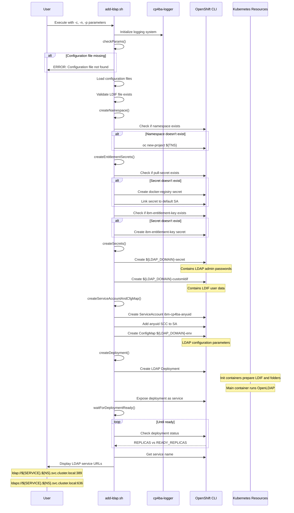

### Key Functions

#### checkParams()
- Validates configuration file exists
- Validates properties file exists
- Validates LDIF file exists (checks multiple paths)
- Validates namespace is set
- Validates entitlement key is set

#### createNamespace()
- Checks if namespace exists using `namespaceExist()`
- Creates new project if needed

#### createEntitlementSecrets()
- Creates `pull-secret` for image pulling
- Creates `ibm-entitlement-key` for IBM registry access
- Links secrets to service accounts

#### createSecrets()
- Creates `${LDAP_DOMAIN}-secret` with admin passwords
- Creates `${LDAP_DOMAIN}-customldif` from LDIF file

#### createServiceAccountAndCfgMap()
- Creates `ibm-cp4ba-anyuid` service account
- Adds `anyuid` security context constraint
- Creates ConfigMap with LDAP environment variables

#### createDeployment()
- Deploys OpenLDAP with init containers:
  - `openldap-init-ldif`: Copies custom LDIF files
  - `folder-prepare-container`: Prepares filesystem folders
- Main container runs OpenLDAP server
- Exposes ports 389 (LDAP) and 636 (LDAPS)

### Execution Branches

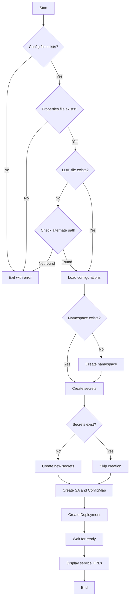

---

## 2. add-idp.sh - Identity Provider Configuration

### Purpose
Registers an LDAP server as an Identity Provider in the CP4BA platform, enabling authentication and user management.

### Parameters
- `-c`: Full path to environment configuration file (required)
- `-p`: Full path to IDP configuration file (required)
- `-f`: Force installation (optional, removes existing IDP)

### Main Execution Flow

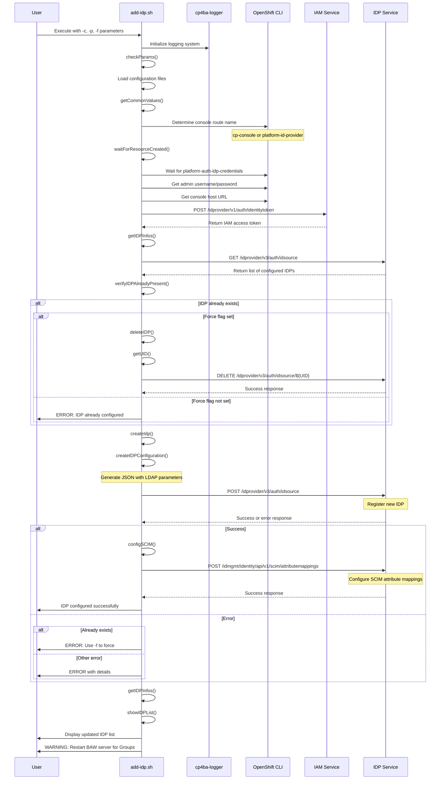

### Key Functions

#### getCommonValues()
- Determines console route name (cp-console or platform-id-provider)
- Waits for `platform-auth-idp-credentials` secret
- Retrieves admin credentials
- Obtains IAM access token for API calls

#### createIDPConfiguration()
- Generates JSON configuration with LDAP parameters:
  - Connection details (URL, host, port, protocol)
  - Bind credentials
  - User and group filters
  - ID mappings
  - Search settings

#### configSCIM()
- Configures SCIM (System for Cross-domain Identity Management) attributes
- Maps LDAP attributes to platform user/group attributes
- Defines object classes and member relationships

#### createIdp()
- Creates IDP configuration JSON
- Posts configuration to IDP service
- Handles error responses
- Calls configSCIM on success

#### verifyIDPAlreadyPresent()
- Checks if IDP name already exists
- If force flag set, deletes existing IDP
- Otherwise exits with error

### Execution Branches

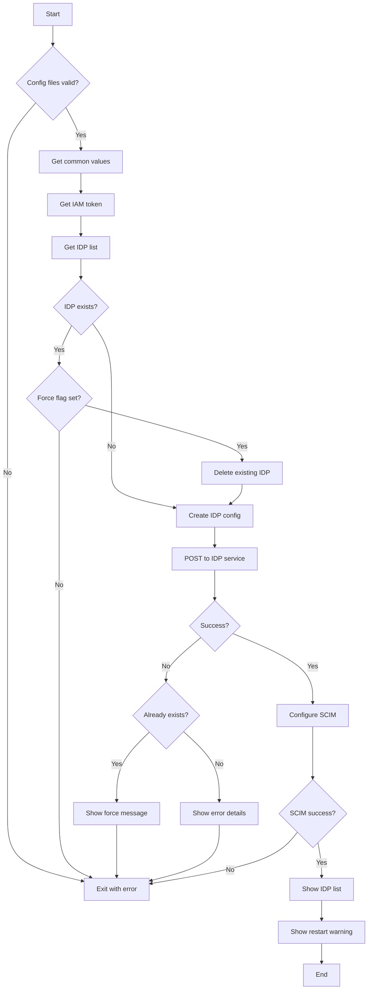

---

## 3. add-phpadmin.sh - PHP LDAP Admin Installation

### Purpose
Deploys phpLDAPadmin web interface for managing LDAP entries through a browser.

### Parameters
- `-p`: Full path to LDAP configuration file (required)
- `-n`: Target namespace (required)
- `-s`: Secret name for TLS certificates (required)
- `-w`: Web UI secret name for TLS certificates (required)

### Main Execution Flow

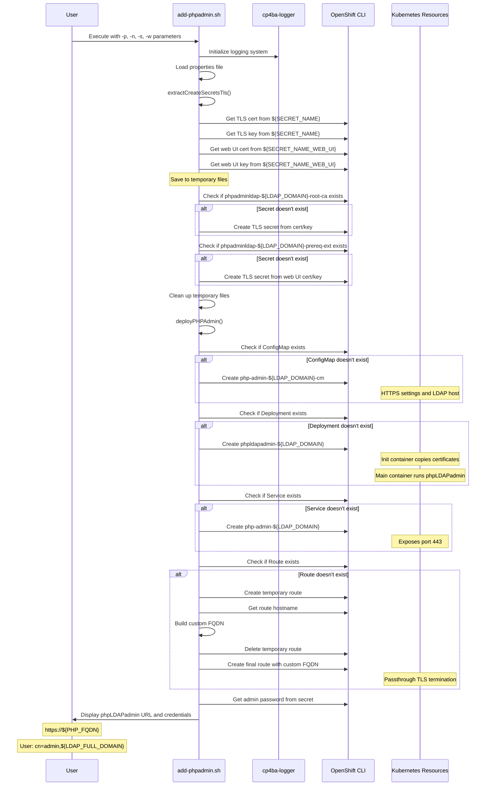

### Key Functions

#### extractCreateSecretsTls()
- Extracts TLS certificates from existing secrets
- Creates temporary cert/key files
- Creates two new secrets:
  - `phpadminldap-${LDAP_DOMAIN}-root-ca`: Root CA certificate
  - `phpadminldap-${LDAP_DOMAIN}-prereq-ext`: Web UI certificate
- Cleans up temporary files

#### deployPHPAdmin()
- Creates ConfigMap with phpLDAPadmin settings
- Deploys phpLDAPadmin with:
  - Init container to prepare certificates
  - Main container running phpLDAPadmin
  - Volume mounts for certificates
- Creates Service on port 443
- Creates Route with custom FQDN and passthrough TLS

### Execution Branches

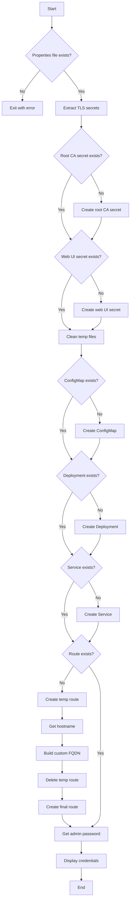

---

## 4. onboard-users.sh - User Management

### Purpose
Manages user onboarding in the CP4BA platform by adding, removing, or updating users from LDAP.

### Parameters
- `-p`: Full path to properties file (required)
- `-l`: Full path to LDAP configuration file (optional)
- `-n`: LDAP namespace (optional)
- `-e`: Environment namespace (required)
- `-u`: Users file path (required if not using -s)
- `-o`: Operation mode: add, remove, remove-and-add (required)
- `-s`: Load users from secret instead of file (optional)
- `-r`: List available roles and groups (optional)

### Main Execution Flow

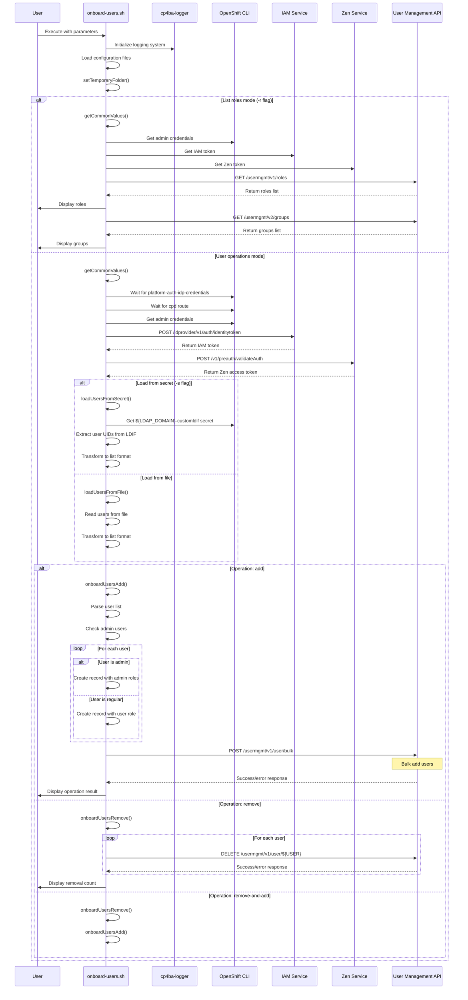

### Key Functions

#### setTemporaryFolder()
- Validates temporary folder exists and is writable
- Uses `CP4BA_INST_TMP_FOLDER` environment variable or defaults to `/tmp`

#### getCommonValues()
- Determines console route name
- Waits for required secrets and routes
- Retrieves admin credentials
- Obtains IAM and Zen access tokens

#### loadUsersFromSecret()
- Extracts LDIF data from Kubernetes secret
- Parses user UIDs from LDIF format
- Transforms to internal list format

#### loadUsersFromFile()
- Reads users from specified file
- Transforms to internal list format

#### onboardUsersAdd()
- Parses user list
- Checks against admin list from configuration
- Creates user records with appropriate roles:
  - Admins: Multiple roles including zen_administrator_role
  - Regular users: zen_user_role only
- Bulk posts to user management API

#### onboardUsersRemove()
- Iterates through user list
- Deletes each user individually via API
- Handles errors for non-existent users

### Execution Branches

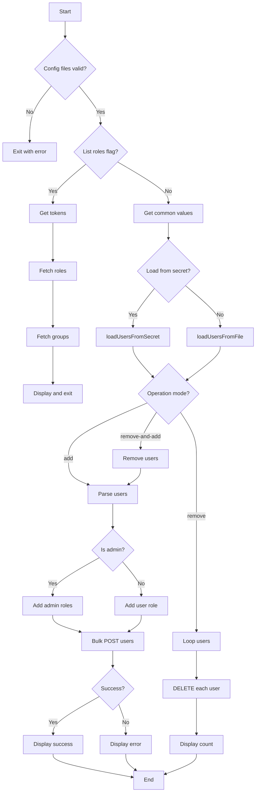

---

## 5. remove-ldap.sh - LDAP Server Removal

### Purpose
Removes LDAP server deployment and associated resources from OpenShift namespace.

### Parameters
- `-p`: Full path to LDAP properties file (required)
- `-n`: Target namespace (optional, can be set in config)

### Main Execution Flow

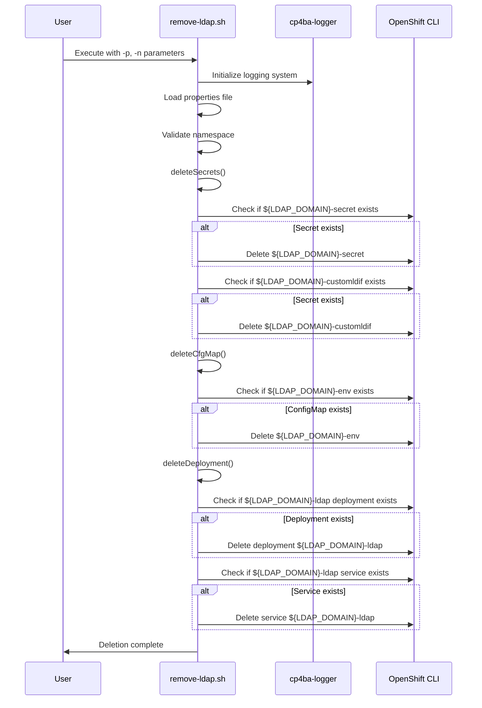

### Key Functions

#### deleteSecrets()
- Checks and deletes `${LDAP_DOMAIN}-secret`
- Checks and deletes `${LDAP_DOMAIN}-customldif`

#### deleteCfgMap()
- Checks and deletes `${LDAP_DOMAIN}-env` ConfigMap

#### deleteDeployment()
- Checks and deletes LDAP deployment
- Checks and deletes LDAP service

### Execution Branches

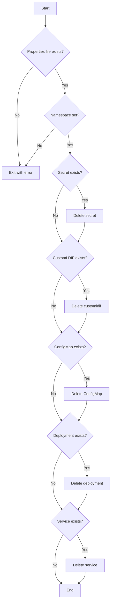

---

## 6. remove-idp.sh - Identity Provider Removal

### Purpose
Unregisters an Identity Provider from the CP4BA platform.

### Parameters
- `-p`: Full path to IDP properties file (required)
- `-n`: Target namespace (optional, can be set in config)

### Main Execution Flow

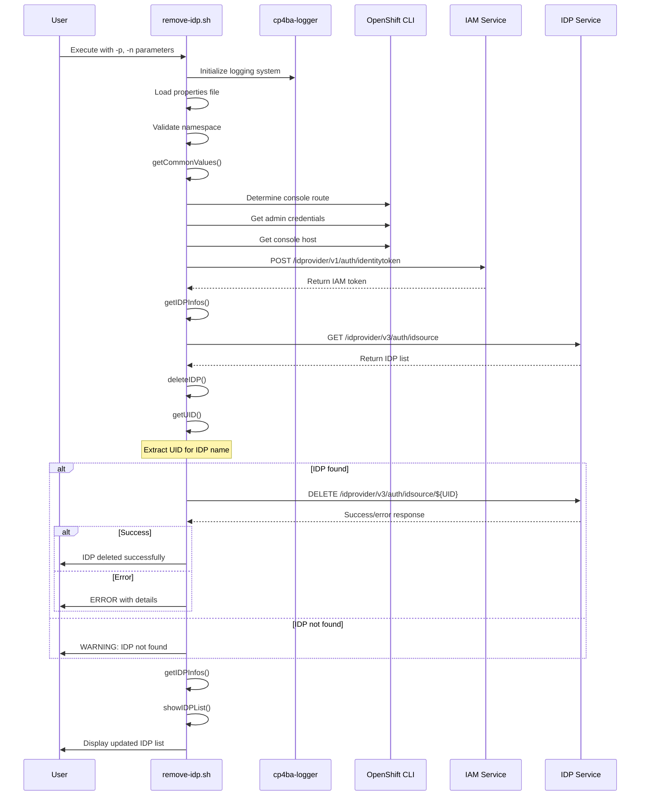

### Key Functions

#### getCommonValues()
- Determines console route name
- Retrieves admin credentials
- Obtains IAM access token

#### getIDPInfos()
- Fetches list of configured IDPs
- Extracts IDP names

#### getUID()
- Searches IDP list for matching name
- Returns UID for deletion

#### deleteIDP()
- Gets IDP UID
- Sends DELETE request to IDP service
- Handles success/error responses

### Execution Branches

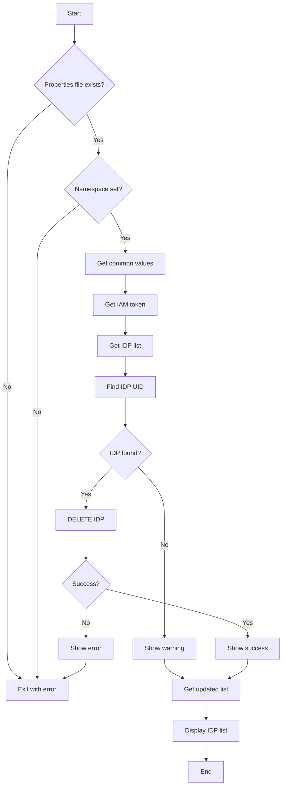

---

## 7. remove-phpadmin.sh - PHP LDAP Admin Removal

### Purpose
Removes phpLDAPadmin web interface and associated resources.

### Parameters
- `-p`: Full path to LDAP properties file (required)
- `-n`: Target namespace (optional, can be set in config)

### Main Execution Flow

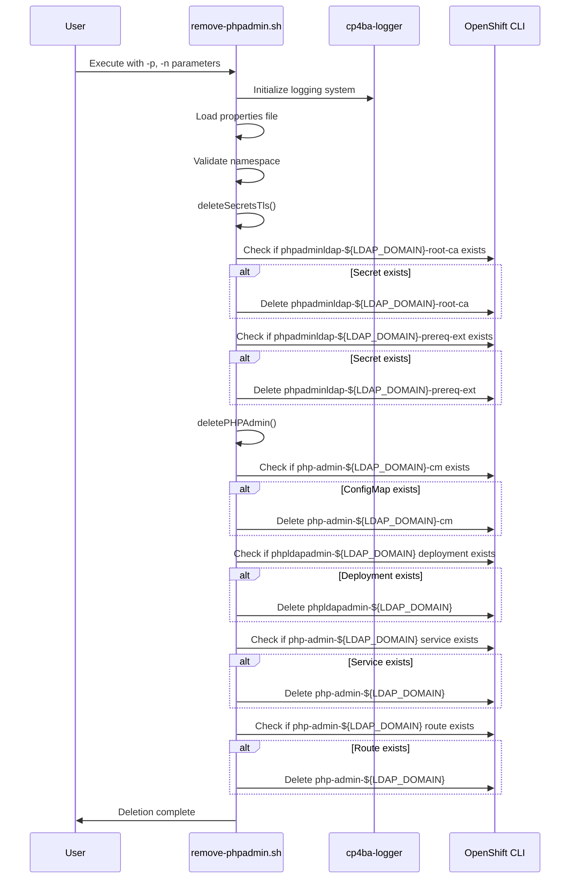

### Key Functions

#### deleteSecretsTls()
- Checks and deletes `phpadminldap-${LDAP_DOMAIN}-root-ca`
- Checks and deletes `phpadminldap-${LDAP_DOMAIN}-prereq-ext`

#### deletePHPAdmin()
- Checks and deletes ConfigMap
- Checks and deletes Deployment
- Checks and deletes Service
- Checks and deletes Route

### Execution Branches

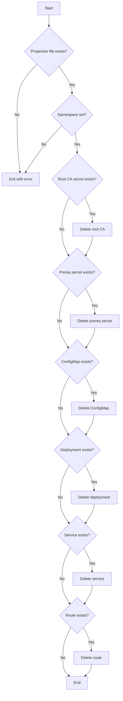

---

## Common Patterns and Dependencies

### Logger Integration

All scripts integrate with the `cp4ba-logger` package:

```bash
source $_SCRIPT_DIR/../../cp4ba-logger/scripts/logger.sh
```

Environment variables for logging:
- `CP4BA_LOGGING_ENABLED`: Enable/disable logging (default: true)
- `CP4BA_LOG_LEVEL`: Log level (default: INFO)
- `CP4BA_LOG_TO_CONSOLE`: Console output (default: true)
- `CP4BA_LOG_TO_FILE`: File output (default: false)
- `CP4BA_LOG_FILE`: Log file path
- `CP4BA_LOG_MAX_SIZE`: Max log file size (default: 10MB)
- `CP4BA_LOG_BACKUP_COUNT`: Number of backup files (default: 5)

### Resource Existence Check

Common function pattern:
```bash
resourceExist () {
  if [ $(oc get $2 -n $1 $3 2> /dev/null | grep $3 | wc -l) -lt 1 ]; then
    return 0  # Resource doesn't exist
  fi
  return 1    # Resource exists
}
```

### Color Codes

All scripts use consistent color coding:
- `_CLR_RED`: Error messages
- `_CLR_GREEN`: Success messages and labels
- `_CLR_YELLOW`: Values and highlights
- `_CLR_BLUE`: Information
- `_CLR_NC`: Reset color

---

## Typical Installation Workflow

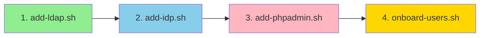

### Step-by-Step Process

1. **Install LDAP Server** (`add-ldap.sh`)
   - Creates namespace and secrets
   - Deploys OpenLDAP with custom users
   - Exposes LDAP service

2. **Configure Identity Provider** (`add-idp.sh`)
   - Registers LDAP as IDP in CP4BA
   - Configures SCIM mappings
   - Enables authentication

3. **Deploy PHP Admin** (`add-phpadmin.sh`)
   - Installs web management interface
   - Configures TLS certificates
   - Creates accessible route

4. **Onboard Users** (`onboard-users.sh`)
   - Adds users to CP4BA platform
   - Assigns roles and permissions
   - Enables user access

---

## Typical Removal Workflow

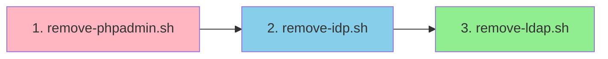

### Removal Order

1. **Remove PHP Admin** (`remove-phpadmin.sh`)
   - Removes web interface
   - Cleans up routes and services

2. **Remove Identity Provider** (`remove-idp.sh`)
   - Unregisters IDP from CP4BA
   - Removes authentication configuration

3. **Remove LDAP Server** (`remove-ldap.sh`)
   - Deletes LDAP deployment
   - Removes secrets and ConfigMaps

---

## Configuration Files

### Environment Configuration
Typically contains:
- `TNS`: Target namespace
- `ENTITLEMENT_KEY`: IBM entitlement key

### LDAP Configuration
Typically contains:
- `LDAP_DOMAIN`: Domain name
- `LDAP_DOMAIN_EXT`: Domain extension
- `LDAP_HOST`: LDAP server host
- `LDAP_PORT`: LDAP server port
- `LDAP_PROTOCOL`: Protocol (ldap/ldaps)
- `LDAP_BASEDN`: Base DN
- `LDAP_BINDDN`: Bind DN
- `LDAP_BINDPASSWORD`: Bind password
- `LDAP_USERFILTER`: User filter
- `LDAP_USERIDMAP`: User ID mapping
- `LDAP_GROUPFILTER`: Group filter
- `LDAP_GROUPIDMAP`: Group ID mapping
- `LDAP_GROUPMEMBERIDMAP`: Group member mapping
- `LDAP_NESTEDSEARCH`: Nested search setting
- `LDAP_PAGINGSEARCH`: Paging search setting
- `LDAP_LDIF_NAME`: LDIF file name
- `LDAP_ADMINS`: Comma-separated admin users

### IDP Configuration
Typically contains:
- `IDP_NAME`: Identity provider name
- All LDAP configuration parameters

---

## Error Handling

All scripts implement consistent error handling:

1. **Parameter Validation**
   - Check required parameters
   - Validate file existence
   - Verify namespace settings

2. **Resource Checks**
   - Verify resources before operations
   - Handle existing resources gracefully
   - Provide clear error messages

3. **API Response Handling**
   - Check for error responses
   - Parse and display error details
   - Exit with appropriate codes

4. **Logging**
   - Use color-coded messages
   - Provide context for operations
   - Display success/failure clearly

---

## Best Practices

1. **Always use configuration files** instead of hardcoding values
2. **Check resource existence** before creation or deletion
3. **Wait for resources** to be ready before proceeding
4. **Use force flags carefully** when overwriting existing resources
5. **Follow the installation order** for proper setup
6. **Follow the removal order** for clean uninstallation
7. **Verify credentials** after installation
8. **Restart BAW server** after IDP configuration to see groups

---

## Troubleshooting

### Common Issues

1. **LDAP not accessible**
   - Check deployment status
   - Verify service creation
   - Check network policies

2. **IDP registration fails**
   - Verify LDAP is running
   - Check LDAP connection parameters
   - Ensure IAM token is valid

3. **Users not appearing**
   - Verify IDP is configured
   - Check SCIM mappings
   - Restart BAW server

4. **PHP Admin not accessible**
   - Check route creation
   - Verify TLS certificates
   - Check deployment logs

### Debug Commands

```bash
# Check LDAP deployment
oc get deployment -n ${TNS} ${LDAP_DOMAIN}-ldap

# Check LDAP logs
oc logs -n ${TNS} deployment/${LDAP_DOMAIN}-ldap

# Test LDAP connection
ldapsearch -x -H ldap://${LDAP_HOST}:389 -b "${LDAP_BASEDN}"

# Check IDP configuration
curl -sk -H "Authorization: Bearer ${IAM_TOKEN}" \
  ${CONSOLE_HOST}/idprovider/v3/auth/idsource

# Check user list
curl -sk -H "Authorization: Bearer ${ZEN_TOKEN}" \
  ${PAK_HOST}/usermgmt/v1/usermgmt/users
```

---

## Summary

This pipeline provides a complete solution for:
- Deploying LDAP servers in OpenShift
- Integrating LDAP with CP4BA as an Identity Provider
- Managing LDAP through a web interface
- Onboarding and managing users
- Clean removal of all components

All scripts follow consistent patterns, use proper error handling, and integrate with the logging framework for operational visibility.