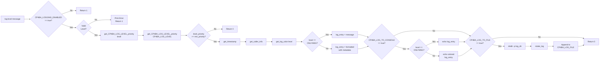
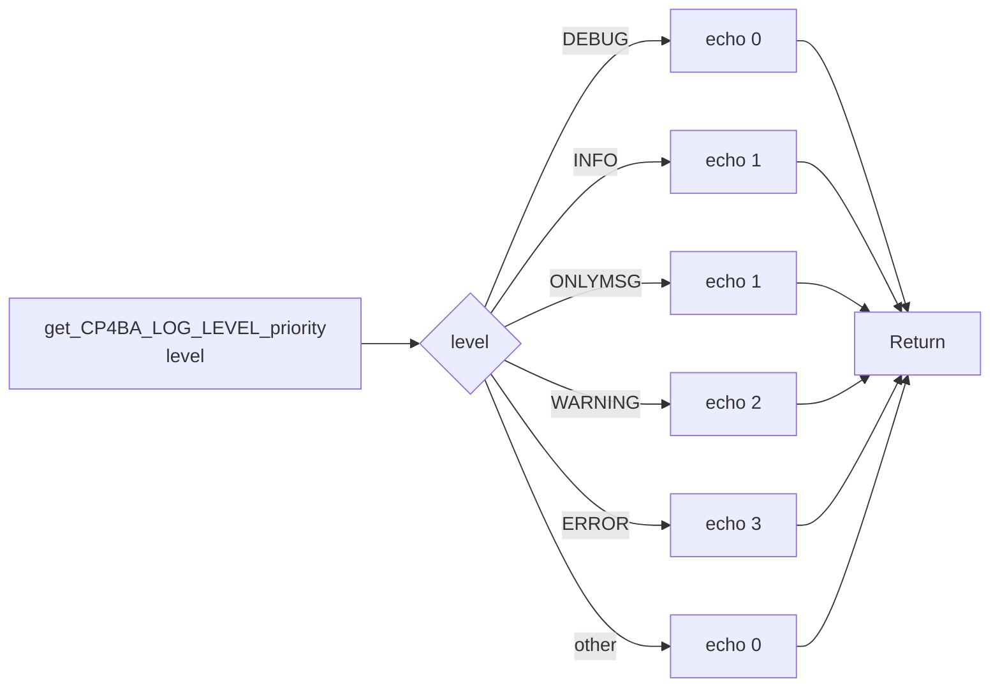
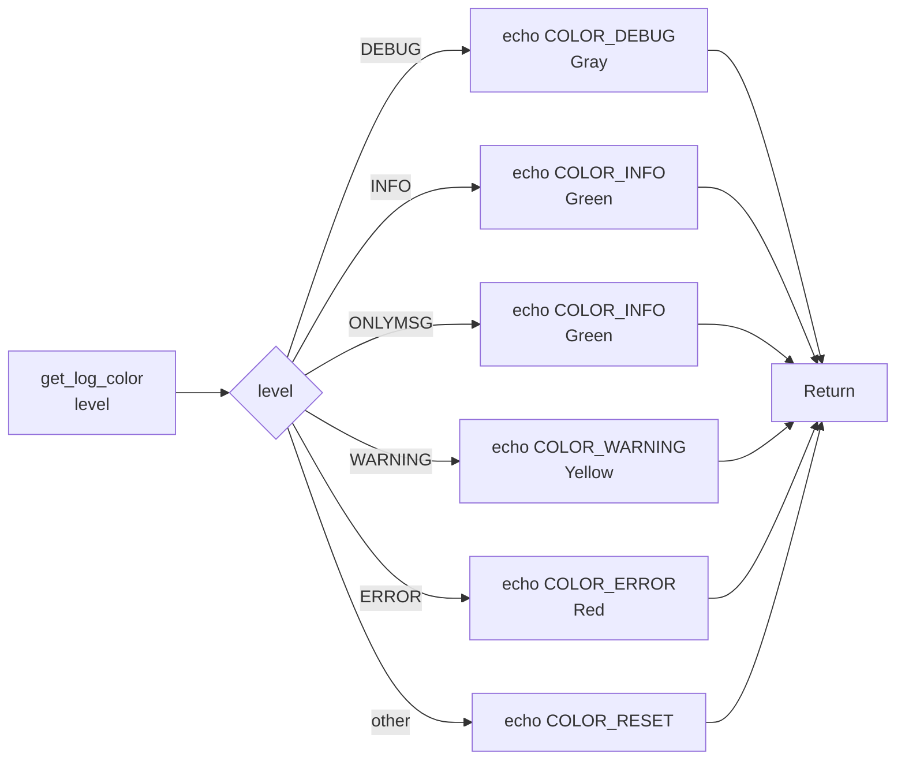
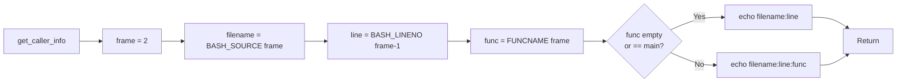
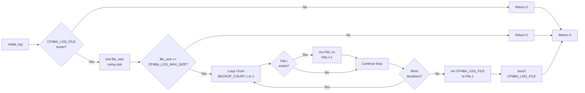
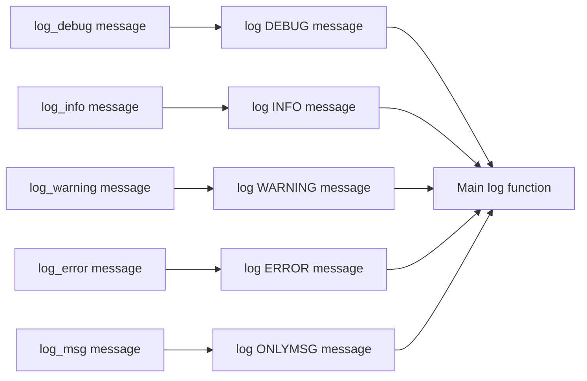
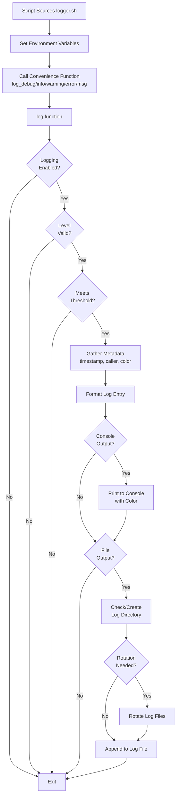

# CP4BA Logger Script Documentation

## Overview

The [`logger.sh`](../cp4ba-logger/scripts/logger.sh) script provides an advanced logging system for bash scripts with multiple log levels, colored console output, file logging, and automatic log rotation capabilities.

**Version:** 1.0  
**Date:** 2026-04-29

---

## Table of Contents

1. [Features](#features)
2. [Environment Variables](#environment-variables)
3. [Functions Reference](#functions-reference)
4. [Usage Guide](#usage-guide)
5. [Execution Flow Diagrams](#execution-flow-diagrams)
6. [Examples](#examples)

---

## Features

- ✅ **Enable/Disable Logging**: Master switch via `CP4BA_LOGGING_ENABLED` variable
- ✅ **Multiple Log Levels**: DEBUG, INFO, WARNING, ERROR, ONLYMSG
- ✅ **Colored Console Output**: ANSI color codes for better readability
- ✅ **File Output**: Optional logging to file with configurable path
- ✅ **Automatic Log Rotation**: Based on file size with configurable backup count
- ✅ **ISO 8601 Timestamps**: Standard timestamp formatting
- ✅ **Caller Information**: Automatic tracking of calling function/line

---

## Environment Variables

### Configuration Variables

All environment variables should be exported before sourcing the logger script or set in your script before calling logging functions.

| Variable | Type | Default | Description |
|----------|------|---------|-------------|
| `CP4BA_LOGGING_ENABLED` | boolean | `false` | Master switch to enable/disable all logging. Set to `"true"` to enable, `"false"` to disable. |
| `CP4BA_LOG_LEVEL` | string | `"INFO"` | Minimum log level to display/record. Options: `DEBUG`, `INFO`, `WARNING`, `ERROR`. Only messages at this level or higher will be logged. |
| `CP4BA_LOG_TO_CONSOLE` | boolean | `true` | Enable/disable console output. Set to `"true"` to output to console. |
| `CP4BA_LOG_TO_FILE` | boolean | `false` | Enable/disable file output. Set to `"true"` to write logs to file. |
| `CP4BA_LOG_FILE` | string | `""` | Log file path (will be created if it doesn't exist). Example: `"./application.log"` |
| `CP4BA_LOG_MAX_SIZE` | integer | `10485760` | Maximum log file size in bytes before rotation (default: 10MB = 10 * 1024 * 1024). |
| `CP4BA_LOG_BACKUP_COUNT` | integer | `5` | Number of rotated log files to keep. |

### Color Constants (Read-Only)

These constants are defined in the script and cannot be modified:

| Constant | Value | Description |
|----------|-------|-------------|
| `COLOR_RESET` | `'\033[0m'` | Reset color to default |
| `COLOR_DEBUG` | `'\033[0;37m'` | Gray color for DEBUG messages |
| `COLOR_INFO` | `'\033[0;32m'` | Green color for INFO messages |
| `COLOR_WARNING` | `'\033[0;33m'` | Yellow color for WARNING messages |
| `COLOR_ERROR` | `'\033[0;31m'` | Red color for ERROR messages |
| `COLOR_BOLD` | `'\033[1m'` | Bold text formatting |

### How to Use Environment Variables

#### Method 1: Export Before Sourcing

```bash
# Set environment variables
export CP4BA_LOGGING_ENABLED=true
export CP4BA_LOG_LEVEL="DEBUG"
export CP4BA_LOG_TO_CONSOLE=true
export CP4BA_LOG_TO_FILE=true
export CP4BA_LOG_FILE="./logs/myapp.log"
export CP4BA_LOG_MAX_SIZE=$((5 * 1024 * 1024))  # 5MB
export CP4BA_LOG_BACKUP_COUNT=3

# Source the logger script
source ./cp4ba-logger/scripts/logger.sh

# Use logging functions
log_info "Application started"
```

#### Method 2: Set in Script

```bash
#!/bin/bash

# Source the logger script first
source ./cp4ba-logger/scripts/logger.sh

# Configure logging
CP4BA_LOGGING_ENABLED=true
CP4BA_LOG_LEVEL="INFO"
CP4BA_LOG_TO_CONSOLE=true
CP4BA_LOG_TO_FILE=true
CP4BA_LOG_FILE="./application.log"

# Use logging functions
log_info "Configuration loaded"
```

#### Method 3: Runtime Configuration

```bash
#!/bin/bash

source ./cp4ba-logger/scripts/logger.sh

# Enable logging dynamically
CP4BA_LOGGING_ENABLED=true
log_info "Logging enabled"

# Disable logging temporarily
CP4BA_LOGGING_ENABLED=false
log_info "This won't be logged"

# Re-enable logging
CP4BA_LOGGING_ENABLED=true
log_info "Logging re-enabled"
```

---

## Functions Reference

### Helper Functions

#### `get_CP4BA_LOG_LEVEL_priority()`

**Description:** Returns numeric priority for log level comparison.

**Parameters:**
- `$1` - Log level (DEBUG, INFO, WARNING, ERROR, ONLYMSG)

**Returns:** Numeric priority (0-3)
- DEBUG: 0
- INFO/ONLYMSG: 1
- WARNING: 2
- ERROR: 3

**Usage:**
```bash
priority=$(get_CP4BA_LOG_LEVEL_priority "INFO")
echo $priority  # Output: 1
```

---

#### `get_log_color()`

**Description:** Returns ANSI color code for the specified log level.

**Parameters:**
- `$1` - Log level (DEBUG, INFO, WARNING, ERROR, ONLYMSG)

**Returns:** ANSI color code string

**Usage:**
```bash
color=$(get_log_color "ERROR")
echo -e "${color}This is red text${COLOR_RESET}"
```

---

#### `get_timestamp()`

**Description:** Returns current timestamp in ISO 8601 format.

**Parameters:** None

**Returns:** Timestamp string (YYYY-MM-DDTHH:MM:SS+TZ)

**Usage:**
```bash
timestamp=$(get_timestamp)
echo $timestamp  # Output: 2026-05-13T12:30:45+0200
```

---

#### `get_caller_info()`

**Description:** Returns information about the calling function/line.

**Parameters:** None

**Returns:** String with filename:line or filename:line:function

**Usage:**
```bash
caller=$(get_caller_info)
echo $caller  # Output: myscript.sh:42:my_function
```

---

#### `rotate_log()`

**Description:** Rotates log files when size limit is exceeded. Moves current log to `.1`, shifts existing backups, and removes oldest if backup count exceeded.

**Parameters:** None (uses global variables)

**Global Variables Used:**
- `CP4BA_LOG_FILE` - Path to current log file
- `CP4BA_LOG_MAX_SIZE` - Maximum size before rotation
- `CP4BA_LOG_BACKUP_COUNT` - Number of backups to keep

**Rotation Process:**
1. Check if log file exists and size exceeds `CP4BA_LOG_MAX_SIZE`
2. Shift existing backups: `.1` → `.2`, `.2` → `.3`, etc.
3. Move current log to `.1`
4. Create new empty log file

**Usage:**
```bash
# Called automatically by log() function
# Can also be called manually if needed
rotate_log
```

---

### Main Logging Function

#### `log()`

**Description:** Main logging function with level filtering, coloring, and output routing.

**Parameters:**
- `$1` - Log level (DEBUG, INFO, WARNING, ERROR, ONLYMSG)
- `$2` - Log message

**Returns:**
- `0` on success
- `1` if logging is disabled or invalid level

**Behavior:**
1. Checks if logging is enabled via `CP4BA_LOGGING_ENABLED`
2. Validates log level
3. Filters messages based on `CP4BA_LOG_LEVEL` threshold
4. Builds log entry with timestamp and caller info (except for ONLYMSG)
5. Outputs to console with color if `CP4BA_LOG_TO_CONSOLE=true`
6. Outputs to file if `CP4BA_LOG_TO_FILE=true`
7. Performs log rotation if needed

**Log Entry Format:**
- Standard: `[TIMESTAMP] [LEVEL] [CALLER] MESSAGE`
- ONLYMSG: `MESSAGE` (no metadata)

**Usage:**
```bash
log "INFO" "Application started successfully"
log "ERROR" "Failed to connect to database"
log "ONLYMSG" "Simple message without metadata"
```

---

### Convenience Wrapper Functions

#### `log_debug()`

**Description:** Log a DEBUG level message.

**Parameters:**
- `$1` - Log message

**Usage:**
```bash
log_debug "Variable x = $x"
log_debug "Entering function process_data()"
```

---

#### `log_info()`

**Description:** Log an INFO level message.

**Parameters:**
- `$1` - Log message

**Usage:**
```bash
log_info "Configuration loaded successfully"
log_info "Processing 100 records"
```

---

#### `log_warning()`

**Description:** Log a WARNING level message.

**Parameters:**
- `$1` - Log message

**Usage:**
```bash
log_warning "Deprecated function called"
log_warning "Disk space running low: 85% used"
```

---

#### `log_error()`

**Description:** Log an ERROR level message.

**Parameters:**
- `$1` - Log message

**Usage:**
```bash
log_error "Failed to connect to database"
log_error "Invalid configuration file format"
```

---

#### `log_msg()`

**Description:** Log a message without metadata (timestamp, level, caller info).

**Parameters:**
- `$1` - Log message

**Usage:**
```bash
log_msg "========================================="
log_msg "Application Name v1.0"
log_msg "========================================="
```

---

## Usage Guide

### Basic Setup

1. **Source the script in your bash script:**

```bash
#!/bin/bash

# Source the logger
source ./cp4ba-logger/scripts/logger.sh

# Configure logging
export CP4BA_LOGGING_ENABLED=true
export CP4BA_LOG_LEVEL="INFO"
export CP4BA_LOG_TO_CONSOLE=true
```

2. **Use the convenience functions:**

```bash
log_info "Starting application"
log_debug "Debug information"
log_warning "Warning message"
log_error "Error occurred"
```

### Advanced Configuration

#### Console-Only Logging

```bash
export CP4BA_LOGGING_ENABLED=true
export CP4BA_LOG_LEVEL="DEBUG"
export CP4BA_LOG_TO_CONSOLE=true
export CP4BA_LOG_TO_FILE=false
```

#### File-Only Logging

```bash
export CP4BA_LOGGING_ENABLED=true
export CP4BA_LOG_LEVEL="INFO"
export CP4BA_LOG_TO_CONSOLE=false
export CP4BA_LOG_TO_FILE=true
export CP4BA_LOG_FILE="./logs/application.log"
```

#### Both Console and File Logging

```bash
export CP4BA_LOGGING_ENABLED=true
export CP4BA_LOG_LEVEL="INFO"
export CP4BA_LOG_TO_CONSOLE=true
export CP4BA_LOG_TO_FILE=true
export CP4BA_LOG_FILE="./logs/application.log"
export CP4BA_LOG_MAX_SIZE=$((10 * 1024 * 1024))  # 10MB
export CP4BA_LOG_BACKUP_COUNT=5
```

#### Production vs Development Settings

**Development:**
```bash
export CP4BA_LOGGING_ENABLED=true
export CP4BA_LOG_LEVEL="DEBUG"
export CP4BA_LOG_TO_CONSOLE=true
export CP4BA_LOG_TO_FILE=true
export CP4BA_LOG_FILE="./logs/dev.log"
```

**Production:**
```bash
export CP4BA_LOGGING_ENABLED=true
export CP4BA_LOG_LEVEL="WARNING"
export CP4BA_LOG_TO_CONSOLE=false
export CP4BA_LOG_TO_FILE=true
export CP4BA_LOG_FILE="/var/log/myapp/production.log"
export CP4BA_LOG_MAX_SIZE=$((50 * 1024 * 1024))  # 50MB
export CP4BA_LOG_BACKUP_COUNT=10
```

---

## Execution Flow Diagrams

### 1. Main Log Function Flow



### 2. get_CP4BA_LOG_LEVEL_priority Function Flow



### 3. get_log_color Function Flow



### 4. get_timestamp Function Flow


### 5. get_caller_info Function Flow



### 6. rotate_log Function Flow



### 7. Convenience Functions Flow



### 8. Complete Execution Flow (High-Level)



---

## Examples

### Example 1: Simple Console Logging

```bash
#!/bin/bash

source ./cp4ba-logger/scripts/logger.sh

# Enable console logging only
export CP4BA_LOGGING_ENABLED=true
export CP4BA_LOG_LEVEL="INFO"
export CP4BA_LOG_TO_CONSOLE=true
export CP4BA_LOG_TO_FILE=false

log_info "Application started"
log_debug "This won't appear (below INFO level)"
log_warning "This is a warning"
log_error "This is an error"
```

**Output:**
```
[2026-05-13T12:30:45+0200] [INFO] [script.sh:10] Application started
[2026-05-13T12:30:45+0200] [WARNING] [script.sh:12] This is a warning
[2026-05-13T12:30:45+0200] [ERROR] [script.sh:13] This is an error
```

### Example 2: File Logging with Rotation

```bash
#!/bin/bash

source ./cp4ba-logger/scripts/logger.sh

# Configure file logging with rotation
export CP4BA_LOGGING_ENABLED=true
export CP4BA_LOG_LEVEL="DEBUG"
export CP4BA_LOG_TO_CONSOLE=false
export CP4BA_LOG_TO_FILE=true
export CP4BA_LOG_FILE="./logs/app.log"
export CP4BA_LOG_MAX_SIZE=$((1 * 1024 * 1024))  # 1MB
export CP4BA_LOG_BACKUP_COUNT=3

for i in {1..1000}; do
    log_info "Processing record $i"
    log_debug "Details for record $i"
done

log_info "Processing complete"
```

**Result:**
- Creates `./logs/app.log`
- When file reaches 1MB, rotates to `app.log.1`
- Keeps up to 3 backup files: `app.log.1`, `app.log.2`, `app.log.3`

### Example 3: Mixed Output (Console + File)

```bash
#!/bin/bash

source ./cp4ba-logger/scripts/logger.sh

# Enable both console and file output
export CP4BA_LOGGING_ENABLED=true
export CP4BA_LOG_LEVEL="INFO"
export CP4BA_LOG_TO_CONSOLE=true
export CP4BA_LOG_TO_FILE=true
export CP4BA_LOG_FILE="./logs/deployment.log"

log_msg "========================================="
log_msg "CP4BA Deployment Script"
log_msg "========================================="

log_info "Starting deployment process"
log_info "Checking prerequisites..."

if ! command -v oc &> /dev/null; then
    log_error "OpenShift CLI (oc) not found"
    exit 1
fi

log_info "Prerequisites check passed"
log_info "Deploying components..."
log_warning "This may take several minutes"

# Deployment logic here...

log_info "Deployment completed successfully"
```

### Example 4: Dynamic Log Level Control

```bash
#!/bin/bash

source ./cp4ba-logger/scripts/logger.sh

export CP4BA_LOGGING_ENABLED=true
export CP4BA_LOG_TO_CONSOLE=true

# Start with INFO level
export CP4BA_LOG_LEVEL="INFO"
log_info "Application started"
log_debug "This won't appear"

# Switch to DEBUG for troubleshooting
export CP4BA_LOG_LEVEL="DEBUG"
log_debug "Now debug messages appear"
log_info "Processing data..."

# Switch to ERROR only for critical sections
export CP4BA_LOG_LEVEL="ERROR"
log_info "This won't appear"
log_warning "This won't appear either"
log_error "Only errors appear now"

# Back to INFO
export CP4BA_LOG_LEVEL="INFO"
log_info "Application finished"
```

### Example 5: Function with Logging

```bash
#!/bin/bash

source ./cp4ba-logger/scripts/logger.sh

export CP4BA_LOGGING_ENABLED=true
export CP4BA_LOG_LEVEL="DEBUG"
export CP4BA_LOG_TO_CONSOLE=true

process_file() {
    local filename="$1"
    
    log_debug "Entering process_file with filename: $filename"
    
    if [[ ! -f "$filename" ]]; then
        log_error "File not found: $filename"
        return 1
    fi
    
    log_info "Processing file: $filename"
    
    local line_count
    line_count=$(wc -l < "$filename")
    log_info "File contains $line_count lines"
    
    if [[ $line_count -eq 0 ]]; then
        log_warning "File is empty: $filename"
        return 0
    fi
    
    # Process file...
    log_info "File processed successfully: $filename"
    log_debug "Exiting process_file"
    
    return 0
}

# Use the function
process_file "data.txt"
```

**Output:**
```
[2026-05-13T12:30:45+0200] [DEBUG] [script.sh:10:process_file] Entering process_file with filename: data.txt
[2026-05-13T12:30:45+0200] [INFO] [script.sh:17:process_file] Processing file: data.txt
[2026-05-13T12:30:45+0200] [INFO] [script.sh:21:process_file] File contains 150 lines
[2026-05-13T12:30:45+0200] [INFO] [script.sh:29:process_file] File processed successfully: data.txt
[2026-05-13T12:30:45+0200] [DEBUG] [script.sh:30:process_file] Exiting process_file
```

### Example 6: Conditional Logging

```bash
#!/bin/bash

source ./cp4ba-logger/scripts/logger.sh

# Disable logging in production
if [[ "$ENVIRONMENT" == "production" ]]; then
    export CP4BA_LOGGING_ENABLED=false
else
    export CP4BA_LOGGING_ENABLED=true
    export CP4BA_LOG_LEVEL="DEBUG"
    export CP4BA_LOG_TO_CONSOLE=true
fi

log_info "This only appears in non-production environments"
```

---

## Best Practices

1. **Always check return values for critical operations:**
   ```bash
   if ! log_error "Critical failure"; then
       echo "Logging failed!" >&2
   fi
   ```

2. **Use appropriate log levels:**
   - `DEBUG`: Detailed diagnostic information
   - `INFO`: General informational messages
   - `WARNING`: Warning messages for potentially harmful situations
   - `ERROR`: Error messages for serious problems

3. **Set log rotation parameters based on disk space:**
   ```bash
   # For systems with limited space
   export CP4BA_LOG_MAX_SIZE=$((5 * 1024 * 1024))  # 5MB
   export CP4BA_LOG_BACKUP_COUNT=2
   
   # For systems with ample space
   export CP4BA_LOG_MAX_SIZE=$((50 * 1024 * 1024))  # 50MB
   export CP4BA_LOG_BACKUP_COUNT=10
   ```

4. **Use `log_msg()` for user-facing output without metadata:**
   ```bash
   log_msg "====================================="
   log_msg "Installation Progress: 75%"
   log_msg "====================================="
   ```

5. **Disable logging in performance-critical sections:**
   ```bash
   # Temporarily disable for tight loops
   CP4BA_LOGGING_ENABLED=false
   for i in {1..1000000}; do
       # Fast processing without logging overhead
       process_item $i
   done
   CP4BA_LOGGING_ENABLED=true
   ```

---

## Troubleshooting

### Logs not appearing

**Check:**
1. `CP4BA_LOGGING_ENABLED` is set to `"true"`
2. Log level threshold allows your messages (e.g., DEBUG messages won't show if `CP4BA_LOG_LEVEL="INFO"`)
3. Console or file output is enabled

### Log rotation not working

**Check:**
1. `CP4BA_LOG_TO_FILE` is set to `"true"`
2. `CP4BA_LOG_FILE` path is writable
3. `CP4BA_LOG_MAX_SIZE` is set appropriately
4. File system has sufficient space

### Colors not displaying

**Check:**
1. Terminal supports ANSI color codes
2. `CP4BA_LOG_TO_CONSOLE` is set to `"true"`
3. Not redirecting output (colors are stripped in pipes/redirects)

---

## Integration with Other Scripts

The logger can be easily integrated into existing CP4BA scripts:

```bash
#!/bin/bash

# Source the logger
SCRIPT_DIR="$(cd "$(dirname "${BASH_SOURCE[0]}")" && pwd)"
source "${SCRIPT_DIR}/../../cp4ba-logger/scripts/logger.sh"

# Configure logging
export CP4BA_LOGGING_ENABLED=true
export CP4BA_LOG_LEVEL="INFO"
export CP4BA_LOG_TO_CONSOLE=true
export CP4BA_LOG_TO_FILE=true
export CP4BA_LOG_FILE="${SCRIPT_DIR}/logs/$(basename "$0" .sh).log"

# Your script logic with logging
log_info "Script started: $(basename "$0")"

# ... rest of your script ...

log_info "Script completed successfully"
```

---

## Summary

The [`logger.sh`](../cp4ba-logger/scripts/logger.sh) script provides a robust, flexible logging solution for bash scripts with:

- **Easy configuration** through environment variables
- **Multiple output targets** (console, file, or both)
- **Automatic log management** with rotation
- **Rich formatting** with colors and metadata
- **Performance control** with enable/disable switches
- **Simple API** with convenience wrapper functions

This logging system is ideal for CP4BA deployment scripts, utilities, and any bash automation that requires professional logging capabilities.

---
