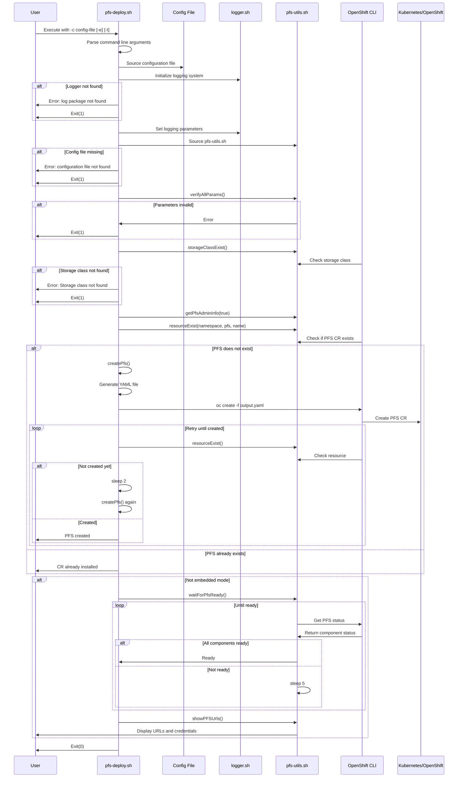
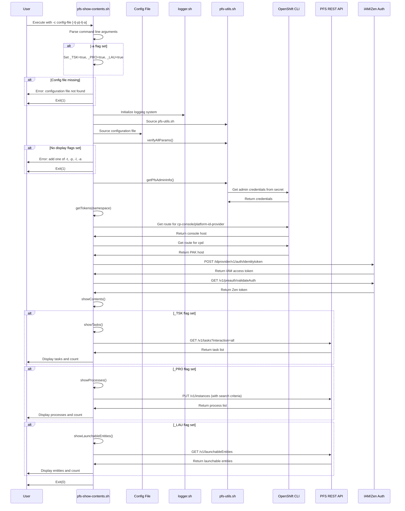
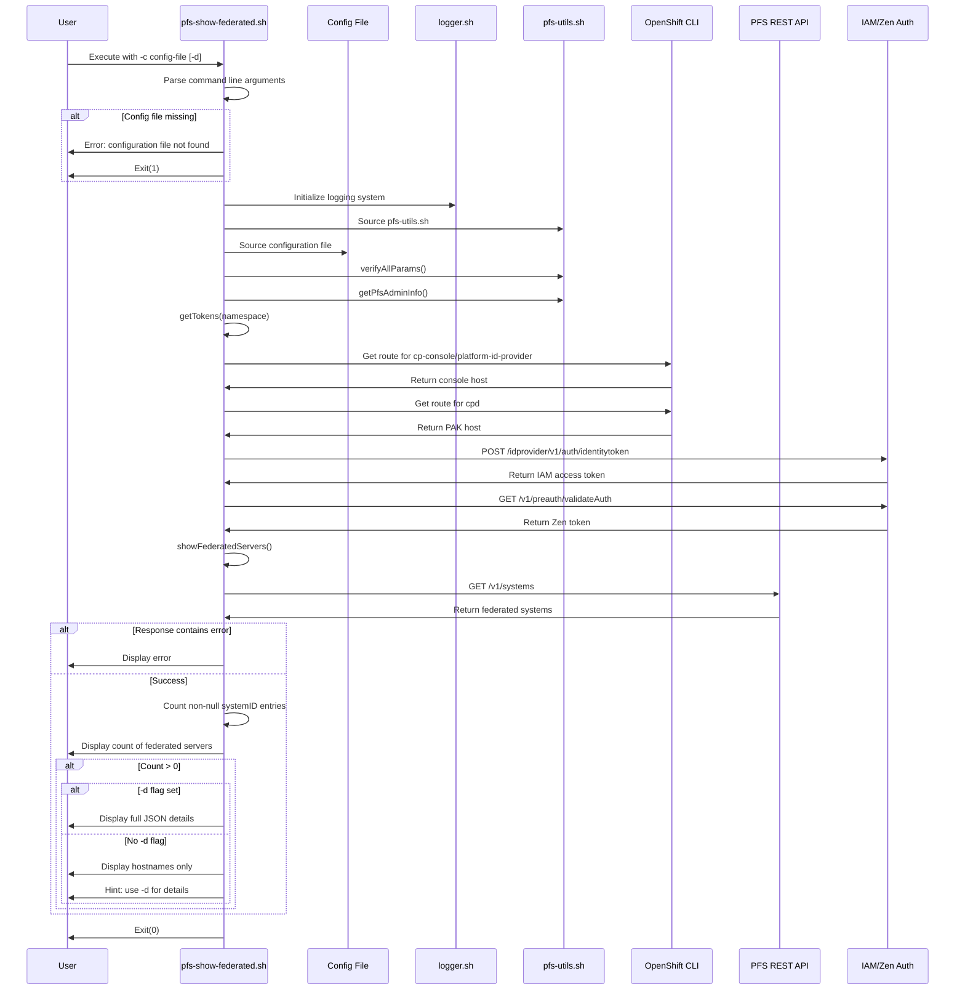
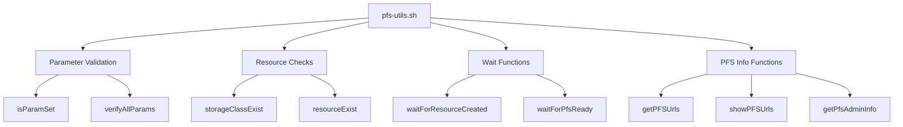
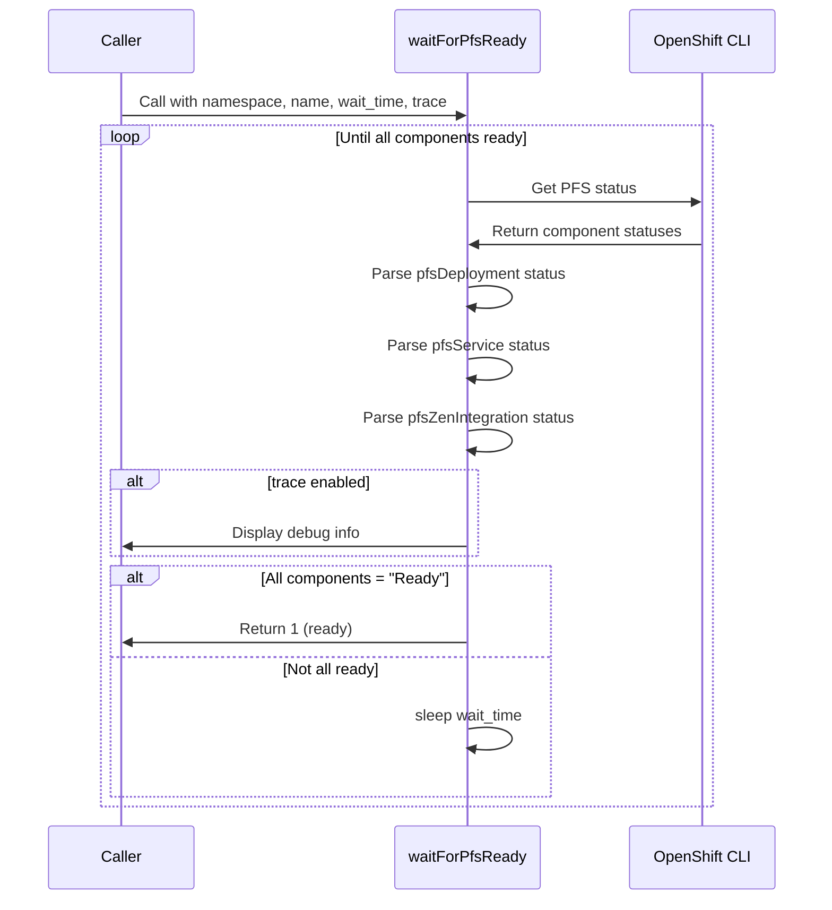
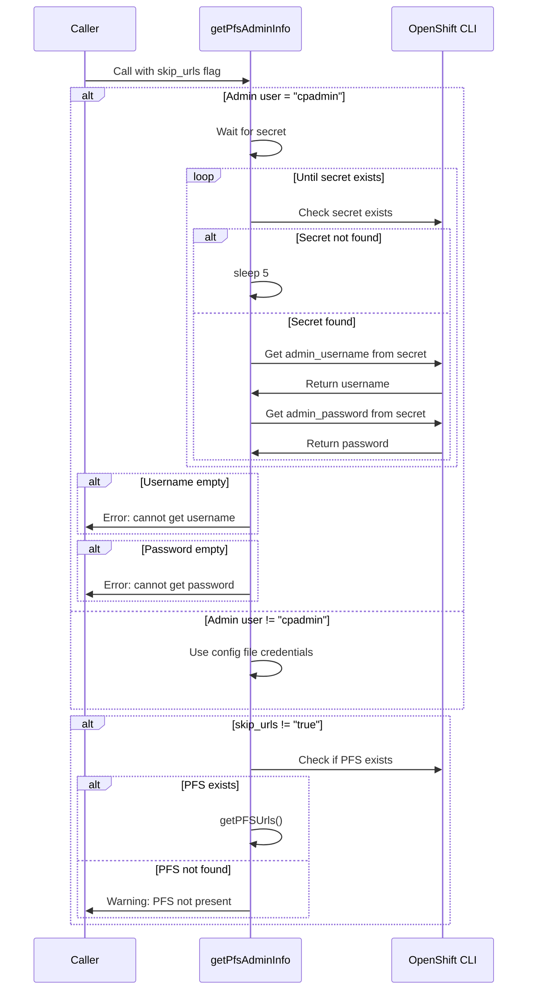
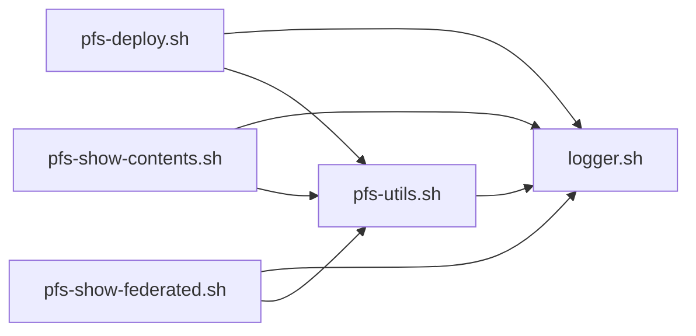

# Process Federation Server (PFS) Pipeline Documentation

## Overview

This documentation describes the execution flows of shell scripts in the `cp4ba-process-federation-server` folder. The scripts are designed to deploy, manage, and monitor IBM Cloud Pak for Business Automation Process Federation Server instances.

## Scripts Summary

| Script | Purpose |
|--------|---------|
| `pfs-deploy.sh` | Deploy a new Process Federation Server instance |
| `pfs-show-contents.sh` | Display federated content (tasks, processes, launchable entities) |
| `pfs-show-federated.sh` | Show federated servers connected to PFS |
| `pfs-utils.sh` | Utility functions library (sourced by other scripts) |

---

## 1. pfs-deploy.sh

### Purpose
Deploys a Process Federation Server (PFS) Custom Resource (CR) in a specified namespace.

### Command Line Parameters
- `-c <config-file>` (required): Full path to configuration file
- `-e` (optional): Embedded run mode, no wait for completion
- `-t` (optional): Enable trace mode

### Main Execution Flow



### Key Functions

#### createPfs()
Generates a YAML file for the PFS Custom Resource and creates it in OpenShift.

**YAML Structure:**
- apiVersion: icp4a.ibm.com/v1
- kind: ProcessFederationServer
- Includes: license, storage configuration, admin user, replicas, resource limits

### Branch Logic

1. **Logger Check**: If logger package not found → Exit with error
2. **Config File Check**: If config file missing → Exit with error
3. **Parameter Validation**: If required parameters missing → Exit with error
4. **Storage Class Check**: If storage class doesn't exist → Exit with error
5. **PFS Existence Check**: 
   - If PFS doesn't exist → Create new PFS
   - If PFS exists → Skip creation
6. **Embedded Mode Check**:
   - If embedded mode (`-e`) → Exit immediately after creation
   - If not embedded → Wait for PFS ready and show URLs

---

## 2. pfs-show-contents.sh

### Purpose
Displays federated content from a Process Federation Server including tasks, processes, and launchable entities.

### Command Line Parameters
- `-c <config-file>` (required): Path to configuration file
- `-t` (optional): Display task list
- `-p` (optional): Display process list
- `-l` (optional): Display launchable entities
- `-a` (optional): Display all (equivalent to -t -p -l)

### Main Execution Flow



### Key Functions

#### getTokens(namespace)
Obtains authentication tokens required for PFS REST API calls:
1. Gets console and PAK routes
2. Obtains IAM access token
3. Obtains Zen token for API authorization

#### showTasks()
Retrieves and displays all tasks from federated systems.

#### showProcesses()
Retrieves and displays process instances using a saved search query.

#### showLaunchableEntities()
Retrieves and displays launchable entities (processes that can be started).

### Branch Logic

1. **All Flag Check**: If `-a` set → Enable all display flags
2. **Config File Check**: If missing → Exit with error
3. **Display Flags Check**: If no flags set → Exit with error
4. **Task Display**: If `-t` flag → Show tasks
5. **Process Display**: If `-p` flag → Show processes
6. **Launchable Display**: If `-l` flag → Show launchable entities

---

## 3. pfs-show-federated.sh

### Purpose
Displays information about federated servers connected to the Process Federation Server.

### Command Line Parameters
- `-c <config-file>` (required): Path to configuration file
- `-d` (optional): Display full details (otherwise shows only hostnames)

### Main Execution Flow



### Key Functions

#### getTokens(namespace)
Same as in `pfs-show-contents.sh` - obtains authentication tokens.

#### showFederatedServers()
Retrieves and displays federated server information:
- Counts only servers with non-null systemID
- Shows full details if `-d` flag is set
- Shows only hostnames otherwise

### Branch Logic

1. **Config File Check**: If missing → Exit with error
2. **API Response Check**: 
   - If error in response → Display error
   - If success → Process and display results
3. **Server Count Check**: If count > 0 → Display servers
4. **Detail Flag Check**:
   - If `-d` set → Display full JSON
   - If not set → Display hostnames only

---

## 4. pfs-utils.sh

### Purpose
Utility library providing common functions used by all PFS scripts.

### Key Functions Overview



### Function Details

#### isParamSet(param)
**Purpose**: Check if a parameter is set
**Returns**: 
- 0 if parameter is empty/unset
- 1 if parameter is set

#### storageClassExist(storage_class)
**Purpose**: Verify if a storage class exists in OpenShift
**Returns**:
- 0 if storage class not found
- 1 if storage class exists

#### verifyAllParams()
**Purpose**: Validate all required PFS configuration parameters
**Checks**:
- CP4BA_INST_PFS_STORAGE_CLASS
- CP4BA_INST_PFS_NAME
- CP4BA_INST_PFS_NAMESPACE
- CP4BA_INST_PFS_APP_VER

**Exits with error if any parameter is missing**

#### resourceExist(namespace, resource_type, resource_name)
**Purpose**: Check if a Kubernetes resource exists
**Parameters**:
- namespace: Target namespace
- resource_type: Type of resource (e.g., "pfs", "secret")
- resource_name: Name of the resource
**Returns**:
- 0 if resource not found
- 1 if resource exists

#### waitForResourceCreated(namespace, resource_type, resource_name, wait_time)
**Purpose**: Wait until a resource is created
**Behavior**: Loops until resource exists, sleeping for wait_time seconds between checks

#### waitForPfsReady(namespace, pfs_name, wait_time, trace)
**Purpose**: Wait until PFS is fully ready
**Checks**:
- pfsDeployment status = "Ready"
- pfsService status = "Ready"
- pfsZenIntegration status = "Ready"
**Behavior**: Loops until all components are ready



#### getPFSUrls(namespace, pfs_name)
**Purpose**: Extract PFS URLs from the CR status
**Exports**:
- PFS_URL_BASE: Base URL for PFS
- PFS_URL_REST: REST API endpoint
- PFS_URL_OPENAPI: OpenAPI explorer URL

#### showPFSUrls(namespace, pfs_name)
**Purpose**: Display PFS URLs and admin credentials
**Displays**:
- Base URL
- REST API URL
- OpenAPI explorer URL
- Admin username
- Admin password

#### getPfsAdminInfo(skip_urls)
**Purpose**: Retrieve PFS admin credentials
**Behavior**:
- If admin user is "cpadmin": Retrieves credentials from `platform-auth-idp-credentials` secret
- Otherwise: Uses credentials from config file
- If skip_urls is not "true": Also retrieves PFS URLs



---

## Configuration Files

### Required Variables

All scripts require a configuration file with the following variables:

```properties
# PFS Instance Configuration
CP4BA_INST_PFS_NAME=<pfs-instance-name>
CP4BA_INST_PFS_NAMESPACE=<target-namespace>
CP4BA_INST_PFS_STORAGE_CLASS=<storage-class-name>
CP4BA_INST_PFS_APP_VER=<version> # e.g., 23.0.2, 24.0.0, 25.0.1

# Admin User Configuration
CP4BA_INST_PFS_ADMINUSER=<admin-username> # e.g., "cpadmin"
CP4BA_INST_PFS_ADMINPASSW=<admin-password> # Only if not using cpadmin

# Resource Configuration (for pfs-deploy.sh)
CP4BA_INST_PFS_REPLICAS=<number-of-replicas>
CP4BA_INST_LICENSE_TYPE=<license-type> # e.g., production, non-production

# Resource Limits
CP4BA_INST_PFS_RES_REQS_CPU=<cpu-request>
CP4BA_INST_PFS_RES_REQS_MEMORY=<memory-request>
CP4BA_INST_PFS_RES_LIMITS_REQS_CPU=<cpu-limit>
CP4BA_INST_PFS_RES_LIMITS_REQS_MEMORY=<memory-limit>
```

---

## Dependencies

### External Dependencies

1. **cp4ba-logger** (required by all scripts)
   - Location: `../../cp4ba-logger/scripts/logger.sh`
   - Must be cloned alongside PFS scripts
   - Repository: https://github.com/marcoantonioni/cp4ba-logger

2. **OpenShift CLI (oc)** (required)
   - Used for all Kubernetes/OpenShift operations

3. **jq** (required)
   - Used for JSON parsing

4. **curl** (required)
   - Used for REST API calls

### Script Dependencies



---

## Error Handling

### Common Error Scenarios

1. **Missing Logger Package**
   - All scripts check for logger.sh existence
   - Exit with error message and clone instructions

2. **Missing Configuration File**
   - Scripts validate config file path
   - Exit with error if not found

3. **Missing Required Parameters**
   - `verifyAllParams()` validates all required variables
   - Exit with specific error for missing parameter

4. **Storage Class Not Found**
   - `pfs-deploy.sh` validates storage class existence
   - Exit with error if not found

5. **Authentication Failures**
   - Token retrieval failures in show scripts
   - API call failures return error responses

6. **Resource Not Found**
   - PFS CR not found when trying to show info
   - Warning displayed but script continues

---

## Logging Configuration

All scripts support the following logging environment variables:

```bash
CP4BA_LOGGING_ENABLED=true|false    # Enable/disable logging
CP4BA_LOG_LEVEL=INFO|DEBUG|ERROR    # Log level
CP4BA_LOG_TO_CONSOLE=true|false     # Console output
CP4BA_LOG_TO_FILE=true|false        # File output
CP4BA_LOG_FILE=<path>               # Log file path
CP4BA_LOG_MAX_SIZE=<bytes>          # Max log file size
CP4BA_LOG_BACKUP_COUNT=<number>     # Number of backup files
```

**Defaults** (if not set):
- LOGGING_ENABLED: true
- LOG_LEVEL: INFO
- LOG_TO_CONSOLE: true
- LOG_TO_FILE: false
- LOG_MAX_SIZE: 10MB
- LOG_BACKUP_COUNT: 5

---

## Usage Examples

### Deploy a PFS Instance

```bash
cd ./scripts
./pfs-deploy.sh -c ../configs/demo-wfps-pfs-production.properties
```

### Deploy in Embedded Mode (no wait)

```bash
./pfs-deploy.sh -c ../configs/pfs1.properties -e
```

### Show Federated Servers (names only)

```bash
./pfs-show-federated.sh -c ../configs/demo-wfps-pfs-production.properties
```

### Show Federated Servers (full details)

```bash
./pfs-show-federated.sh -c ../configs/demo-wfps-pfs-production.properties -d
```

### Show All Content Types

```bash
./pfs-show-contents.sh -c ../configs/demo-wfps-pfs-production.properties -a
```

### Show Specific Content Types

```bash
# Tasks only
./pfs-show-contents.sh -c ../configs/pfs1.properties -t

# Processes only
./pfs-show-contents.sh -c ../configs/pfs1.properties -p

# Launchable entities only
./pfs-show-contents.sh -c ../configs/pfs1.properties -l

# Combine multiple (tasks and processes)
./pfs-show-contents.sh -c ../configs/pfs1.properties -t -p
```

---

## API Endpoints Used

### Authentication Endpoints

- **IAM Token**: `POST /idprovider/v1/auth/identitytoken`
- **Zen Token**: `GET /v1/preauth/validateAuth`

### PFS REST API Endpoints

- **Systems**: `GET /rest/bpm/federated/v1/systems`
- **Tasks**: `GET /rest/bpm/federated/v1/tasks?interaction=all`
- **Processes**: `PUT /rest/bpm/federated/v1/instances`
- **Launchable Entities**: `GET /rest/bpm/federated/v1/launchableEntities`
- **OpenAPI Explorer**: `/rest/bpm/federated/openapi/index.html`

---

## Prerequisites

1. **Foundation Deployment**: Target namespace must contain a running Foundation deployment
2. **Elasticsearch**: Must be present in `shared_configuration.sc_optional_components`
3. **Storage Class**: Dynamic storage class must be available
4. **Admin Access**: User must have cluster-admin or equivalent permissions
5. **Network Access**: Ability to reach OpenShift API and routes

---

## Color Coding

Scripts use ANSI color codes for output:

- **Red** (`\033[0;31m`): Errors
- **Green** (`\033[0;32m`): Success messages, info
- **Yellow** (`\033[1;33m`): Highlighted values, warnings
- **Blue** (`\033[0;34m`): Additional info
- **No Color** (`\033[0m`): Reset to default

---

## Exit Codes

- **0**: Success
- **1**: Error (various reasons - check error message)

---

## References

- [IBM CP4BA Process Federation Server Documentation](https://www.ibm.com/docs/en/cloud-paks/cp-biz-automation/25.0.1?topic=deployments-installing-cp4ba-process-federation-server-production-deployment)
- [Process Federation Server Containers GitHub](https://github.com/icp4a/process-federation-server-containers)
- [OpenShift CLI Documentation](https://docs.openshift.com/container-platform/4.14/cli_reference/openshift_cli/getting-started-cli.html)
- [jq Documentation](https://jqlang.github.io/jq)

---
