# CP4BA Utilities - Shell Scripts Documentation

This document provides comprehensive documentation of all shell scripts in the `cp4ba-utilities` folder, including execution flow diagrams in Mermaid format.

## Table of Contents

1. [BAW Applications Management](#1-baw-applications-management)
   - [cp4ba-bastudio-export-app.sh](#11-cp4ba-bastudio-export-appsh)
   - [cp4ba-bastudio-list-apps.sh](#12-cp4ba-bastudio-list-appssh)
   - [cp4ba-baw-update-team-bindings.sh](#13-cp4ba-baw-update-team-bindingssh)
   - [cp4ba-deploy-baw-app.sh](#14-cp4ba-deploy-baw-appsh)
   - [cp4ba-list-baw-apps.sh](#15-cp4ba-list-baw-appssh)
   - [cp4ba-undeploy-baw-app.sh](#16-cp4ba-undeploy-baw-appsh)
   - [cp4ba-update-baw-app.sh](#17-cp4ba-update-baw-appsh)
2. [GenAI Configuration](#2-genai-configuration)
   - [cp4ba-update-secret-genai.sh](#21-cp4ba-update-secret-genaish)
3. [TLS Entry Point Management](#3-tls-entry-point-management)
   - [cp4ba-tls-update-ep.sh](#31-cp4ba-tls-update-epsh)
4. [Cluster Operations](#4-cluster-operations)
   - [reboot-nodes.sh](#41-reboot-nodessh)
5. [Namespace Management](#5-namespace-management)
   - [cp4ba-remove-namespace.sh](#51-cp4ba-remove-namespacesh)

---

## 1. BAW Applications Management

### 1.1. cp4ba-bastudio-export-app.sh

**Purpose**: Export a Business Automation Workflow application from Business Automation Studio.

**Parameters**:
- `-s`: Studio URL (https://hostname/bas)
- `-n`: Application name
- `-a`: Application acronym
- `-u`: Admin user
- `-p`: Password
- `-f`: Output file path

**Main Flow**:

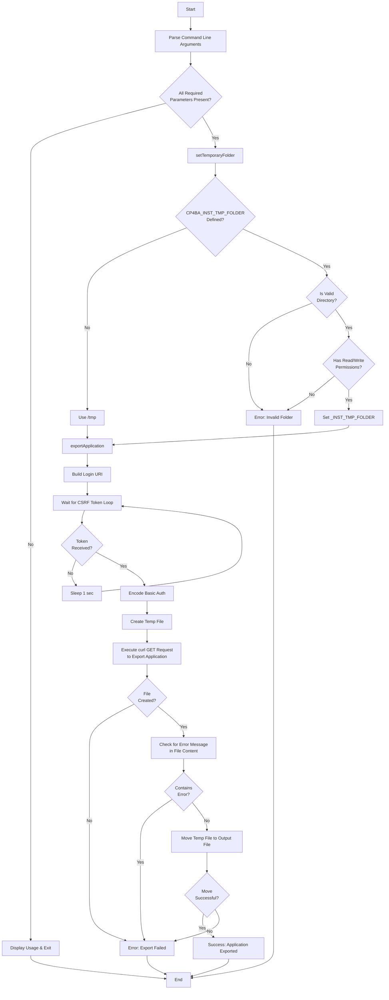

**Key Functions**:
- `setTemporaryFolder()`: Validates and sets temporary folder location
- `exportApplication()`: Authenticates and exports the application package

**Execution Branches**:
1. **Success Path**: Parameters valid → Temp folder set → Authentication successful → Export successful
2. **Error Paths**:
   - Missing parameters → Display usage and exit
   - Invalid temp folder → Error and exit
   - Authentication failure → Retry loop
   - Export failure → Error message

---

### 1.2. cp4ba-bastudio-list-apps.sh

**Purpose**: List Business Automation applications from Business Automation Studio.

**Parameters**:
- `-s`: Studio URL (https://hostname/bas)
- `-u`: Admin user
- `-p`: Password
- `-n`: Application name (optional - for specific app versions)
- `-a`: Application acronym (optional)
- `-d`: Detailed output flag

**Main Flow**:

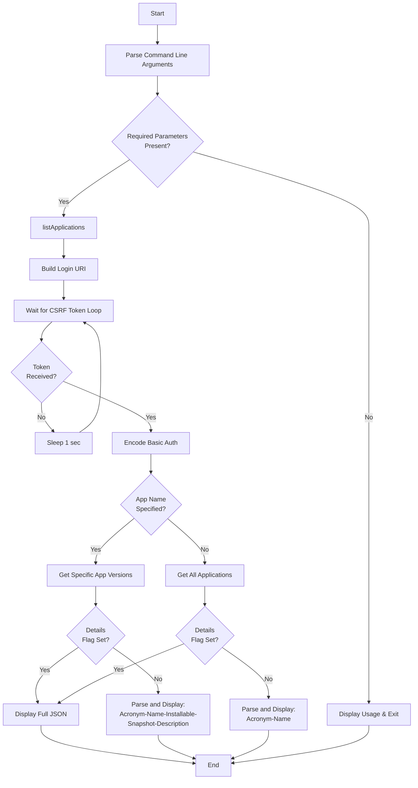

**Key Functions**:
- `listApplications()`: Retrieves and displays application information

**Execution Branches**:
1. **List All Apps**: No app name → Retrieve all containers → Display acronym and name
2. **List Specific App Versions**: App name provided → Retrieve versions → Display detailed version info
3. **Detailed Output**: `-d` flag → Display full JSON response
4. **Summary Output**: No `-d` flag → Display formatted table

---

### 1.3. cp4ba-baw-update-team-bindings.sh

**Purpose**: Update team bindings for a BAW application snapshot.

**Parameters**:
- `-n`: Namespace
- `-b`: BAW deployment name
- `-c`: CR name
- `-u`: Admin user
- `-p`: Password
- `-a`: Application acronym
- `-v`: Snapshot name
- `-t`: Team bindings configuration file
- `-r`: Remove existing content before applying (optional)

**Main Flow**:

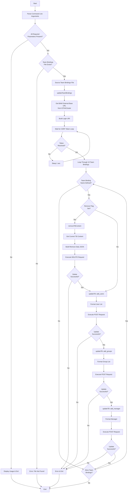

**Key Functions**:
- `updateTeamBindings()`: Main orchestration function
- `updateTB()`: Updates specific team binding operation (add_users, add_groups, add_manager)
- `removeTBContent()`: Removes existing team binding content

**Execution Branches**:
1. **With Remove Flag**: Remove existing content → Add users → Add groups → Add manager
2. **Without Remove Flag**: Add users → Add groups → Add manager
3. **Multiple Team Bindings**: Loop through up to 10 team bindings (BAW_TB_NAME_1 to BAW_TB_NAME_10)

---

### 1.4. cp4ba-deploy-baw-app.sh

**Purpose**: Deploy a BAW application to a runtime environment.

**Parameters**:
- `-n`: Namespace
- `-b`: BAW deployment name
- `-c`: CR name
- `-u`: Admin user
- `-p`: Password
- `-a`: Application file path
- `-d`: Design object store (for case solutions)
- `-e`: Target environment (for case solutions)
- `-f`: Force case overwrite flag

**Main Flow**:

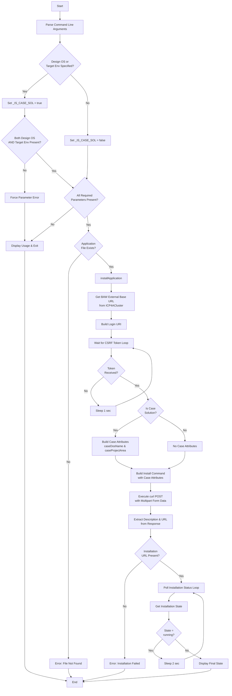

**Key Functions**:
- `installApplication()`: Handles the deployment process

**Execution Branches**:
1. **Workflow Application**: No design OS/target env → Deploy as workflow app
2. **Case Solution**: Design OS and target env provided → Deploy as case solution with additional parameters
3. **Force Overwrite**: `-f` flag → Set caseOverwrite=true
4. **Installation Monitoring**: Poll status until state != "running"

---

### 1.5. cp4ba-list-baw-apps.sh

**Purpose**: List BAW applications and their versions/snapshots.

**Parameters**:
- `-n`: Namespace
- `-b`: BAW deployment name
- `-c`: CR name
- `-u`: Admin user
- `-p`: Password
- `-a`: Application acronym (optional - for specific app versions)
- `-d`: Detailed output flag

**Main Flow**:

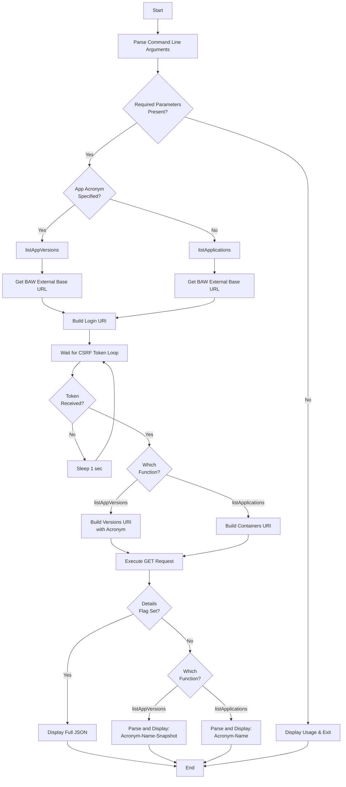

**Key Functions**:
- `listApplications()`: Lists all applications and toolkits
- `listAppVersions()`: Lists versions/snapshots for a specific application

**Execution Branches**:
1. **List All Apps**: No acronym → Retrieve all containers → Display acronym and name
2. **List App Versions**: Acronym provided → Retrieve versions → Display acronym, name, and snapshot
3. **Detailed Output**: `-d` flag → Display full JSON
4. **Summary Output**: No `-d` flag → Display formatted table

---

### 1.6. cp4ba-undeploy-baw-app.sh

**Purpose**: Undeploy a BAW application snapshot from runtime.

**Parameters**:
- `-n`: Namespace
- `-b`: BAW deployment name
- `-c`: CR name
- `-u`: Admin user
- `-p`: Password
- `-a`: Application acronym
- `-v`: Snapshot name
- `-f`: Force deactivation flag

**Main Flow**:

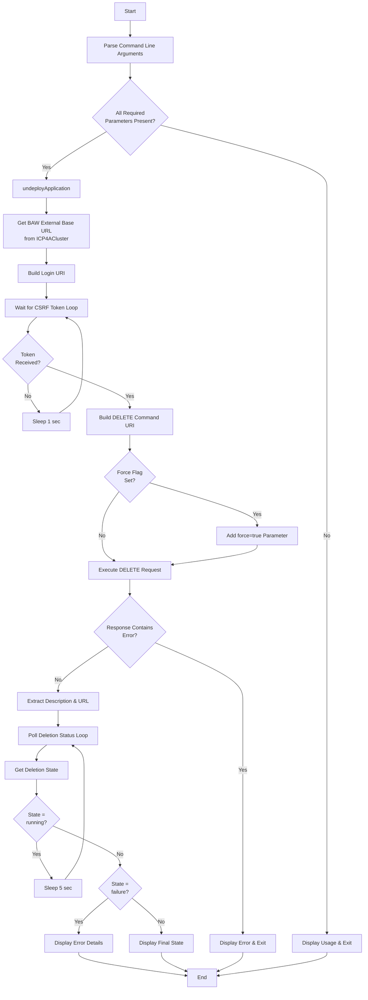

**Key Functions**:
- `undeployApplication()`: Handles the undeployment process

**Execution Branches**:
1. **Normal Undeploy**: No force flag → Standard deletion
2. **Force Undeploy**: `-f` flag → Force deletion even with active instances
3. **Status Monitoring**: Poll deletion status until state != "running"
4. **Error Handling**: Display detailed error if state = "failure"

---

### 1.7. cp4ba-update-baw-app.sh

**Purpose**: Update BAW application state (activate/deactivate) and set as default.

**Parameters**:
- `-n`: Namespace
- `-b`: BAW deployment name
- `-c`: CR name
- `-u`: Admin user
- `-p`: Password
- `-a`: Application acronym
- `-v`: Snapshot name
- `-o`: Operation (activate/deactivate)
- `-m`: Make default flag
- `-s`: Suspend instances flag
- `-f`: Force deactivation flag

**Main Flow**:

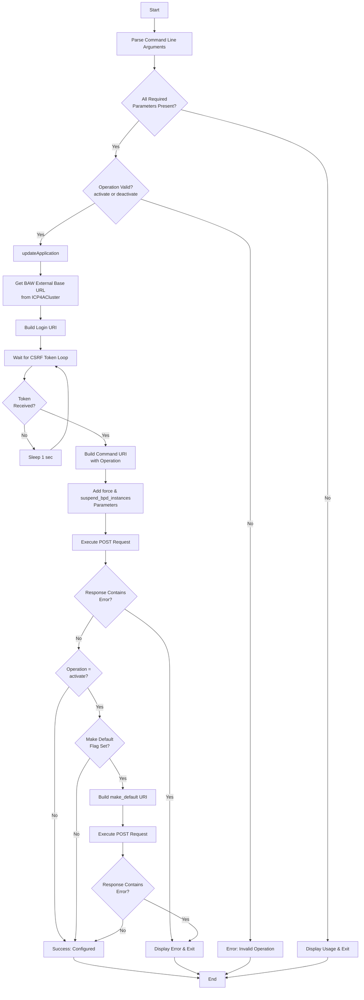

**Key Functions**:
- `updateApplication()`: Handles activation/deactivation and default setting

**Execution Branches**:
1. **Activate**: Set state to activate → Optionally make default
2. **Deactivate**: Set state to deactivate → Optionally force and suspend instances
3. **Make Default**: Only available with activate operation
4. **Force Deactivation**: `-f` flag → Force deactivation even with active instances
5. **Suspend Instances**: `-s` flag → Suspend BPD instances during deactivation

---

## 2. GenAI Configuration

### 2.1. cp4ba-update-secret-genai.sh

**Purpose**: Configure GenAI secret for Watson X integration in CP4BA.

**Parameters**:
- `-c`: Configuration file path

**Main Flow**:

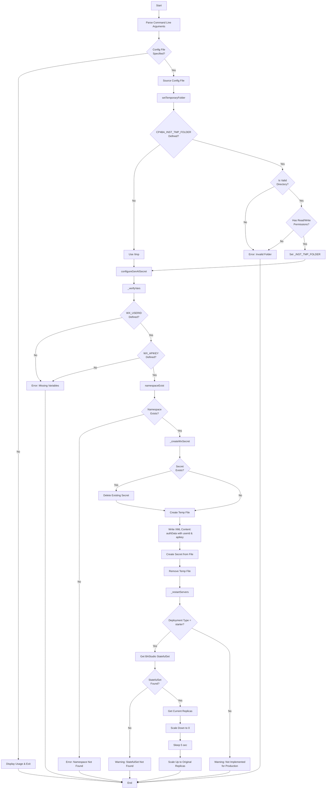

**Key Functions**:
- `setTemporaryFolder()`: Validates and sets temporary folder
- `_verifyVars()`: Validates required GenAI configuration variables
- `_createWxSecret()`: Creates Kubernetes secret with Watson X credentials
- `_restartServers()`: Restarts BAStudio pods to apply new configuration
- `namespaceExist()`: Checks if namespace exists
- `resourceExist()`: Checks if resource exists

**Execution Branches**:
1. **Success Path**: Config valid → Namespace exists → Secret created → Servers restarted
2. **Error Paths**:
   - Missing config file → Exit
   - Invalid temp folder → Exit
   - Missing variables → Exit
   - Namespace not found → Exit
3. **Deployment Types**:
   - Starter: Scale down/up StatefulSet
   - Production: Warning (not implemented)

---

## 3. TLS Entry Point Management

### 3.1. cp4ba-tls-update-ep.sh

**Purpose**: Update TLS certificate for ZenService entry point.

**Parameters**:
- `-n`: Target namespace
- `-z`: Target ZenService name
- `-s`: Target new secret name
- `-f`: Source secret name (optional)
- `-k`: Source secret namespace (optional)
- `-w`: Wait for progress flag
- `-x`: No wait after update flag

**Main Flow**:

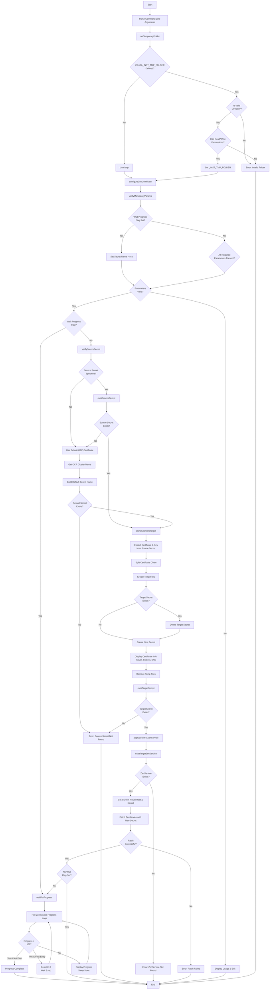

**Key Functions**:
- `setTemporaryFolder()`: Validates and sets temporary folder
- `verifyMandatoryParams()`: Validates required parameters
- `verifySourceSecret()`: Validates source secret parameters
- `existSourceSecret()`: Checks if source secret exists
- `existTargetSecret()`: Checks if target secret exists
- `existTargetZenService()`: Checks if target ZenService exists
- `cloneSecretToTarget()`: Clones certificate from source to target namespace
- `applySecretToZenService()`: Applies new secret to ZenService
- `waitForProgress()`: Monitors ZenService update progress

**Execution Branches**:
1. **Wait Progress Only**: `-w` flag → Monitor existing update progress
2. **Clone from Source**: Source secret specified → Clone to target → Apply to ZenService
3. **Use Default OCP Cert**: No source specified → Use OCP ingress certificate → Apply to ZenService
4. **Wait After Update**: Default behavior → Apply changes → Wait for completion
5. **No Wait**: `-x` flag → Apply changes → Exit immediately

---

## 4. Cluster Operations

### 4.1. reboot-nodes.sh

**Purpose**: Reboot OpenShift cluster nodes (control plane and/or workers).

**Parameters**:
- `-c`: Reboot control plane nodes flag
- `-w`: Reboot worker nodes flag

**Main Flow**:

```mermaid
flowchart TD
    A[Start] --> B[Parse Command Line Arguments]
    B --> C[setTemporaryFolder]
    C --> D{CP4BA_INST_TMP_FOLDER<br/>Defined?}
    D -->|No| E[Use /tmp]
    D -->|Yes| F{Is Valid<br/>Directory?}
    F -->|No| G[Error: Invalid Folder]
    F -->|Yes| H{Has Read/Write<br/>Permissions?}
    H -->|No| G
    H -->|Yes| I[Set _INST_TMP_FOLDER]
    E --> J[Switch to default Project]
    I --> J
    J --> K[Set Delays:<br/>Before=5s, After=60s]
    K --> L{Any Flag<br/>Set?}
    L -->|No| M[Error: No Operation Specified]
    L -->|Yes| N{Workers<br/>Flag Set?}
    N -->|Yes| O[listNodes: worker]
    N -->|No| P{Control Plane<br/>Flag Set?}
    O --> Q[Get Worker Nodes List]
    Q --> R[Write to Temp File]
    R --> S[Display Worker Nodes]
    S --> T[rebootNodes: workers]
    T --> U[Read Node from File Loop]
    U --> V{Node Name<br/>Present?}
    V -->|No| W{More<br/>Nodes?}
    V -->|Yes| X[rebootNode]
    X --> Y[Cordon Node]
    Y --> Z[Drain Node:<br/>ignore-daemonsets<br/>delete-emptydir-data<br/>force, disable-eviction]
    Z --> AA[Wait 5 sec]
    AA --> AB[Debug & Reboot Node]
    AB --> AC[Wait 5 sec]
    AC --> AD[Uncordon Node]
    AD --> AE[Patch Node:<br/>unschedulable=false]
    AE --> W
    W -->|Yes| U
    W -->|No| AF[Remove Temp File]
    AF --> P
    P -->|Yes| AG[listNodes: master]
    P -->|No| AH[End]
    AG --> AI[Get Master Nodes List]
    AI --> AJ[Write to Temp File]
    AJ --> AK[Display Master Nodes]
    AK --> AL[rebootNodes: masters]
    AL --> AM[Read Node from File Loop]
    AM --> AN{Node Name<br/>Present?}
    AN -->|No| AO{More<br/>Nodes?}
    AN -->|Yes| AP[rebootNode]
    AP --> AQ[Cordon Node]
    AQ --> AR[Drain Node]
    AR --> AS[Wait 5 sec]
    AS --> AT[Debug & Reboot Node]
    AT --> AU[Wait 5 sec]
    AU --> AV[Uncordon Node]
    AV --> AW[Patch Node]
    AW --> AO
    AO -->|Yes| AM
    AO -->|No| AX[Remove Temp File]
    AX --> AH
    M --> AH
    G --> AH
```

**Key Functions**:
- `setTemporaryFolder()`: Validates and sets temporary folder
- `listNodes()`: Lists nodes of specified type (worker/master)
- `rebootNodes()`: Iterates through nodes and reboots each
- `rebootNode()`: Cordons, drains, reboots, and uncordons a single node

**Execution Branches**:
1. **Workers Only**: `-w` flag → List workers → Reboot each worker sequentially
2. **Control Plane Only**: `-c` flag → List masters → Reboot each master sequentially
3. **Both**: `-c -w` flags → Reboot workers first, then control plane
4. **Node Reboot Sequence**:
   - Cordon (mark unschedulable)
   - Drain (evict pods)
   - Wait 5 seconds
   - Reboot
   - Wait 5 seconds
   - Uncordon (mark schedulable)

---

## 5. Namespace Management

### 5.1. cp4ba-remove-namespace.sh

**Purpose**: Remove CP4BA namespace and all associated resources.

**Parameters**:
- `-n`: Namespace to be removed

**Main Flow**:

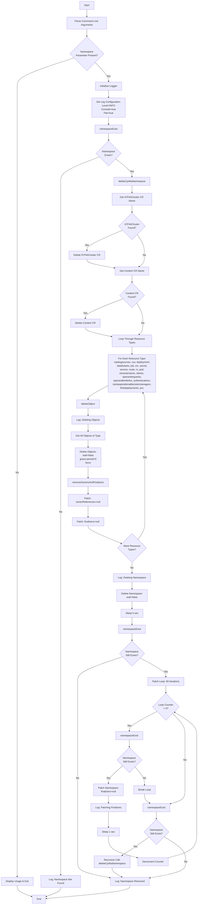

**Key Functions**:
- `namespaceExist()`: Checks if namespace exists
- `resourceExist()`: Checks if specific resource exists
- `deleteCp4baNamespace()`: Main deletion orchestration
- `deleteObject()`: Deletes all objects of a specific type
- `removeOwnersAndFinalizers()`: Removes owner references and finalizers

**Execution Branches**:
1. **Namespace Exists**: Delete CRs → Delete all resources → Delete namespace → Patch finalizers if stuck
2. **Namespace Not Found**: Log message and exit
3. **Stuck Namespace**: Patch finalizers loop (60 iterations) → Recursive call if still exists
4. **Resource Deletion Order**:
   - ICP4ACluster CR
   - Content CR
   - All other resources (catalogsources, deployments, statefulsets, etc.)
   - PVCs (last)
   - Namespace itself

**Resource Types Deleted** (in order):
1. catalogsources.operators.coreos.com
2. csv (ClusterServiceVersion)
3. deployment
4. statefulsets.apps
5. job
6. cm (ConfigMap)
7. secret
8. service
9. route
10. rs (ReplicaSet)
11. pod
12. zenextensions.zen.cpd.ibm.com
13. clients.oidc.security.ibm.com
14. operandrequests.operator.ibm.com
15. operandbindinfos.operator.ibm.com
16. authentications.operator.ibm.com
17. icp4aoperationaldecisionmanagers.icp4a.ibm.com
18. flinkdeployments.flink.ibm.com
19. pvc (PersistentVolumeClaim)

---

## Common Patterns Across Scripts

### 1. Authentication Pattern
Most BAW-related scripts follow this pattern:
```bash
1. Get BAW External Base URL from ICP4ACluster CR
2. Build Login URI
3. Loop until CSRF token received
4. Use token for subsequent API calls
```

### 2. Temporary Folder Management
Scripts use a common pattern for temporary folder validation:
```bash
1. Check if CP4BA_INST_TMP_FOLDER is defined
2. Validate it's a directory
3. Check read/write permissions
4. Fall back to /tmp if not defined
```

### 3. Error Handling
Common error handling patterns:
- Parameter validation before execution
- Resource existence checks
- API response error detection
- Graceful exit with error messages

### 4. Color-Coded Output
All scripts use ANSI color codes for better readability:
- Green: Success messages
- Yellow: Warnings and important values
- Red: Errors
- Blue/Cyan: Informational messages

### 5. Polling Patterns
Several scripts implement polling for async operations:
- Installation status monitoring
- Deletion status monitoring
- ZenService progress monitoring
- Node reboot status

---

## Dependencies

### External Dependencies
- `oc` (OpenShift CLI)
- `curl` (HTTP client)
- `jq` (JSON processor)
- `base64` (encoding/decoding)
- `openssl` (certificate operations)

### Internal Dependencies
- `cp4ba-logger` package (for cp4ba-remove-namespace.sh)
  - Location: `../../cp4ba-logger/scripts/logger.sh`
  - Functions: `log_msg()`, `log_info()`, `log_error()`

---

## Environment Variables

### Common Environment Variables
- `CP4BA_INST_TMP_FOLDER`: Custom temporary folder location
- `CP4BA_LOGGING_ENABLED`: Enable logging (for scripts using logger)
- `CP4BA_LOG_LEVEL`: Log level (INFO, DEBUG, ERROR)
- `CP4BA_LOG_TO_CONSOLE`: Enable console logging
- `CP4BA_LOG_TO_FILE`: Enable file logging
- `CP4BA_LOG_FILE`: Log file path
- `CP4BA_LOG_MAX_SIZE`: Maximum log file size

### GenAI Specific Variables
- `CP4BA_INST_GENAI_WX_USERID`: Watson X user ID
- `CP4BA_INST_GENAI_WX_APIKEY`: Watson X API key
- `CP4BA_INST_GENAI_WX_AUTH_SECRET`: Secret name for Watson X auth
- `CP4BA_INST_NAMESPACE`: Target namespace for GenAI configuration
- `CP4BA_INST_TYPE`: Deployment type (starter/production)

---

## Usage Examples

### BAW Application Management

#### Export Application
```bash
./cp4ba-bastudio-export-app.sh \
  -s https://bas.example.com/bas \
  -n MyApplication \
  -a MYAPP \
  -u admin \
  -p password \
  -f /tmp/myapp.twx
```

#### Deploy Application
```bash
./cp4ba-deploy-baw-app.sh \
  -n cp4ba \
  -b baw-instance \
  -c icp4adeploy \
  -u admin \
  -p password \
  -a /tmp/myapp.twx
```

#### Update Team Bindings
```bash
./cp4ba-baw-update-team-bindings.sh \
  -n cp4ba \
  -b baw-instance \
  -c icp4adeploy \
  -u admin \
  -p password \
  -a MYAPP \
  -v v1.0 \
  -t team-bindings.properties \
  -r
```

### GenAI Configuration
```bash
./cp4ba-update-secret-genai.sh -c genai-config.properties
```

### TLS Certificate Update
```bash
./cp4ba-tls-update-ep.sh \
  -n cp4ba \
  -z lite-cr \
  -s custom-tls-secret \
  -f source-tls-secret \
  -k openshift-ingress
```

### Cluster Node Reboot
```bash
# Reboot workers only
./reboot-nodes.sh -w

# Reboot control plane only
./reboot-nodes.sh -c

# Reboot both
./reboot-nodes.sh -c -w
```

### Namespace Removal
```bash
./cp4ba-remove-namespace.sh -n cp4ba-test
```

---

## Best Practices

1. **Always validate parameters** before executing operations
2. **Use temporary folders** for intermediate files
3. **Implement proper error handling** with clear messages
4. **Poll async operations** until completion
5. **Clean up temporary files** after use
6. **Use color-coded output** for better user experience
7. **Log important operations** for audit trail
8. **Check resource existence** before operations
9. **Handle finalizers** when deleting resources
10. **Implement retry logic** for transient failures

---

## Troubleshooting

### Common Issues

1. **Authentication Failures**
   - Verify admin credentials
   - Check CSRF token retrieval
   - Ensure network connectivity to endpoints

2. **Resource Not Found**
   - Verify namespace exists
   - Check resource names and types
   - Ensure proper RBAC permissions

3. **Temporary Folder Issues**
   - Check CP4BA_INST_TMP_FOLDER permissions
   - Ensure sufficient disk space
   - Verify folder exists and is writable

4. **Namespace Stuck in Terminating**
   - Script handles finalizer removal
   - May require multiple iterations
   - Check for PVs with retain policy

5. **Node Reboot Issues**
   - Ensure proper cluster admin permissions
   - Check node drain timeout settings
   - Verify no critical pods blocking drain

---

## Security Considerations

1. **Credentials**: Never hardcode passwords in scripts
2. **Secrets**: Use Kubernetes secrets for sensitive data
3. **Permissions**: Ensure proper RBAC for operations
4. **Logging**: Avoid logging sensitive information
5. **Temporary Files**: Clean up files containing credentials
6. **API Keys**: Store Watson X API keys securely
7. **Certificates**: Validate certificate chains
8. **Network**: Use HTTPS for all API communications

---

## Maintenance Notes

- Scripts are designed for CP4BA 23.x, 24.x, and 25.x versions
- Regular updates may be needed for API changes
- Test scripts in non-production environments first
- Keep logger package updated for remove-namespace script
- Monitor OpenShift API deprecations

---
