# WfPS Deploy Pipeline Documentation

## Overview
The [`wfps-deploy.sh`](cp4ba-wfps/scripts/wfps-deploy.sh) script is responsible for deploying a Workflow Process Service (WfPS) Runtime instance on OpenShift/Kubernetes. It creates the necessary Custom Resource (CR) for WfPS deployment with configurable parameters.

## Script Information
- **Location**: `cp4ba-wfps/scripts/wfps-deploy.sh`
- **Purpose**: Deploy WfPS Runtime instance with optional trusted certificates
- **Dependencies**: 
  - [`oc-utils.sh`](cp4ba-wfps/scripts/oc-utils.sh) - Utility functions for OpenShift operations
  - [`wfps-export-env-vars-to-file.sh`](cp4ba-wfps/scripts/wfps-export-env-vars-to-file.sh) - Export environment variables

## Command Line Parameters

| Parameter | Required | Description |
|-----------|----------|-------------|
| `-c` | Yes | Full path to WfPS configuration file (e.g., '../configs/env1.properties') |
| `-t` | No | Path to trusted certificates configuration file |
| `-g` | No | Generate YAML only (do not deploy) |
| `-n` | No | No wait for instance readiness |

## Main Execution Flow

```mermaid
flowchart TD
    Start([Start]) --> ParseArgs[Parse command line arguments<br/>-c: config file required<br/>-t: trusted certs optional<br/>-g: generate YAML only<br/>-n: no wait]
    
    ParseArgs --> CheckConfig{Config file<br/>provided?}
    CheckConfig -->|No| Usage[Display usage]
    Usage --> Stop1([Stop])
    
    CheckConfig -->|Yes| SetVars[Set CONFIG_FILE and<br/>TRUST_CERTS_FILE]
    SetVars --> GetScriptDir[Determine script directory]
    GetScriptDir --> SourceUtils[Source oc-utils.sh]
    SourceUtils --> Banner[Display deployment banner]
    
    Banner --> FileExists{Config file<br/>exists?}
    FileExists -->|No| Error1[Display error]
    Error1 --> Stop2([Stop])
    
    FileExists -->|Yes| SourceConfig[Source CONFIG_FILE]
    SourceConfig --> TrustSet{TRUST_CERTS_FILE<br/>set?}
    TrustSet -->|Yes| SourceTrust[Source TRUST_CERTS_FILE]
    TrustSet -->|No| VerifyParams
    SourceTrust --> VerifyParams[Call verifyAllParams<br/>Validates: WFPS_STORAGE_CLASS,<br/>WFPS_NAME, WFPS_NAMESPACE,<br/>WFPS_APP_VER, WFPS_APP_TAG,<br/>WFPS_ADMINUSER]
    
    VerifyParams --> CheckStorage[Check storage class exists]
    CheckStorage --> StorageFound{Storage class<br/>found?}
    StorageFound -->|No| Error2[Display error]
    Error2 --> Stop3([Stop])
    
    StorageFound -->|Yes| CheckResource[Check if WfPS resource exists]
    CheckResource --> ResourceExists{WfPS already<br/>exists?}
    
    ResourceExists -->|No| GetAdmin[Get admin info]
    GetAdmin --> DeployRuntime[Call deployWfPSRuntime]
    
    DeployRuntime --> TrustProvided{TRUST_CERTS_FILE<br/>provided?}
    TrustProvided -->|Yes| BuildCerts[Build certificates list<br/>Iterate TCERT_SECRET_NAME_1<br/>to TCERT_SECRET_NAME_10]
    TrustProvided -->|No| FederateCheck
    BuildCerts --> FederateCheck
    
    FederateCheck{WFPS_FEDERATE<br/>not set?}
    FederateCheck -->|Yes| SetFederate[Set WFPS_FEDERATE=false]
    FederateCheck -->|No| FederateTrue
    SetFederate --> FederateTrue
    
    FederateTrue{WFPS_FEDERATE<br/>=true?}
    FederateTrue -->|Yes| SetTags[Set federation tags<br/>Enable federate capability<br/>and fullTextSearch with<br/>Elasticsearch storage]
    FederateTrue -->|No| CreateSecrets
    SetTags --> CreateSecrets
    
    CreateSecrets[Call createSecrets<br/>Creates database credential secret<br/>WFPS_EXT_DB_CREDENTIAL_SECRET]
    CreateSecrets --> CertsEmpty{Certificates<br/>list empty?}
    
    CertsEmpty -->|Yes| WithoutCerts[Call deployWfPSRuntimeWithoutCerts]
    WithoutCerts --> DetermineTag1[Determine image tag<br/>Use WFPS_PATCHED_IMG_TAG if set,<br/>otherwise WFPS_APP_TAG]
    DetermineTag1 --> GenYAML[Generate CR YAML to output file<br/>../output/WFPS_NAME.yaml]
    GenYAML --> YAMLOnly{YAML_ONLY<br/>=false?}
    YAMLOnly -->|Yes| CreateYAML[Execute oc create -f YAML]
    YAMLOnly -->|No| DisplayCR
    CreateYAML --> DisplayCR
    
    CertsEmpty -->|No| WithCerts[Call deployWfPSRuntimeWithCerts]
    WithCerts --> DetermineTag2[Determine image tag]
    DetermineTag2 --> GenCR[Generate CR with certificates]
    GenCR --> CreateDirect[Execute oc create directly<br/>with serverTrustCertificateList]
    CreateDirect --> DisplayCR
    
    DisplayCR[Display CR location]
    DisplayCR --> WaitCreated[Wait for resource created<br/>5s intervals]
    WaitCreated --> CheckYAMLMode
    
    ResourceExists -->|Yes| AlreadyInstalled[Display already installed message]
    AlreadyInstalled --> YAMLOnlyCheck{YAML_ONLY<br/>=true?}
    YAMLOnlyCheck -->|Yes| RegenYAML[Call deployWfPSRuntime<br/>Regenerate YAML only]
    YAMLOnlyCheck -->|No| CheckYAMLMode
    RegenYAML --> CheckYAMLMode
    
    CheckYAMLMode{YAML_ONLY<br/>=false?}
    CheckYAMLMode -->|No| End
    CheckYAMLMode -->|Yes| NoWaitCheck{NOWAIT<br/>=false?}
    
    NoWaitCheck -->|No| Building[Display building message]
    Building --> End([End])
    
    NoWaitCheck -->|Yes| WaitReady[Wait for WfPS ready<br/>5s intervals]
    WaitReady --> IsReady{WfPS<br/>ready?}
    IsReady -->|No| NotReady[Display not ready message]
    NotReady --> End
    IsReady -->|Yes| Success[Display success message]
    Success --> ExportVars[Call executeExportVars<br/>Export environment variables]
    ExportVars --> End
```



## Key Functions

### deployWfPSRuntime()
Main deployment orchestrator that:
1. Processes trusted certificates if provided
2. Configures federation settings if enabled
3. Creates database secrets
4. Deploys WfPS CR with or without certificates

### deployWfPSRuntimeWithCerts(certificatesList)
Creates WfPS Custom Resource with trusted certificates:
- Generates CR YAML inline
- Includes `serverTrustCertificateList` in TLS configuration
- Executes `oc create` directly

### deployWfPSRuntimeWithoutCerts()
Creates WfPS Custom Resource without certificates:
- Generates CR YAML to output file (`../output/${WFPS_NAME}.yaml`)
- Optionally applies the CR based on `_YAML_ONLY` flag

### createSecrets()
Creates Kubernetes secret for database credentials:
- Secret name: `${WFPS_EXT_DB_CREDENTIAL_SECRET}`
- Contains: username and password for external database

### executeExportVars()
Calls [`wfps-export-env-vars-to-file.sh`](cp4ba-wfps/scripts/wfps-export-env-vars-to-file.sh) to export WfPS environment variables to a file.

## Execution Branches

### Branch 1: Standard Deployment
**Condition**: Config file provided, WfPS doesn't exist, no special flags
```
Parse args → Validate → Check storage → Deploy CR → Wait for ready → Export vars
```

### Branch 2: YAML Generation Only
**Condition**: `-g` flag provided
```
Parse args → Validate → Generate YAML → Exit (no deployment)
```

### Branch 3: No-Wait Deployment
**Condition**: `-n` flag provided
```
Parse args → Validate → Deploy CR → Exit (no wait for ready)
```

### Branch 4: Deployment with Trusted Certificates
**Condition**: `-t` flag with certificates file provided
```
Parse args → Load certs → Build cert list → Deploy CR with certs → Wait/Export
```

### Branch 5: Federated Deployment
**Condition**: `WFPS_FEDERATE=true` in config
```
Parse args → Validate → Enable federation tags → Enable Elasticsearch → Deploy → Wait/Export
```

### Branch 6: Already Installed
**Condition**: WfPS resource already exists
```
Parse args → Validate → Detect existing → Skip deployment (or regenerate YAML if -g)
```

### Branch 7: Patched Image Deployment
**Condition**: `WFPS_PATCHED_IMG` variable set in config
```
Parse args → Validate → Use WFPS_PATCHED_IMG_TAG → Deploy → Wait/Export
```

## Configuration Parameters

### Required Parameters (validated by verifyAllParams)
- `WFPS_STORAGE_CLASS` - Storage class for persistent volumes
- `WFPS_NAME` - Name of the WfPS instance
- `WFPS_NAMESPACE` - Kubernetes namespace
- `WFPS_APP_VER` - Application version
- `WFPS_APP_TAG` - Container image tag
- `WFPS_ADMINUSER` - Admin username

### Database Configuration
- `WFPS_EXT_DB_SERVER` - External database server
- `WFPS_EXT_DB_PORT` - Database port
- `WFPS_EXT_DB_NAME` - Database name
- `WFPS_EXT_DB_CREDENTIAL_SECRET` - Secret name for credentials
- `WFPS_EXT_DB_USER_NAME` - Database username
- `WFPS_EXT_DB_USER_PASSWORD` - Database password

### Resource Limits
- `WFPS_LIMITS_CPU` - CPU limit
- `WFPS_LIMITS_MEMORY` - Memory limit
- `WFPS_REQS_CPU` - CPU request
- `WFPS_REQS_MEMORY` - Memory request

### Optional Parameters
- `WFPS_FEDERATE` - Enable federation (true/false)
- `WFPS_STORAGE_CLASS_BLOCK` - Block storage class for Elasticsearch
- `WFPS_PATCHED_IMG` - Custom patched image repository
- `WFPS_PATCHED_IMG_TAG` - Custom patched image tag
- `TCERT_SECRET_NAME_1` to `TCERT_SECRET_NAME_10` - Trusted certificate secrets

## Output Files

### Generated YAML
- **Location**: `../output/${WFPS_NAME}.yaml`
- **Content**: Complete WfPSRuntime Custom Resource definition
- **Generated when**: Deployment without certificates or YAML-only mode

### Exported Variables
- **Location**: `../output/exp-${WFPS_NAME}.vars`
- **Content**: Environment variables for WfPS instance
- **Generated by**: [`wfps-export-env-vars-to-file.sh`](cp4ba-wfps/scripts/wfps-export-env-vars-to-file.sh)

## Dependencies from oc-utils.sh

The script uses these utility functions from [`oc-utils.sh`](cp4ba-wfps/scripts/oc-utils.sh):

| Function | Purpose |
|----------|---------|
| `verifyAllParams()` | Validates all required configuration parameters |
| `storageClassExist()` | Checks if storage class exists in cluster |
| `resourceExist()` | Checks if Kubernetes resource exists |
| `waitForResourceCreated()` | Waits for resource to be created |
| `waitForWfPSReady()` | Waits for WfPS instance to reach Ready state |
| `getAdminInfo()` | Retrieves admin credentials from secrets |

## Error Handling

The script handles these error conditions:

1. **Missing configuration file**: Exits with usage message
2. **Configuration file not found**: Exits with error
3. **Storage class not found**: Exits with error message
4. **Missing required parameters**: Exits via `verifyAllParams()`
5. **Resource already exists**: Skips deployment, optionally regenerates YAML

## Wait Mechanisms

### Resource Creation Wait
- **Function**: `waitForResourceCreated()`
- **Interval**: 5 seconds
- **Behavior**: Polls until WfPS resource appears in cluster

### Ready State Wait
- **Function**: `waitForWfPSReady()`
- **Interval**: 5 seconds
- **Behavior**: Polls until WfPS status shows "True" for Ready condition
- **Bypass**: Use `-n` flag to skip waiting

## Usage Examples

### Standard deployment
```bash
./wfps-deploy.sh -c ../configs/wfps1.properties
```

### Deployment with trusted certificates
```bash
./wfps-deploy.sh -c ../configs/wfps1.properties -t ../configs/trusted-certs.properties
```

### Generate YAML only (no deployment)
```bash
./wfps-deploy.sh -c ../configs/wfps1.properties -g
```

### Deploy without waiting for ready state
```bash
./wfps-deploy.sh -c ../configs/wfps1.properties -n
```

### Combined options
```bash
./wfps-deploy.sh -c ../configs/wfps1.properties -t ../configs/trusted-certs.properties -n
```

## Notes

- The script supports both standard and patched container images
- Federation capability requires Elasticsearch storage configuration
- Database credentials are stored as Kubernetes secrets
- The script can handle up to 10 trusted certificate secrets
- YAML generation mode is useful for review before actual deployment
- Admin credentials are retrieved from platform-auth-idp-credentials secret if not provided