# WfPS Install Application Pipeline Documentation

## Overview
The [`wfps-install-application.sh`](cp4ba-wfps/scripts/wfps-install-application.sh) script is responsible for installing Business Automation Workflow applications (TWX files) into a deployed WfPS Runtime instance. It uses REST APIs to upload and install the application packages.

## Script Information
- **Location**: `cp4ba-wfps/scripts/wfps-install-application.sh`
- **Purpose**: Install workflow applications into WfPS Runtime
- **Dependencies**: 
  - [`oc-utils.sh`](cp4ba-wfps/scripts/oc-utils.sh) - Utility functions for OpenShift operations
  - `curl` - HTTP client for REST API calls
  - `jq` - JSON processor for parsing API responses

## Command Line Parameters

| Parameter | Required | Description |
|-----------|----------|-------------|
| `-c` | Yes | Path to WfPS configuration file |
| `-a` | Yes | Path to deployable application file (TWX format) |

## Main Execution Flow

```mermaid
flowchart TD
    Start([Start]) --> ParseArgs[Parse command line arguments<br/>-c: config file required<br/>-a: application file required]
    
    ParseArgs --> CheckParams{Config and App<br/>file provided?}
    CheckParams -->|No| Usage[Display usage]
    Usage --> Stop1([Stop])
    
    CheckParams -->|Yes| SetVars[Set CONFIG_FILE and<br/>APPLICATION_FILE]
    SetVars --> GetScriptDir[Determine script directory]
    GetScriptDir --> SourceUtils[Source oc-utils.sh]
    SourceUtils --> Banner[Display installation banner]
    
    Banner --> SourceConfig[Source CONFIG_FILE<br/>Loads: WFPS_NAME, WFPS_NAMESPACE,<br/>WFPS_STORAGE_CLASS, WFPS_APP_VER,<br/>WFPS_APP_TAG, WFPS_ADMINUSER]
    
    SourceConfig --> VerifyParams[Call verifyAllParams<br/>Validates required parameters]
    
    VerifyParams --> FileExists{Application<br/>file exists?}
    FileExists -->|No| Error[Display error]
    Error --> Stop2([Stop])
    
    FileExists -->|Yes| GetAdmin[Call getAdminInfo<br/>Retrieves: WFPS_ADMINUSER,<br/>WFPS_ADMINPASSWORD, WFPS_URL_OPS,<br/>WFPS_URL_EXPLORER, WFPS_URL_WORKPLACE,<br/>WFPS_URL_PROCESSADMIN,<br/>WFPS_EXTERNAL_BASE_URL,<br/>WFPS_PAK_BASE_URL]
    
    GetAdmin --> GetToken[Call getCsrfToken]
    
    GetToken --> BuildCred[Build credentials]
    BuildCred --> SetURI[Set LOGIN_URI =<br/>URL_OPS/system/login]
    
    SetURI --> PostLogin[POST to LOGIN_URI<br/>with credentials]
    PostLogin --> ExtractToken[Extract csrf_token<br/>from JSON response]
    ExtractToken --> TokenReceived{Token<br/>received?}
    TokenReceived -->|No| PostLogin
    TokenReceived -->|Yes| ExportToken[Export WFPS_CSRF_TOKEN]
    
    ExportToken --> InstallApp[Call installApplication<br/>Parameters: WFPS_ADMINUSER,<br/>WFPS_ADMINPASSWORD, WFPS_URL_OPS,<br/>WFPS_CSRF_TOKEN, APPLICATION_FILE]
    
    InstallApp --> DisplayMsg[Display installing message]
    DisplayMsg --> BuildCredStr[Build credentials string]
    
    BuildCredStr --> PostAPI[POST multipart/form-data<br/>to OPS API<br/>Endpoint: /std/bpm/containers/install<br/>Parameters: inactive=false,<br/>caseOverwrite=false<br/>Headers: accept, BPMCSRFToken,<br/>Content-Type<br/>Body: install_file]
    
    PostAPI --> ParseResp[Parse installation response<br/>Extract: description, url]
    ParseResp --> DisplayResult[Display request result]
    DisplayResult --> Wait2[Wait 2 seconds]
    Wait2 --> DisplayURL[Display status URL]
    
    DisplayURL --> ProgressDot[Display progress dot]
    ProgressDot --> GetStatus[GET installation status<br/>Endpoint: status URL<br/>Headers: accept, BPMCSRFToken]
    
    GetStatus --> ExtractState[Extract state from JSON]
    ExtractState --> CheckState{State =<br/>running?}
    
    CheckState -->|Yes| Wait5[Wait 5 seconds]
    Wait5 --> ProgressDot
    
    CheckState -->|No| DisplayFinal[Display final state]
    DisplayFinal --> End([End])
```



## Key Functions

### installApplication(user, password, opsUrl, csrfToken, appFile)
Main installation function that:
1. Uploads the application file via multipart form data
2. Initiates the installation process
3. Polls the installation status until completion
4. Reports the final installation state

**Parameters:**
- `$1` - Admin username
- `$2` - Admin password
- `$3` - WfPS Operations URL
- `$4` - CSRF token for authentication
- `$5` - Full path to application file (TWX)

**Process:**
1. **Upload**: POST request to `/std/bpm/containers/install` with application file
2. **Monitor**: Polls status URL returned in response
3. **Wait**: Checks every 5 seconds while state is "running"
4. **Complete**: Exits when state changes from "running"

### verifyInstalledApplication(user, password, opsUrl, csrfToken, appName)
Verification function (currently commented out) that:
- Lists all installed containers
- Searches for specific application name
- Uses `jq` to filter and display results

**Parameters:**
- `$1` - Admin username
- `$2` - Admin password
- `$3` - WfPS Operations URL
- `$4` - CSRF token
- `$5` - Application name to verify

## Execution Branches

### Branch 1: Successful Installation
**Condition**: All parameters valid, application file exists, WfPS is ready
```
Parse args → Validate → Get admin info → Get CSRF token → Upload app → Monitor status → Complete
```

### Branch 2: Missing Parameters
**Condition**: Config file or application file not provided
```
Parse args → Display usage → Exit
```

### Branch 3: Application File Not Found
**Condition**: Specified application file doesn't exist
```
Parse args → Validate config → Check file → Display error → Exit
```

### Branch 4: Installation Monitoring Loop
**Condition**: Installation initiated successfully
```
Upload → Get status URL → Poll status (every 5s) → Check state → Continue or Exit
```

**Possible States:**
- `running` - Installation in progress (continue polling)
- `completed` - Installation successful (exit)
- `failed` - Installation failed (exit)
- Other states - Installation finished (exit)

## REST API Endpoints Used

### 1. Login Endpoint
- **URL**: `${WFPS_URL_OPS}/system/login`
- **Method**: POST
- **Purpose**: Obtain CSRF token for subsequent requests
- **Headers**:
  - `accept: application/json`
  - `Content-Type: application/json`
- **Authentication**: Basic Auth (username:password)
- **Response**: JSON with `csrf_token` field

### 2. Install Container Endpoint
- **URL**: `${WFPS_URL_OPS}/std/bpm/containers/install`
- **Method**: POST
- **Purpose**: Upload and install application
- **Query Parameters**:
  - `inactive=false` - Install as active
  - `caseOverwrite=false` - Don't overwrite existing cases
- **Headers**:
  - `accept: application/json`
  - `BPMCSRFToken: ${token}`
  - `Content-Type: multipart/form-data`
- **Body**: Multipart form with `install_file` field
- **Response**: JSON with `description` and `url` (status URL)

### 3. Installation Status Endpoint
- **URL**: Returned in install response (e.g., `/std/bpm/containers/install/status/{id}`)
- **Method**: GET
- **Purpose**: Check installation progress
- **Headers**:
  - `accept: application/json`
  - `BPMCSRFToken: ${token}`
- **Authentication**: Basic Auth
- **Response**: JSON with `state` field

## Configuration Parameters

### Required from Config File
These parameters are validated by `verifyAllParams()`:
- `WFPS_STORAGE_CLASS` - Storage class for WfPS
- `WFPS_NAME` - Name of WfPS instance
- `WFPS_NAMESPACE` - Kubernetes namespace
- `WFPS_APP_VER` - Application version
- `WFPS_APP_TAG` - Container image tag
- `WFPS_ADMINUSER` - Admin username

### Retrieved by getAdminInfo()
These are automatically retrieved from the cluster:
- `WFPS_ADMINPASSWORD` - Admin password (from secret)
- `WFPS_URL_OPS` - Operations REST API URL
- `WFPS_URL_EXPLORER` - Explorer UI URL
- `WFPS_URL_WORKPLACE` - Workplace UI URL
- `WFPS_URL_PROCESSADMIN` - Process Admin UI URL
- `WFPS_EXTERNAL_BASE_URL` - External base URL
- `WFPS_PAK_BASE_URL` - Platform console URL

### Generated During Execution
- `WFPS_CSRF_TOKEN` - CSRF token for API authentication

## Application File Format

The application file must be:
- **Format**: TWX (Team Works eXport) or ZIP
- **Type**: `application/x-zip-compressed`
- **Content**: Business Automation Workflow application package
- **Location**: Can be anywhere accessible to the script

Example application files in the project:
- `SimpleDemoBawWfPS.twx`
- `SimpleDemoServicesWfPS.twx`
- `SimpleDemoStraightThroughProcessingWfPS.twx`
- `SimpleDemoWfPS1.twx`
- `SimpleDemoWfPS2.twx`

## Dependencies from oc-utils.sh

The script uses these utility functions from [`oc-utils.sh`](cp4ba-wfps/scripts/oc-utils.sh):

| Function | Purpose |
|----------|---------|
| `verifyAllParams()` | Validates all required configuration parameters |
| `getAdminInfo()` | Retrieves admin credentials and WfPS URLs from cluster |
| `getCsrfToken()` | Obtains CSRF token for REST API authentication |

## Error Handling

The script handles these error conditions:

1. **Missing parameters**: Exits with usage message if `-c` or `-a` not provided
2. **Application file not found**: Exits with error if file doesn't exist
3. **Invalid configuration**: Exits via `verifyAllParams()` if required params missing
4. **API errors**: Displays error description from API response
5. **Installation failures**: Reports final state (failed, error, etc.)

## Installation States

The installation process can have these states:

| State | Description | Action |
|-------|-------------|--------|
| `running` | Installation in progress | Continue polling (wait 5s) |
| `completed` | Installation successful | Exit with success |
| `failed` | Installation failed | Exit with failure state |
| `error` | Error during installation | Exit with error state |
| Other | Unknown or custom state | Exit and report state |

## Monitoring and Progress

### Progress Indicators
- **Dots**: Each dot (`.`) represents a 5-second polling interval
- **Messages**: 
  - "Installing application: {file}"
  - "Request result: {description}"
  - "Get installation status at url: {url}"
  - "Final installation state: {state}"

### Timing
- **Initial wait**: 2 seconds after upload before first status check
- **Poll interval**: 5 seconds between status checks
- **Total time**: Depends on application size and complexity

## Usage Examples

### Install a single application
```bash
./wfps-install-application.sh \
  -c ../configs/wfps1.properties \
  -a ../apps/SimpleDemoWfPS1.twx
```

### Install with full paths
```bash
./wfps-install-application.sh \
  -c /path/to/configs/wfps-pfs-demo-1.properties \
  -a /path/to/apps/SimpleDemoBawWfPS.twx
```

### Install multiple applications (sequential)
```bash
# Install first app
./wfps-install-application.sh -c ../configs/wfps1.properties -a ../apps/app1.twx

# Install second app
./wfps-install-application.sh -c ../configs/wfps1.properties -a ../apps/app2.twx
```

## Integration with Other Scripts

### Prerequisites
Before running this script, ensure:
1. WfPS Runtime is deployed (via [`wfps-deploy.sh`](cp4ba-wfps/scripts/wfps-deploy.sh))
2. WfPS instance is in Ready state
3. Admin credentials are available

### Related Scripts
- **[`wfps-deploy.sh`](cp4ba-wfps/scripts/wfps-deploy.sh)** - Deploy WfPS Runtime (run first)
- **[`wfps-list-applications.sh`](cp4ba-wfps/scripts/wfps-list-applications.sh)** - List installed applications
- **[`wfps-update-application.sh`](cp4ba-wfps/scripts/wfps-update-application.sh)** - Update existing application
- **[`wfps-remove-application.sh`](cp4ba-wfps/scripts/wfps-remove-application.sh)** - Remove installed application

## Security Considerations

### Authentication
- Uses Basic Authentication with admin credentials
- CSRF token required for all state-changing operations
- Credentials retrieved from Kubernetes secrets

### HTTPS
- All API calls use HTTPS (https://)
- Certificate validation can be skipped with `-k` flag in curl

### Credentials Handling
- Admin password retrieved from cluster secrets
- Not stored in configuration files
- Passed securely via environment variables

## Troubleshooting

### Common Issues

1. **CSRF Token Error**
   - **Symptom**: API calls fail with authentication error
   - **Solution**: Ensure WfPS is fully ready and accessible

2. **Application File Not Found**
   - **Symptom**: "ERROR: file not found"
   - **Solution**: Verify file path is correct and file exists

3. **Installation Stuck in Running State**
   - **Symptom**: Continuous dots without completion
   - **Solution**: Check WfPS logs, verify application package is valid

4. **Installation Failed State**
   - **Symptom**: Final state shows "failed"
   - **Solution**: Check application compatibility, review WfPS logs

### Debug Information

To get more details during installation:
- Check WfPS pod logs: `oc logs -n ${NAMESPACE} ${WFPS_POD}`
- Review installation status URL directly in browser
- Use `verifyInstalledApplication()` function to confirm installation

## Notes

- The script polls installation status every 5 seconds
- Installation time varies based on application complexity
- Multiple applications can be installed sequentially
- The `verifyInstalledApplication()` function is available but commented out
- CSRF token is required for security and must be obtained before installation
- Applications are installed as active by default (`inactive=false`)
- Existing cases are not overwritten (`caseOverwrite=false`)